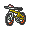
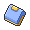
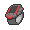

# Nuvema Town

## Items
### General
| Item |
| --- |
|  [Bicycle](../items/bicycle.md) Xtransceiver (Gift from Mother) |
|  [Gracidea](../items/gracidea.md) Super Rod (Gift from Looker) |
|  [Town Map](../items/town-map.md) (Gift from Mother) |
|  [Xtransceiver](../items/xtransceiver.md) (Gift from Mother) |
|  [TM10 Hidden Power](../items/tm10.md) (Professor Juniper after seeing 100 Pokémon) |
|  [TM17 Protect](../items/tm17.md) (Professor Juniper after seeing 60 Pokémon) |
|  [TM54 False Swipe](../items/tm54.md) (Professor Juniper after seeing 30 Pokémon) |

## Trainers
### Rival Bianca – 1
**Battle Type:** Single Battle  

#### Bianca’s Team
| Sprite | Pokemon | Level | Ability | Item | Moves |
| --- | --- | --- | --- | --- | --- |
|  | [Snivy](../pokemon/snivy.md) | 5 | - | - |  |

### Rival Cheren – 1
**Battle Type:** Single Battle  

#### Cheren’s Team
| Sprite | Pokemon | Level | Ability | Item | Moves |
| --- | --- | --- | --- | --- | --- |
|  | [Snivy](../pokemon/snivy.md) | 5 | - | - |  |

