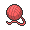
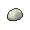

# Opelucid City

## Items
### General
| Item |
| --- |
|  [Fresh Water](../items/fresh-water.md) (In Gym Entrance) |
|  [Cell Battery](../items/cell-battery.md) |
|  [Destiny Knot](../items/destiny-knot.md) |
|  [Float Stone](../items/float-stone.md) |
|  [Ring Target](../items/ring-target.md) |
|  [Max Repel](../items/max-repel.md) (With Dowsing Machine) |
|  [Master Ball](../items/master-ball.md) (From Professor Juniper) |
|  [Ultra Ball](../items/ultra-ball.md) (With Dowsing Machine) |

### PokéMart
| Item |
| --- |
|  [Antidote](../items/antidote.md) |
|  [Awakening](../items/awakening.md) |
|  [Burn Heal](../items/burn-heal.md) |
|  [Fresh Water](../items/fresh-water.md) |
|  [Full Heal](../items/full-heal.md) |
|  [Full Restore](../items/full-restore.md) |
|  [Hyper Potion](../items/hyper-potion.md) |
|  [Ice Heal](../items/ice-heal.md) |
|  [Lemonade](../items/lemonade.md) |
|  [Max Potion](../items/max-potion.md) |
|  [Parlyz Heal](../items/parlyz-heal.md) |
|  [Potion](../items/potion.md) |
|  [Revive](../items/revive.md) |
|  [Soda Pop](../items/soda-pop.md) |
|  [Super Potion](../items/super-potion.md) |
|  [Escape Rope](../items/escape-rope.md) |
|  [Max Repel](../items/max-repel.md) |
|  [Repel](../items/repel.md) |
|  [Dusk Ball](../items/dusk-ball.md) |
|  [Great Ball](../items/great-ball.md) |
|  [Poké Ball](../items/poke-ball.md) |
|  [Quick Ball](../items/quick-ball.md) |
|  [Timer Ball](../items/timer-ball.md) |
|  [Ultra Ball](../items/ultra-ball.md) |

## Trainers
### Ace Trainer Eileen
| Sprite | Pokemon | Level | Ability | Item | Moves |
| --- | --- | --- | --- | --- | --- |
|  | [Vaporeon](../pokemon/vaporeon.md) | 63 | - | - |  |
|  | [Jolteon](../pokemon/jolteon.md) | 63 | - | - |  |
|  | [Flareon](../pokemon/flareon.md) | 63 | - | - |  |

### Ace Trainer Lou
| Sprite | Pokemon | Level | Ability | Item | Moves |
| --- | --- | --- | --- | --- | --- |
|  | [Hitmonlee](../pokemon/hitmonlee.md) | 63 | - | - |  |
|  | [Hitmonchan](../pokemon/hitmonchan.md) | 63 | - | - |  |
|  | [Hitmontop](../pokemon/hitmontop.md) | 63 | - | - |  |

### Ace Trainer Webster
| Sprite | Pokemon | Level | Ability | Item | Moves |
| --- | --- | --- | --- | --- | --- |
|  | [Gyarados](../pokemon/gyarados.md) | 58 | - | - |  |
|  | [Dragonair](../pokemon/dragonair.md) | 56 | - | - |  |
|  | [Dragonair](../pokemon/dragonair.md) | 56 | - | - |  |
|  | [Aerodactyl](../pokemon/aerodactyl.md) | 60 | - | - |  |
|  | [Dragonite](../pokemon/dragonite.md) | 62 | - | - |  |

### Ace Trainer Olwen
| Sprite | Pokemon | Level | Ability | Item | Moves |
| --- | --- | --- | --- | --- | --- |
|  | [Zweilous](../pokemon/zweilous.md) | 62 | - | - |  |
|  | [Druddigon](../pokemon/druddigon.md) | 62 | - | - |  |
|  | [Ampharos](../pokemon/ampharos.md) | 62 | - | - |  |

### Ace Trainer Jose
| Sprite | Pokemon | Level | Ability | Item | Moves |
| --- | --- | --- | --- | --- | --- |
|  | [Fraxure](../pokemon/fraxure.md) | 62 | - | - |  |
|  | [Gyarados](../pokemon/gyarados.md) | 62 | - | - |  |
|  | [Charizard](../pokemon/charizard.md) | 62 | - | - |  |

### Ace Trainer Clara
| Sprite | Pokemon | Level | Ability | Item | Moves |
| --- | --- | --- | --- | --- | --- |
|  | [Milotic](../pokemon/milotic.md) | 62 | - | - |  |
|  | [Dragonair](../pokemon/dragonair.md) | 62 | - | - |  |
|  | [Kangaskhan](../pokemon/kangaskhan.md) | 62 | - | - |  |

### Veteran Hugo
| Sprite | Pokemon | Level | Ability | Item | Moves |
| --- | --- | --- | --- | --- | --- |
|  | [Druddigon](../pokemon/druddigon.md) | 63 | - | - |  |
|  | [Flygon](../pokemon/flygon.md) | 63 | - | - |  |
|  | [Garchomp](../pokemon/garchomp.md) | 63 | - | - |  |

### Ace Trainer Tom
| Sprite | Pokemon | Level | Ability | Item | Moves |
| --- | --- | --- | --- | --- | --- |
|  | [Steelix](../pokemon/steelix.md) | 62 | - | - |  |
|  | [Tyranitar](../pokemon/tyranitar.md) | 62 | - | - |  |
|  | [Altaria](../pokemon/altaria.md) | 62 | - | - |  |

### Ace Trainer Dara
| Sprite | Pokemon | Level | Ability | Item | Moves |
| --- | --- | --- | --- | --- | --- |
|  | [Druddigon](../pokemon/druddigon.md) | 63 | - | - |  |
|  | [Zweilous](../pokemon/zweilous.md) | 63 | - | - |  |
|  | [Flygon](../pokemon/flygon.md) | 63 | - | - |  |

### Veteran Kim
| Sprite | Pokemon | Level | Ability | Item | Moves |
| --- | --- | --- | --- | --- | --- |
|  | [Druddigon](../pokemon/druddigon.md) | 63 | - | - |  |
|  | [Altaria](../pokemon/altaria.md) | 63 | - | - |  |
|  | [Salamence](../pokemon/salamence.md) | 63 | - | - |  |

### Gym Leader Drayden
**Battle Type:** Rotation Battle  
**Reward:** [TM82](../moves/dragon-tail.md) Dragon Tail  

#### Drayden’s Team
| Sprite | Pokemon | Level | Ability | Item | Moves |
| --- | --- | --- | --- | --- | --- |
|  | [Druddigon](../pokemon/druddigon.md) | 64 | Rough Skin |  [Rocky Helmet](../items/rocky-helmet.md) | Revenge, Earthquake, Dragon Tail |
|  | [Charizard](../pokemon/charizard.md) | 64 | Blaze |  Salac Berry | Fire Punch, Earthquake, Substitute |
|  | [Flygon](../pokemon/flygon.md) | 64 | Levitate |  Yache Berry | Dragon Pulse, Earth Power, Fire Blast |
|  | [Salamence](../pokemon/salamence.md) | 64 | Intimidate |  [Life Orb](../items/life-orb.md) | Hydro Pump, Brick Break, Fire Blast |
|  | [Kingdra](../pokemon/kingdra.md) | 64 | Sniper |  [White Herb](../items/white-herb.md) | Waterfall, Outrage, Frost Breath |
|  | [Haxorus](../pokemon/haxorus.md) | 66 | Mold Breaker |  Sitrus Berry | Outrage, Earthquake, Dragon Tail |

### Gym Leader Iris
**Battle Type:** Triple Battle  
**Reward:** [TM82](../moves/dragon-tail.md) Dragon Tail  

#### Iris’s Team
| Sprite | Pokemon | Level | Ability | Item | Moves |
| --- | --- | --- | --- | --- | --- |
|  | [Druddigon](../pokemon/druddigon.md) | 63 | Rough Skin |  [Rocky Helmet](../items/rocky-helmet.md) | Outrage, Revenge, Earthquake, Dragon Tail |
|  | [Gyarados](../pokemon/gyarados.md) | 63 | Intimidate |  Wacan Berry | Dragon Dance, Aqua Tail, Ice Fang, Earthquake |
|  | [Altaria](../pokemon/altaria.md) | 63 | Natural Cure |  Yache Berry | Cotton Guard, Dragon Pulse, Ice Beam, Fire Blast |
|  | [Dragonite](../pokemon/dragonite.md) | 65 | Inner Focus |  Sitrus Berry | Stone Edge, Dragon Claw, Hurricane, Thunder |
|  | [Kingdra](../pokemon/kingdra.md) | 65 | Swift Swim |  [Damp Rock](../items/damp-rock.md) | Rain Dance, Hydro Pump, Dragon Pulse, Blizzard |
|  | [Haxorus](../pokemon/haxorus.md) | 65 | Mold Breaker |  [Dragon Gem](../items/dragon-gem.md) | Dragon Dance, Outrage, Earthquake, Dragon Tail |

