# Pinwheel Forest

## Encounters
### Outside
####  Grass, Normal
| Sprite | Pokemon | Rate |
| --- | --- | --- |
|  | [Tympole](../pokemon/tympole.md) | 20% |
|  | [Timburr](../pokemon/timburr.md) | 20% |
|  | [Meditite](../pokemon/meditite.md) | 10% |
| 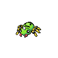 | [Spinarak](../pokemon/spinarak.md) | 10% |
| 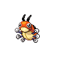 | [Ledyba](../pokemon/ledyba.md) | 10% |
|  | [Machop](../pokemon/machop.md) | 10% |
| 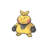 | [Makuhita](../pokemon/makuhita.md) | 10% |
|  | [Croagunk](../pokemon/croagunk.md) | 5% |
|  | [Slakoth](../pokemon/slakoth.md) | 5% |

####  Grass, Doubles
| Sprite | Pokemon | Rate |
| --- | --- | --- |
| 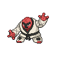 | [Throh](../pokemon/throh.md) | 20% |
|  | [Sawk](../pokemon/sawk.md) | 20% |
|  | [Dunsparce](../pokemon/dunsparce.md) | 10% |
| 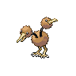 | [Doduo](../pokemon/doduo.md) | 10% |
|  | [Snubbull](../pokemon/snubbull.md) | 10% |
|  | [Aipom](../pokemon/aipom.md) | 10% |
|  | [Cubone](../pokemon/cubone.md) | 9% |
| 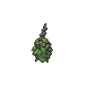 | [Burmy](../pokemon/burmy.md) | 9% |
|  | [Heracross](../pokemon/heracross.md) | 2% |

####  Grass, Special
| Sprite | Pokemon | Rate |
| --- | --- | --- |
|  | [Audino](../pokemon/audino.md) | 50% |
|  | [Tepig](../pokemon/tepig.md) | 10% |
| 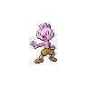 | [Tyrogue](../pokemon/tyrogue.md) | 10% |
|  | [Riolu](../pokemon/riolu.md) | 10% |
|  | [Charmander](../pokemon/charmander.md) | 5% |
| 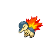 | [Cyndaquil](../pokemon/cyndaquil.md) | 5% |
|  | [Torchic](../pokemon/torchic.md) | 5% |
|  | [Chimchar](../pokemon/chimchar.md) | 5% |

### Inside
####  Grass, Normal
| Sprite | Pokemon | Rate |
| --- | --- | --- |
| 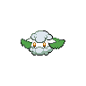 | [Cottonee](../pokemon/cottonee.md) | 20% |
|  | [Petilil](../pokemon/petilil.md) | 20% |
| 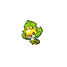 | [Sewaddle](../pokemon/sewaddle.md) | 10% |
| 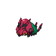 | [Venipede](../pokemon/venipede.md) | 10% |
| 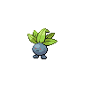 | [Oddish](../pokemon/oddish.md) | 10% |
|  | [Bellsprout](../pokemon/bellsprout.md) | 10% |
| 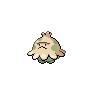 | [Shroomish](../pokemon/shroomish.md) | 5% |
|  | [Exeggcute](../pokemon/exeggcute.md) | 5% |
| 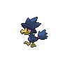 | [Murkrow](../pokemon/murkrow.md) | 5% |
|  | [Misdreavus](../pokemon/misdreavus.md) | 5% |

####  Grass, Doubles
| Sprite | Pokemon | Rate |
| --- | --- | --- |
| 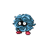 | [Tangela](../pokemon/tangela.md) | 20% |
| 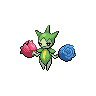 | [Roselia](../pokemon/roselia.md) | 20% |
|  | [Swadloon](../pokemon/swadloon.md) | 10% |
| 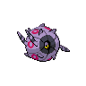 | [Whirlipede](../pokemon/whirlipede.md) | 10% |
|  | [Gloom](../pokemon/gloom.md) | 10% |
| 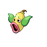 | [Weepinbell](../pokemon/weepinbell.md) | 10% |
| 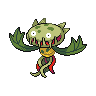 | [Carnivine](../pokemon/carnivine.md) | 5% |
|  | [Scyther](../pokemon/scyther.md) | 5% |
| 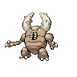 | [Pinsir](../pokemon/pinsir.md) | 5% |
| 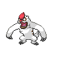 | [Vigoroth](../pokemon/vigoroth.md) | 5% |

####  Grass, Special
| Sprite | Pokemon | Rate |
| --- | --- | --- |
|  | [Audino](../pokemon/audino.md) | 40% |
| 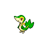 | [Snivy](../pokemon/snivy.md) | 10% |
|  | [Pansage](../pokemon/pansage.md) | 10% |
|  | [Panpour](../pokemon/panpour.md) | 10% |
|  | [Pansear](../pokemon/pansear.md) | 10% |
|  | [Bulbasaur](../pokemon/bulbasaur.md) | 5% |
| 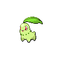 | [Chikorita](../pokemon/chikorita.md) | 5% |
|  | [Treecko](../pokemon/treecko.md) | 5% |
|  | [Turtwig](../pokemon/turtwig.md) | 5% |

####  Surf, Normal
| Sprite | Pokemon | Rate |
| --- | --- | --- |
|  | [Surskit](../pokemon/surskit.md) | 100% |

####  Surf, Special
| Sprite | Pokemon | Rate |
| --- | --- | --- |
|  | [Masquerain](../pokemon/masquerain.md) | 100% |

####  Fish, Normal
| Sprite | Pokemon | Rate |
| --- | --- | --- |
| 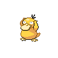 | [Psyduck](../pokemon/psyduck.md) | 60% |
|  | [Poliwag](../pokemon/poliwag.md) | 40% |

####  Fish, Special
| Sprite | Pokemon | Rate |
| --- | --- | --- |
|  | [Poliwhirl](../pokemon/poliwhirl.md) | 95% |
|  | [Politoed](../pokemon/politoed.md) | 5% |

## Special Encounters
### [Virizion](../pokemon/virizion.md)
| Sprite | Level | Location | Method | Rate |
| --- | --- | --- | --- | --- |
|  | 56 | Rumination Field |  Fixed | Fixed |

## Items
### General
| Item | Original |
| --- | --- |
|  [TM43 Flame Charge](../items/tm43.md) | Great Ball |
| 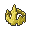 [King's Rock * 2](../items/kings-rock.md) | Miracle Seed |
|  [Prism Scale](../items/prism-scale.md) | Parlyz Heal |
|  [TM09 Venoshock](../items/tm09.md) | Super Potion |
|  [TM95 Snarl](../items/tm95.md) | Antidote |
|  Miracle Seed | Hyper Potion |
| 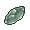 Moon Stone * 6 | Moon Stone (NPC) |

## Trainers
### Nurse Shery
| Sprite | Pokemon | Level | Ability | Item | Moves |
| --- | --- | --- | --- | --- | --- |
|  | [Happiny](../pokemon/happiny.md) | 18 | - | - |  |
|  | [Audino](../pokemon/audino.md) | 18 | - | - |  |

### Preschooler Juliet
| Sprite | Pokemon | Level | Ability | Item | Moves |
| --- | --- | --- | --- | --- | --- |
|  | [Pansage](../pokemon/pansage.md) | 18 | - | - |  |
|  | [Panpour](../pokemon/panpour.md) | 18 | - | - |  |
|  | [Pansear](../pokemon/pansear.md) | 18 | - | - |  |

### Preschooler Homer
| Sprite | Pokemon | Level | Ability | Item | Moves |
| --- | --- | --- | --- | --- | --- |
| 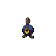 | [Roggenrola](../pokemon/roggenrola.md) | 18 | - | - |  |
| 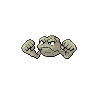 | [Geodude](../pokemon/geodude.md) | 18 | - | - |  |
|  | [Aron](../pokemon/aron.md) | 18 | - | - |  |

### Youngster Keita
| Sprite | Pokemon | Level | Ability | Item | Moves |
| --- | --- | --- | --- | --- | --- |
|  | [Spinarak](../pokemon/spinarak.md) | 18 | - | - |  |
|  | [Doduo](../pokemon/doduo.md) | 18 | - | - |  |
|  | [Charmander](../pokemon/charmander.md) | 18 | - | - |  |

### Youngster Zachary
| Sprite | Pokemon | Level | Ability | Item | Moves |
| --- | --- | --- | --- | --- | --- |
|  | [Burmy](../pokemon/burmy.md) | 18 | - | - |  |
|  | [Torchic](../pokemon/torchic.md) | 18 | - | - |  |
|  | [Ledyba](../pokemon/ledyba.md) | 18 | - | - |  |

### Battle Girl Lee
| Sprite | Pokemon | Level | Ability | Item | Moves |
| --- | --- | --- | --- | --- | --- |
|  | [Timburr](../pokemon/timburr.md) | 18 | - | - |  |
|  | [Croagunk](../pokemon/croagunk.md) | 18 | - | - |  |
|  | [Tyrogue](../pokemon/tyrogue.md) | 18 | - | - |  |
|  | [Throh](../pokemon/throh.md) | 18 | - | - |  |

### Black Belt Kentaro
| Sprite | Pokemon | Level | Ability | Item | Moves |
| --- | --- | --- | --- | --- | --- |
|  | [Machop](../pokemon/machop.md) | 18 | - | - |  |
|  | [Meditite](../pokemon/meditite.md) | 18 | - | - |  |
|  | [Riolu](../pokemon/riolu.md) | 18 | - | - |  |
|  | [Sawk](../pokemon/sawk.md) | 18 | - | - |  |

### Twins Mayo & May D
| Sprite | Pokemon | Level | Ability | Item | Moves |
| --- | --- | --- | --- | --- | --- |
|  | [Sewaddle](../pokemon/sewaddle.md) | 20 | - | - |  |
|  | [Venipede](../pokemon/venipede.md) | 20 | - | - |  |
|  | [Cottonee](../pokemon/cottonee.md) | 20 | - | - |  |
|  | [Petilil](../pokemon/petilil.md) | 20 | - | - |  |

### Team Plasma Grunt
| Sprite | Pokemon | Level | Ability | Item | Moves |
| --- | --- | --- | --- | --- | --- |
| 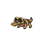 | [Sandile](../pokemon/sandile.md) | 21 | - | - |  |
|  | [Skorupi](../pokemon/skorupi.md) | 21 | - | - |  |
|  | [Foongus](../pokemon/foongus.md) | 21 | - | - |  |

### Team Plasma Grunt
| Sprite | Pokemon | Level | Ability | Item | Moves |
| --- | --- | --- | --- | --- | --- |
| 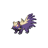 | [Stunky](../pokemon/stunky.md) | 21 | - | - |  |
| 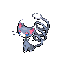 | [Glameow](../pokemon/glameow.md) | 21 | - | - |  |
| 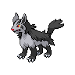 | [Mightyena](../pokemon/mightyena.md) | 21 | - | - |  |

### PKMN Ranger Forrest
| Sprite | Pokemon | Level | Ability | Item | Moves |
| --- | --- | --- | --- | --- | --- |
|  | [Dunsparce](../pokemon/dunsparce.md) | 22 | - | - |  |
|  | [Chimchar](../pokemon/chimchar.md) | 22 | - | - |  |
|  | [Heracross](../pokemon/heracross.md) | 22 | - | - |  |

### Youngster Nicholas
| Sprite | Pokemon | Level | Ability | Item | Moves |
| --- | --- | --- | --- | --- | --- |
|  | [Shroomish](../pokemon/shroomish.md) | 21 | - | - |  |
|  | [Cyndaquil](../pokemon/cyndaquil.md) | 21 | - | - |  |
|  | [Treecko](../pokemon/treecko.md) | 21 | - | - |  |

### PKMN Ranger Audra
| Sprite | Pokemon | Level | Ability | Item | Moves |
| --- | --- | --- | --- | --- | --- |
|  | [Tangela](../pokemon/tangela.md) | 22 | - | - |  |
|  | [Bulbasaur](../pokemon/bulbasaur.md) | 22 | - | - |  |
|  | [Scyther](../pokemon/scyther.md) | 22 | - | - |  |

### PKMN Ranger Irene
| Sprite | Pokemon | Level | Ability | Item | Moves |
| --- | --- | --- | --- | --- | --- |
|  | [Roselia](../pokemon/roselia.md) | 22 | - | - |  |
|  | [Chikorita](../pokemon/chikorita.md) | 22 | - | - |  |
|  | [Pinsir](../pokemon/pinsir.md) | 22 | - | - |  |

### Team Plasma Grunt
| Sprite | Pokemon | Level | Ability | Item | Moves |
| --- | --- | --- | --- | --- | --- |
|  | [Murkrow](../pokemon/murkrow.md) | 22 | - | - |  |
|  | [Liepard](../pokemon/liepard.md) | 22 | - | - |  |

### PKMN Ranger Miguel
| Sprite | Pokemon | Level | Ability | Item | Moves |
| --- | --- | --- | --- | --- | --- |
|  | [Vigoroth](../pokemon/vigoroth.md) | 22 | - | - |  |
|  | [Turtwig](../pokemon/turtwig.md) | 22 | - | - |  |
| 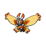 | [Mothim](../pokemon/mothim.md) | 22 | - | - |  |

### Team Plasma Grunt
| Sprite | Pokemon | Level | Ability | Item | Moves |
| --- | --- | --- | --- | --- | --- |
|  | [Golbat](../pokemon/golbat.md) | 23 | - | - |  |
|  | [Scraggy](../pokemon/scraggy.md) | 23 | - | - |  |
| 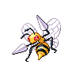 | [Beedrill](../pokemon/beedrill.md) | 23 | - | - |  |
|  | [Carnivine](../pokemon/carnivine.md) | 23 | - | - |  |

### School Kid Millie
| Sprite | Pokemon | Level | Ability | Item | Moves |
| --- | --- | --- | --- | --- | --- |
|  | [Tranquill](../pokemon/tranquill.md) | 22 | - | - |  |
|  | [Furret](../pokemon/furret.md) | 22 | - | - |  |
| 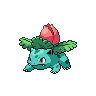 | [Ivysaur](../pokemon/ivysaur.md) | 22 | - | - |  |

### Lass Eva
| Sprite | Pokemon | Level | Ability | Item | Moves |
| --- | --- | --- | --- | --- | --- |
|  | [Oddish](../pokemon/oddish.md) | 22 | - | - |  |
|  | [Bellsprout](../pokemon/bellsprout.md) | 22 | - | - |  |
| 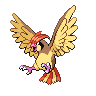 | [Pidgeotto](../pokemon/pidgeotto.md) | 22 | - | - |  |
| 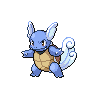 | [Wartortle](../pokemon/wartortle.md) | 22 | - | - |  |

### School Kid Sammy
| Sprite | Pokemon | Level | Ability | Item | Moves |
| --- | --- | --- | --- | --- | --- |
| 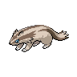 | [Linoone](../pokemon/linoone.md) | 22 | - | - |  |
| 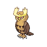 | [Noctowl](../pokemon/noctowl.md) | 22 | - | - |  |
|  | [Charmeleon](../pokemon/charmeleon.md) | 22 | - | - |  |
| 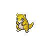 | [Sandshrew](../pokemon/sandshrew.md) | 22 | - | - |  |

