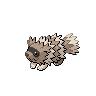
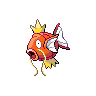

# Recall that no shaking grass will appear until after the first badge has been obtained!

##  Grass, Normal
| Sprite | Pokemon | Rate |
| --- | --- | --- |
|  | [Lillipup](../pokemon/lillipup.md) | 20% |
|  | [Pidgey](../pokemon/pidgey.md) | 20% |
|  | [Bidoof](../pokemon/bidoof.md) | 10% |
|  | [Sentret](../pokemon/sentret.md) | 10% |
|  | [Rattata](../pokemon/rattata.md) | 10% |
|  | [Zigzagoon](../pokemon/zigzagoon.md) | 10% |
|  | [Starly](../pokemon/starly.md) | 10% |
|  | [Hoothoot](../pokemon/hoothoot.md) | 10% |

##  Grass, Doubles
| Sprite | Pokemon | Rate |
| --- | --- | --- |
|  | [Herdier](../pokemon/herdier.md) | 20% |
|  | [Watchog](../pokemon/watchog.md) | 20% |
|  | [Bibarel](../pokemon/bibarel.md) | 10% |
|  | [Furret](../pokemon/furret.md) | 10% |
|  | [Raticate](../pokemon/raticate.md) | 10% |
|  | [Linoone](../pokemon/linoone.md) | 10% |
|  | [Mightyena](../pokemon/mightyena.md) | 5% |
|  | [Pidgeotto](../pokemon/pidgeotto.md) | 5% |
|  | [Staravia](../pokemon/staravia.md) | 5% |
|  | [Noctowl](../pokemon/noctowl.md) | 5% |

##  Grass, Special
| Sprite | Pokemon | Rate |
| --- | --- | --- |
|  | [Audino](../pokemon/audino.md) | 80% |
|  | [Happiny](../pokemon/happiny.md) | 10% |
|  | [Azurill](../pokemon/azurill.md) | 10% |

##  Surf, Normal
| Sprite | Pokemon | Rate |
| --- | --- | --- |
|  | [Basculin](../pokemon/basculin.md) | 60% |
|  | [Marill](../pokemon/marill.md) | 30% |
|  | [Feebas](../pokemon/feebas.md) | 10% |

##  Surf, Special
| Sprite | Pokemon | Rate |
| --- | --- | --- |
|  | [Basculin](../pokemon/basculin.md) | 60% |
|  | [Azumarill](../pokemon/azumarill.md) | 30% |
|  | [Feebas](../pokemon/feebas.md) | 10% |

##  Fish, Normal
| Sprite | Pokemon | Rate |
| --- | --- | --- |
|  | [Goldeen](../pokemon/goldeen.md) | 60% |
|  | [Magikarp](../pokemon/magikarp.md) | 30% |
|  | [Feebas](../pokemon/feebas.md) | 10% |

##  Fish, Special
| Sprite | Pokemon | Rate |
| --- | --- | --- |
|  | [Basculin](../pokemon/basculin.md) | 60% |
|  | [Dratini](../pokemon/dratini.md) | 30% |
|  | [Gyarados](../pokemon/gyarados.md) | 5% |
|  | [Milotic](../pokemon/milotic.md) | 5% |

