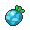
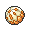
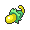
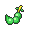
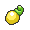

# Route 11

## Encounters
### General
####  Grass, Normal
| Sprite | Pokemon | Rate |
| --- | --- | --- |
|  | [Golduck](../pokemon/golduck.md) | 20% |
|  | [Bisharp](../pokemon/bisharp.md) | 20% |
|  | [Mandibuzz](../pokemon/mandibuzz.md) | 10% |
|  | [Braviary](../pokemon/braviary.md) | 10% |
|  | [Gligar](../pokemon/gligar.md) | 10% |
|  | [Marowak](../pokemon/marowak.md) | 10% |
|  | [Purugly](../pokemon/purugly.md) | 10% |
|  | [Skuntank](../pokemon/skuntank.md) | 10% |

####  Grass, Doubles
| Sprite | Pokemon | Rate |
| --- | --- | --- |
|  | [Loudred](../pokemon/loudred.md) | 20% |
|  | [Staravia](../pokemon/staravia.md) | 20% |
|  | [Vigoroth](../pokemon/vigoroth.md) | 10% |
|  | [Electabuzz](../pokemon/electabuzz.md) | 10% |
|  | [Magmar](../pokemon/magmar.md) | 10% |
|  | [Flygon](../pokemon/flygon.md) | 10% |
|  | [Rhydon](../pokemon/rhydon.md) | 10% |
|  | [Boldore](../pokemon/boldore.md) | 10% |

####  Grass, Special
| Sprite | Pokemon | Rate |
| --- | --- | --- |
|  | [Audino](../pokemon/audino.md) | 70% |
|  | [Emolga](../pokemon/emolga.md) | 10% |
|  | [Electivire](../pokemon/electivire.md) | 5% |
|  | [Magmortar](../pokemon/magmortar.md) | 5% |
|  | [Gliscor](../pokemon/gliscor.md) | 5% |
|  | [Staraptor](../pokemon/staraptor.md) | 5% |

####  Surf, Normal
| Sprite | Pokemon | Rate |
| --- | --- | --- |
|  | [Buizel](../pokemon/buizel.md) | 60% |
|  | [Floatzel](../pokemon/floatzel.md) | 40% |

####  Surf, Special
| Sprite | Pokemon | Rate |
| --- | --- | --- |
|  | [Dratini](../pokemon/dratini.md) | 60% |
|  | [Dragonair](../pokemon/dragonair.md) | 35% |
|  | [Dragonite](../pokemon/dragonite.md) | 5% |

####  Fish, Normal
| Sprite | Pokemon | Rate |
| --- | --- | --- |
|  | [Goldeen](../pokemon/goldeen.md) | 70% |
|  | [Basculin](../pokemon/basculin.md) | 30% |

####  Fish, Special
| Sprite | Pokemon | Rate |
| --- | --- | --- |
|  | [Goldeen](../pokemon/goldeen.md) | 60% |
|  | [Basculin](../pokemon/basculin.md) | 30% |
|  | [Seaking](../pokemon/seaking.md) | 10% |

## Items
### General
| Item |
| --- |
|  [Air Balloon](../items/air-balloon.md) Protector |
|  [Hyper Potion](../items/hyper-potion.md) |
|  [Hyper Potion](../items/hyper-potion.md) (With Dowsing Machine) |
|  [Max Revive](../items/max-revive.md) (With Dowsing Machine) |
|  [Protector](../items/protector.md) |
|  [TM50 Overheat](../items/tm50.md) |

## Trainers
### Gym Leader Cilan, Gym Leader Cress, Gym Leader Chili
**Battle Type:** Rotation Battle (First Fight) / Triple Battle (Rematch)  
**Reward:** [TM83](../moves/work-up.md) Work Up  

#### Cilan’s Team
| Sprite | Pokemon | Level | Ability | Item | Moves |
| --- | --- | --- | --- | --- | --- |
|  | [Serperior](../pokemon/serperior.md) | 86 | Overgrow |  Yache Berry | Leaf Storm, Light Screen, Reflect, Sunny Day |
|  | [Venusaur](../pokemon/venusaur.md) | 86 | Overgrow |  Payapa Berry | Growth, Earthquake, Power Whip, Sludge Bomb |
|  | [Meganium](../pokemon/meganium.md) | 86 | Overgrow |  Kebia Berry | Aromatherapy, Petal Dance, Toxic, Leech Seed |
|  | [Sceptile](../pokemon/sceptile.md) | 86 | Overgrow |  Tanga Berry | Energy Ball, Focus Blast, Dragon Pulse, Leaf Storm |
|  | [Torterra](../pokemon/torterra.md) | 86 | Overgrow |  Occa Berry | Earthquake, Crunch, Wood Hammer, Stone Edge |
|  | [Simisage](../pokemon/simisage.md) | 88 | Gluttony |  Liechi Berry | Leaf Storm, Rock Slide, Shadow Claw, Low Kick |

#### Cress’s Team
| Sprite | Pokemon | Level | Ability | Item | Moves |
| --- | --- | --- | --- | --- | --- |
|  | [Samurott](../pokemon/samurott.md) | 86 | Torrent |  Wacan Berry | Shell Smash**, Aqua Jet, Megahorn, Razor Shell |
|  | [Blastoise](../pokemon/blastoise.md) | 86 | Torrent |  Rindo Berry | Shell Smash*, Hydro Pump, Blizzard, Focus Blast |
|  | [Feraligatr](../pokemon/feraligatr.md) | 86 | Torrent |  Wacan Berry | Dragon Dance, Waterfall, Crunch, Earthquake |
|  | [Swampert](../pokemon/swampert.md) | 86 | Torrent |  Rindo Berry | Earthquake, Waterfall, Avalanche, Hammer Arm |
|  | [Empoleon](../pokemon/empoleon.md) | 86 | Torrent |  Shuca Berry | Hydro Pump, Flash Cannon, Grass Knot, Aqua Jet |
|  | [Simipour](../pokemon/simipour.md) | 88 | Gluttony |  Petaya Berry | Hydro Pump, Ice Beam, Grass Knot, Focus Blast |

