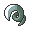
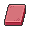
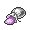
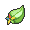

# Route 13

## Encounters
### General
####  Grass, Normal
| Sprite | Pokemon | Rate |
| --- | --- | --- |
|  | [Absol](../pokemon/absol.md) | 20% |
|  | [Drifblim](../pokemon/drifblim.md) | 20% |
|  | [Swellow](../pokemon/swellow.md) | 10% |
|  | [Lunatone](../pokemon/lunatone.md) | 10% |
|  | [Solrock](../pokemon/solrock.md) | 10% |
|  | [Wormadam](../pokemon/wormadam.md) | 10% |
|  | [Mothim](../pokemon/mothim.md) | 10% |
|  | [Pelipper](../pokemon/pelipper.md) | 10% |

####  Grass, Doubles
| Sprite | Pokemon | Rate |
| --- | --- | --- |
|  | [Golbat](../pokemon/golbat.md) | 20% |
|  | [Tangela](../pokemon/tangela.md) | 20% |
|  | [Nidorino](../pokemon/nidorino.md) | 10% |
|  | [Nidorina](../pokemon/nidorina.md) | 10% |
|  | [Yanma](../pokemon/yanma.md) | 10% |
|  | [Gloom](../pokemon/gloom.md) | 10% |
|  | [Weepinbell](../pokemon/weepinbell.md) | 10% |
|  | [Skiploom](../pokemon/skiploom.md) | 10% |

####  Grass, Special
| Sprite | Pokemon | Rate |
| --- | --- | --- |
|  | [Audino](../pokemon/audino.md) | 80% |
|  | [Tangrowth](../pokemon/tangrowth.md) | 5% |
|  | [Crobat](../pokemon/crobat.md) | 5% |
|  | [Nidoking](../pokemon/nidoking.md) | 5% |
|  | [Nidoqueen](../pokemon/nidoqueen.md) | 5% |

####  Surf, Normal
| Sprite | Pokemon | Rate |
| --- | --- | --- |
|  | [Pelipper](../pokemon/pelipper.md) | 60% |
|  | [Corsola](../pokemon/corsola.md) | 40% |

####  Surf, Special
| Sprite | Pokemon | Rate |
| --- | --- | --- |
|  | [Tentacruel](../pokemon/tentacruel.md) | 60% |
|  | [Starmie](../pokemon/starmie.md) | 30% |
|  | [Kingdra](../pokemon/kingdra.md) | 10% |

####  Fish, Normal
| Sprite | Pokemon | Rate |
| --- | --- | --- |
|  | [Shellder](../pokemon/shellder.md) | 65% |
|  | [Krabby](../pokemon/krabby.md) | 30% |
|  | [Luvdisc](../pokemon/luvdisc.md) | 5% |

####  Fish, Special
| Sprite | Pokemon | Rate |
| --- | --- | --- |
|  | [Shellder](../pokemon/shellder.md) | 60% |
|  | [Luvdisc](../pokemon/luvdisc.md) | 30% |
|  | [Kingler](../pokemon/kingler.md) | 5% |
|  | [Cloyster](../pokemon/cloyster.md) | 5% |

## Special Encounters
### [Lugia](../pokemon/lugia.md)
| Sprite | Level | Location | Method | Rate |
| --- | --- | --- | --- | --- |
|  | 70 | Route 13 |  Surf, Special | 1% |

*The sea is vast, and allows Lugia to spy on the humans it so dearly tries to protect. Of course, it’ll not hesitate to fight if a gifted trainer comes along, looking for a challenge…*

## Items
### General
| Item |
| --- |
|  [Binding Band](../items/binding-band.md) Electirizer |
|  [Grip Claw](../items/grip-claw.md) Razor Claw |
|  [Shed Shell](../items/shed-shell.md) Prism Scale |
|  [TM32 Double Team](../items/tm32.md) TM29 Psychic |
|  [Metronome](../items/metronome.md) TM89 U-turn (NPC) |
|  [Max Ether](../items/max-ether.md) |
|  [Max Revive](../items/max-revive.md) |
|  [DeepSeaScale](../items/deepseascale.md) |
|  [DeepSeaScale](../items/deepseascale.md) |
|  [DeepSeaScale](../items/deepseascale.md) |
|  [DeepSeaScale](../items/deepseascale.md) |
|  [DeepSeaTooth](../items/deepseatooth.md) |
|  [DeepSeaTooth](../items/deepseatooth.md) |
|  [Draco Plate](../items/draco-plate.md) |
|  [Dubious Disc](../items/dubious-disc.md) |
|  [Dubious Disc](../items/dubious-disc.md) |
|  [King's Rock](../items/kings-rock.md) |
|  [King's Rock](../items/kings-rock.md) |
|  [Lucky Egg](../items/lucky-egg.md) |
|  [Lucky Punch](../items/lucky-punch.md) |
|  [Magmarizer](../items/magmarizer.md) |
|  [Magmarizer](../items/magmarizer.md) |
|  [Metal Coat](../items/metal-coat.md) |
|  [Metal Coat](../items/metal-coat.md) |
|  [Metal Powder](../items/metal-powder.md) |
|  [Protector](../items/protector.md) |
|  [Protector](../items/protector.md) |
|  [Razor Fang](../items/razor-fang.md) |
|  [Razor Fang](../items/razor-fang.md) |
|  [Reaper Cloth](../items/reaper-cloth.md) |
|  [Reaper Cloth](../items/reaper-cloth.md) |
|  [Splash Plate](../items/splash-plate.md) |
|  [Stick](../items/stick.md) |
|  [Thick Club](../items/thick-club.md) |
|  [Dragon Scale](../items/dragon-scale.md) |
|  [Up-Grade](../items/up-grade.md) |
|  [Rare Candy](../items/rare-candy.md) |
|  [Big Pearl](../items/big-pearl.md) |
|  [Black Flute](../items/black-flute.md) |
|  [Blue Flute](../items/blue-flute.md) |
|  [Heart Scale](../items/heart-scale.md) |
|  [Heart Scale](../items/heart-scale.md) |
|  [Pearl](../items/pearl.md) |
|  [Pearl String](../items/pearl-string.md) |
|  [Red Flute](../items/red-flute.md) |
|  [Shoal Salt](../items/shoal-salt.md) |
|  [Shoal Shell](../items/shoal-shell.md) |
|  [Stardust](../items/stardust.md) |
|  [Stardust](../items/stardust.md) |
|  [White Flute](../items/white-flute.md) |
|  [Yellow Flute](../items/yellow-flute.md) |
|  [Gram 1](../items/gram-1.md) |
|  [Gram 2](../items/gram-2.md) |
|  [Gram 3](../items/gram-3.md) |

## Trainers
### Gym Leader Burgh
**Battle Type:** Double Battle (Initial) / Single Battle (Rematch)  
**Reward:** [TM89](../moves/u-turn.md) U-turn  

#### Burgh’s Team
| Sprite | Pokemon | Level | Ability | Item | Moves |
| --- | --- | --- | --- | --- | --- |
|  | [Yanmega](../pokemon/yanmega.md) | 87 | Speed Boost |  Occa Berry | Bug Buzz, Air Slash, Psychic, Shadow Ball |
|  | [Crustle](../pokemon/crustle.md) | 87 | Sturdy |  [White Herb](../items/white-herb.md) | Shell Smash, Stone Edge, X-Scissor, Earthquake |
|  | [Scizor](../pokemon/scizor.md) | 87 | Technician |  [Life Orb](../items/life-orb.md) | Bullet Punch, Bug Bite, Superpower, Pursuit |
|  | [Venomoth](../pokemon/venomoth.md) | 87 | Tinted Lens |  Starf Berry | Quiver Dance, Bug Buzz, Sludge Bomb, Sleep Powder |
|  | [Scolipede](../pokemon/scolipede.md) | 87 | Swarm |  Liechi Berry | Megahorn, Toxic Spikes, Spikes, Rock Slide |
|  | [Leavanny](../pokemon/leavanny.md) | 89 | Swarm |  [Focus Sash](../items/focus-sash.md) | X-Scissor, Leaf Blade, Agility, Shadow Claw |

### Gym Leader Elesa
**Battle Type:** Single Battle  
**Reward:** [TM93](../moves/wild-charge.md) Wild Charge  

#### Elesa’s Team
| Sprite | Pokemon | Level | Ability | Item | Moves |
| --- | --- | --- | --- | --- | --- |
|  | [Emolga](../pokemon/emolga.md) | 88 | Static |  Starf Berry | Baton Pass, Agility, Thunder, Light Screen |
|  | [Electivire](../pokemon/electivire.md) | 88 | Motor Drive |  Sitrus Berry | Volt Tackle*, Cross Chop, Ice Punch, Earthquake |
|  | [Jolteon](../pokemon/jolteon.md) | 88 | Volt Absorb |  Starf Berry | Thunder, Shadow Ball, Baton Pass, Thunder Wave |
|  | [Eelektross](../pokemon/eelektross.md) | 88 | Levitate |  [Flying Gem](../items/flying-gem.md) | Acrobatics, Thunder, Rock Slide, Flamethrower |
|  | [Galvantula](../pokemon/galvantula.md) | 88 | Compoundeyes |  [Wide Lens](../items/wide-lens.md) | Thunder, Bug Buzz, Energy Ball, Thunder Wave |
|  | [Zebstrika](../pokemon/zebstrika.md) | 90 | Motor Drive |  [Life Orb](../items/life-orb.md) | Volt Tackle*, Flame Charge, Quick Attack, Return |

