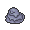
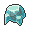

# Route 15

## Encounters
### General
####  Grass, Normal
| Sprite | Pokemon | Rate |
| --- | --- | --- |
|  | [Throh](../pokemon/throh.md) | 20% |
|  | [Sawk](../pokemon/sawk.md) | 20% |
|  | [Tyrogue](../pokemon/tyrogue.md) | 10% |
|  | [Graveler](../pokemon/graveler.md) | 10% |
|  | [Gabite](../pokemon/gabite.md) | 10% |
|  | [Pupitar](../pokemon/pupitar.md) | 10% |
|  | [Kangaskhan](../pokemon/kangaskhan.md) | 10% |
|  | [Marowak](../pokemon/marowak.md) | 10% |

####  Grass, Doubles
| Sprite | Pokemon | Rate |
| --- | --- | --- |
|  | [Machoke](../pokemon/machoke.md) | 20% |
|  | [Gurdurr](../pokemon/gurdurr.md) | 20% |
|  | [Pupitar](../pokemon/pupitar.md) | 10% |
|  | [Gligar](../pokemon/gligar.md) | 10% |
|  | [Kangaskhan](../pokemon/kangaskhan.md) | 10% |
|  | [Donphan](../pokemon/donphan.md) | 10% |
|  | [Ursaring](../pokemon/ursaring.md) | 10% |
|  | [Marowak](../pokemon/marowak.md) | 10% |

####  Grass, Special
| Sprite | Pokemon | Rate |
| --- | --- | --- |
|  | [Audino](../pokemon/audino.md) | 70% |
|  | [Emolga](../pokemon/emolga.md) | 10% |
|  | [Tyranitar](../pokemon/tyranitar.md) | 5% |
|  | [Gliscor](../pokemon/gliscor.md) | 5% |
|  | [Machamp](../pokemon/machamp.md) | 5% |
|  | [Conkeldurr](../pokemon/conkeldurr.md) | 5% |

## Special Encounters
!!! info
    LEGENDARY ENCOUNTER
    Groudon, Level 70
    Route 15
    Grass, Doubles, 1%
    * With the lack of volcanoes in Unova there isn’t much for Groudon to enjoy, but the mountainous terrain of Route 15 gives it at least some solace. Perhaps you’ll find it after shifting you a sea of various Rock, Ground, Normal and Fighting Pokémon. If you’re lucky.

## Items
### General
| Item | Original |
| --- | --- |
|  [Thick Club](../items/thick-club.md) | Up-Grade |
|  [Black Sludge](../items/black-sludge.md) | TM09 Venoshock |

## Trainers
### Gym Leader Iris
**Battle Type:** Triple Battle  
**Reward:** [TM82](../moves/dragon-tail.md) Dragon Tail  

#### Iris’s Team
| Sprite | Pokemon | Level | Ability | Item | Moves |
| --- | --- | --- | --- | --- | --- |
|  | [Kingdra](../pokemon/kingdra.md) | 87 | Swift Swim |  Damp Rock | Rain Dance, Hydro Pump, Blizzard, Dragon Pulse |
|  | [Druddigon](../pokemon/druddigon.md) | 87 | Rough Skin |  Rocky Helmet | Outrage, Superpower, Rock Slide, Substitute |
|  | [Altaria](../pokemon/altaria.md) | 87 | Natural Cure |  Sitrus Berry | Outrage, Roost, Cotton Guard, Ice Beam |
|  | [Garchomp](../pokemon/garchomp.md) | 89 | Sand Veil |  Yache Berry | Outrage, Earthquake, Stone Edge, Draco Meteor |
|  | [Dragonite](../pokemon/dragonite.md) | 89 | Inner Focus |  Sitrus Berry | Outrage, Hurricane, Thunder, Roost |
|  | [Haxorus](../pokemon/haxorus.md) | 89 | Mold Breaker |  [Choice Band](../items/choice-band.md) | Outrage, Dual Chop, Earthquake, Brick Break |

