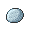

# Route 2

## Encounters
### General
####  Grass, Normal
| Sprite | Pokemon | Rate |
| --- | --- | --- |
|  | [Purrloin](../pokemon/purrloin.md) | 20% |
|  | [Patrat](../pokemon/patrat.md) | 20% |
|  | [Kricketot](../pokemon/kricketot.md) | 10% |
|  | [Caterpie](../pokemon/caterpie.md) | 10% |
|  | [Wurmple](../pokemon/wurmple.md) | 10% |
|  | [Weedle](../pokemon/weedle.md) | 10% |
|  | [Poochyena](../pokemon/poochyena.md) | 5% |
|  | [Meowth](../pokemon/meowth.md) | 5% |
|  | [Spearow](../pokemon/spearow.md) | 5% |
|  | [Mankey](../pokemon/mankey.md) | 5% |

####  Grass, Special
| Sprite | Pokemon | Rate |
| --- | --- | --- |
|  | [Audino](../pokemon/audino.md) | 60% |
|  | [Skitty](../pokemon/skitty.md) | 10% |
|  | [Nincada](../pokemon/nincada.md) | 10% |
|  | [Butterfree](../pokemon/butterfree.md) | 5% |
|  | [Beedrill](../pokemon/beedrill.md) | 5% |
|  | [Beautifly](../pokemon/beautifly.md) | 5% |
|  | [Dustox](../pokemon/dustox.md) | 5% |

## Items
### General
| Item | Original |
| --- | --- |
|  [Oval Stone](../items/oval-stone.md) | Pok Ball |
|  [Everstone](../items/everstone.md) | Potion |

## Trainers
### Youngster Jimmy
| Sprite | Pokemon | Level | Ability | Item | Moves |
| --- | --- | --- | --- | --- | --- |
|  | [Hoothoot](../pokemon/hoothoot.md) | 7 | - | - |  |
|  | [Wurmple](../pokemon/wurmple.md) | 7 | - | - |  |
|  | [Patrat](../pokemon/patrat.md) | 7 | - | - |  |

### Lass Mail
| Sprite | Pokemon | Level | Ability | Item | Moves |
| --- | --- | --- | --- | --- | --- |
|  | [Zigzagoon](../pokemon/zigzagoon.md) | 7 | - | - |  |
|  | [Meowth](../pokemon/meowth.md) | 7 | - | - |  |
|  | [Pidgey](../pokemon/pidgey.md) | 7 | - | - |  |
|  | [Caterpie](../pokemon/caterpie.md) | 7 | - | - |  |

### Youngster Roland
| Sprite | Pokemon | Level | Ability | Item | Moves |
| --- | --- | --- | --- | --- | --- |
|  | [Lillipup](../pokemon/lillipup.md) | 7 | - | - |  |
|  | [Bidoof](../pokemon/bidoof.md) | 7 | - | - |  |
|  | [Kricketot](../pokemon/kricketot.md) | 7 | - | - |  |
|  | [Weedle](../pokemon/weedle.md) | 7 | - | - |  |

### Rival Bianca – 1
**Battle Type:** Single Battle  

#### Bianca’s Team
| Sprite | Pokemon | Level | Ability | Item | Moves |
| --- | --- | --- | --- | --- | --- |
|  | [Snivy](../pokemon/snivy.md) | 5 | - | - |  |

