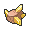

# Route 8

## Items
### General
| Item |
| --- |
|  [Full Heal](../items/full-heal.md) |
|  [Full Restore](../items/full-restore.md) (From Bianca) |
|  [Full Restore](../items/full-restore.md) (With Dowsing Machine) |
|  [Max Elixir](../items/max-elixir.md) (With Dowsing Machine) |
|  [Damp Rock](../items/damp-rock.md) |
|  [Heat Rock](../items/heat-rock.md) |
|  [Icy Rock](../items/icy-rock.md) |
|  [Poison Barb](../items/poison-barb.md) |
|  [Smooth Rock](../items/smooth-rock.md) |
|  [Ultra Ball](../items/ultra-ball.md) |
|  [TM36 Sludge Bomb](../items/tm36.md) |
|  [TM42 Facade](../items/tm42.md) |

## Trainers
### PKMN Ranger Lewis
| Sprite | Pokemon | Level | Ability | Item | Moves |
| --- | --- | --- | --- | --- | --- |
|  | [Maractus](../pokemon/maractus.md) | 57 | - | - |  |
|  | [Politoed](../pokemon/politoed.md) | 57 | - | - |  |
|  | [Escavalier](../pokemon/escavalier.md) | 57 | - | - |  |

### Parasol Lady Melita
| Sprite | Pokemon | Level | Ability | Item | Moves |
| --- | --- | --- | --- | --- | --- |
|  | [Jellicent](../pokemon/jellicent.md) | 58 | - | - |  |
|  | [Kingdra](../pokemon/kingdra.md) | 58 | - | - |  |

### Fisherman Bruce
| Sprite | Pokemon | Level | Ability | Item | Moves |
| --- | --- | --- | --- | --- | --- |
|  | [Basculin](../pokemon/basculin.md) | 58 | - | - |  |
|  | [Basculin](../pokemon/basculin.md) | 58 | - | - |  |
|  | [Kingler](../pokemon/kingler.md) | 58 | - | - |  |
|  | [Whiscash](../pokemon/whiscash.md) | 58 | - | - |  |

### Parasol Lady Lumi
| Sprite | Pokemon | Level | Ability | Item | Moves |
| --- | --- | --- | --- | --- | --- |
|  | [Flareon](../pokemon/flareon.md) | 58 | - | - |  |
|  | [Flygon](../pokemon/flygon.md) | 58 | - | - |  |

### PKMN Ranger Annie
| Sprite | Pokemon | Level | Ability | Item | Moves |
| --- | --- | --- | --- | --- | --- |
|  | [Tropius](../pokemon/tropius.md) | 58 | - | - |  |
|  | [Cinccino](../pokemon/cinccino.md) | 58 | - | - |  |
|  | [Archeops](../pokemon/archeops.md) | 58 | - | - |  |

### Rival Bianca – 1
**Battle Type:** Single Battle  

#### Bianca’s Team
| Sprite | Pokemon | Level | Ability | Item | Moves |
| --- | --- | --- | --- | --- | --- |
|  | [Snivy](../pokemon/snivy.md) | 5 | - | - |  |

