# Route 9

## Encounters
### General
####  Grass, Normal
| Sprite | Pokemon | Rate |
| --- | --- | --- |
|  | [Gothorita](../pokemon/gothorita.md) | 20% |
|  | [Duosion](../pokemon/duosion.md) | 20% |
|  | [Kirlia](../pokemon/kirlia.md) | 10% |
| 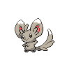 | [Minccino](../pokemon/minccino.md) | 10% |
|  | [Pawniard](../pokemon/pawniard.md) | 10% |
|  | [Skitty](../pokemon/skitty.md) | 10% |
|  | [Liepard](../pokemon/liepard.md) | 10% |
|  | [Persian](../pokemon/persian.md) | 10% |

####  Grass, Doubles
| Sprite | Pokemon | Rate |
| --- | --- | --- |
| 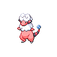 | [Flaaffy](../pokemon/flaaffy.md) | 20% |
|  | [Luxio](../pokemon/luxio.md) | 20% |
|  | [Hypno](../pokemon/hypno.md) | 10% |
|  | [Cinccino](../pokemon/cinccino.md) | 10% |
|  | [Bisharp](../pokemon/bisharp.md) | 10% |
|  | [Garbodor](../pokemon/garbodor.md) | 10% |
|  | [Houndoom](../pokemon/houndoom.md) | 10% |
|  | [Granbull](../pokemon/granbull.md) | 10% |

####  Grass, Special
| Sprite | Pokemon | Rate |
| --- | --- | --- |
|  | [Audino](../pokemon/audino.md) | 90% |
|  | [Gothitelle](../pokemon/gothitelle.md) | 5% |
|  | [Reuniclus](../pokemon/reuniclus.md) | 5% |

## Special Encounters
### [Raikou](../pokemon/raikou.md)
| Sprite | Level | Location | Method | Rate |
| --- | --- | --- | --- | --- |
|  | 50 | Route 9 |  Grass, Special. | 1% |

*You’ll have to sift through loads of Audino for this beast. Raikou is naturally attracted to electricity, and the Department Store in the route has plenty of that.*

### [Entei](../pokemon/entei.md)
| Sprite | Level | Location | Method | Rate |
| --- | --- | --- | --- | --- |
|  | 50 | Route 9 |  Grass, Special. | 1% |

*Entei and Raikou are like best friends and brothers; they will always stay together, and Entei will follow Raikou to whatever attracts him.*

## Items
### General
| Item |
| --- |
| 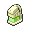 [Full Restore](../items/full-restore.md) |
| 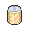 [Lemonade](../items/lemonade.md) |
| 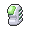 [Max Ether](../items/max-ether.md) |
|  [Thunderstone](../items/thunderstone.md) |
|  [HP Up](../items/hp-up.md) |
|  [PP Up](../items/pp-up.md) |

### Shop
| Item |
| --- |
| 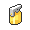 [Antidote](../items/antidote.md) |
| 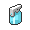 [Awakening](../items/awakening.md) |
| 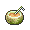 [Berry Juice](../items/berry-juice.md) |
| 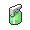 [Burn Heal](../items/burn-heal.md) |
| 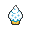 [Casteliacone](../items/casteliacone.md) |
| 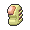 [Elixir](../items/elixir.md) |
| 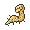 [Energy Root](../items/energy-root.md) |
| 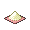 [Energy Powder](../items/energy-powder.md) |
| 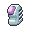 [Ether](../items/ether.md) |
|  [Fresh Water](../items/fresh-water.md) |
|  [Full Heal](../items/full-heal.md) |
|  [Full Restore](../items/full-restore.md) |
| 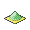 [Heal Powder](../items/heal-powder.md) |
| 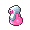 [Hyper Potion](../items/hyper-potion.md) |
| 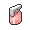 [Ice Heal](../items/ice-heal.md) |
| 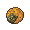 [Lava Cookie](../items/lava-cookie.md) |
|  [Lemonade](../items/lemonade.md) |
| 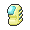 [Max Elixir](../items/max-elixir.md) |
|  [Max Ether](../items/max-ether.md) |
| 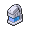 [Max Potion](../items/max-potion.md) |
|  [Max Revive](../items/max-revive.md) |
|  [Moomoo Milk](../items/moomoo-milk.md) |
|  [Old Gateau](../items/old-gateau.md) |
|  [Parlyz Heal](../items/parlyz-heal.md) |
| 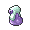 [Potion](../items/potion.md) |
|  [Ragecandybar](../items/ragecandybar.md) |
| 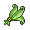 [Revival Herb](../items/revival-herb.md) |
|  [Revive](../items/revive.md) |
| 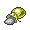 [Sacred Ash](../items/sacred-ash.md) |
| 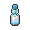 [Soda Pop](../items/soda-pop.md) |
| 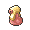 [Super Potion](../items/super-potion.md) |
| 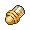 [Dire Hit](../items/dire-hit.md) |
| 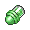 [Guard Spec.](../items/guard-spec.md) |
| 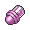 [X Accuracy](../items/x-accuracy.md) |
| 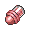 [X Attack](../items/x-attack.md) |
| 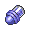 [X Defend](../items/x-defend.md) |
| 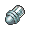 [X Sp. Def](../items/x-sp-def.md) |
| 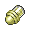 [X Special](../items/x-special.md) |
| 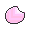 [Deep Sea Scale](../items/deep-sea-scale.md) |
|  [Deep Sea Tooth](../items/deep-sea-tooth.md) |
| 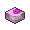 [Dubious Disc](../items/dubious-disc.md) |
| 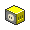 [Electirizer](../items/electirizer.md) |
|  [King's Rock](../items/kings-rock.md) |
|  [Magmarizer](../items/magmarizer.md) |
| 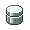 [Metal Coat](../items/metal-coat.md) |
| 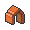 [Protector](../items/protector.md) |
| 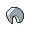 [Razor Claw](../items/razor-claw.md) |
| 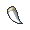 [Razor Fang](../items/razor-fang.md) |
| 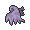 [Reaper Cloth](../items/reaper-cloth.md) |
| 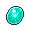 [Dawn Stone](../items/dawn-stone.md) |
|  [Dragon Scale](../items/dragon-scale.md) |
| 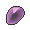 [Dusk Stone](../items/dusk-stone.md) |
| 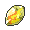 [Fire Stone](../items/fire-stone.md) |
| 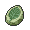 [Leaf Stone](../items/leaf-stone.md) |
|  [Moon Stone](../items/moon-stone.md) |
| 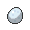 [Oval Stone](../items/oval-stone.md) |
|  [Prism Scale](../items/prism-scale.md) |
| 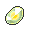 [Shiny Stone](../items/shiny-stone.md) |
| 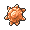 [Sun Stone](../items/sun-stone.md) |
|  [Thunderstone](../items/thunderstone.md) |
| 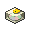 [Up-Grade](../items/up-grade.md) |
| 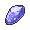 [Water Stone](../items/water-stone.md) |
|  [Calcium](../items/calcium.md) |
|  [Carbos](../items/carbos.md) |
|  [Clever Wing](../items/clever-wing.md) |
|  [Genius Wing](../items/genius-wing.md) |
|  [HP Up](../items/hp-up.md) |
|  [Health Wing](../items/health-wing.md) |
|  [Iron](../items/iron.md) |
|  [Muscle Wing](../items/muscle-wing.md) |
|  [PP Max](../items/pp-max.md) |
|  [PP Up](../items/pp-up.md) |
|  [Protein](../items/protein.md) |
| 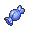 [Rare Candy](../items/rare-candy.md) |
|  [Resist Wing](../items/resist-wing.md) |
|  [Swift Wing](../items/swift-wing.md) |
|  [Zinc](../items/zinc.md) |
|  [Balm Mushroom](../items/balm-mushroom.md) |
|  [Big Mushroom](../items/big-mushroom.md) |
|  [Big Nugget](../items/big-nugget.md) |
|  [Big Pearl](../items/big-pearl.md) |
|  [Black Flute](../items/black-flute.md) |
|  [Blue Flute](../items/blue-flute.md) |
|  [Blue Shard](../items/blue-shard.md) |
|  [Comet Shard](../items/comet-shard.md) |
|  [Escape Rope](../items/escape-rope.md) |
|  [Fluffy Tail](../items/fluffy-tail.md) |
|  [Green Shard](../items/green-shard.md) |
|  [Heart Scale](../items/heart-scale.md) |
|  [Honey](../items/honey.md) |
|  [Max Repel](../items/max-repel.md) |
|  [Nugget](../items/nugget.md) |
|  [Pass Orb](../items/pass-orb.md) |
|  [Pearl](../items/pearl.md) |
|  [Pearl String](../items/pearl-string.md) |
|  [Poké Doll](../items/poke-doll.md) |
|  [Poké Toy](../items/poke-toy.md) |
|  [Pretty Wing](../items/pretty-wing.md) |
|  [Rare Bone](../items/rare-bone.md) |
|  [Red Flute](../items/red-flute.md) |
|  [Red Shard](../items/red-shard.md) |
|  [Relic Band](../items/relic-band.md) |
|  [Relic Copper](../items/relic-copper.md) |
|  [Relic Crown](../items/relic-crown.md) |
|  [Relic Gold](../items/relic-gold.md) |
|  [Relic Silver](../items/relic-silver.md) |
|  [Relic Statue](../items/relic-statue.md) |
|  [Relic Vase](../items/relic-vase.md) |
|  [Repel](../items/repel.md) |
|  [Shoal Salt](../items/shoal-salt.md) |
|  [Shoal Shell](../items/shoal-shell.md) |
|  [Star Piece](../items/star-piece.md) |
|  [Stardust](../items/stardust.md) |
|  [Super Repel](../items/super-repel.md) |
|  [Tiny Mushroom](../items/tiny-mushroom.md) |
|  [White Flute](../items/white-flute.md) |
|  [Yellow Flute](../items/yellow-flute.md) |
|  [Yellow Shard](../items/yellow-shard.md) |
|  [Cherish Ball](../items/cherish-ball.md) |
|  [Dive Ball](../items/dive-ball.md) |
|  [Dream Ball](../items/dream-ball.md) |
|  [Dusk Ball](../items/dusk-ball.md) |
|  [Great Ball](../items/great-ball.md) |
|  [Heal Ball](../items/heal-ball.md) |
|  [Luxury Ball](../items/luxury-ball.md) |
|  [Master Ball](../items/master-ball.md) |
|  [Nest Ball](../items/nest-ball.md) |
|  [Net Ball](../items/net-ball.md) |
|  [Poké Ball](../items/poke-ball.md) |
|  [Premier Ball](../items/premier-ball.md) |
|  [Quick Ball](../items/quick-ball.md) |
|  [Repeat Ball](../items/repeat-ball.md) |
|  [Safari Ball](../items/safari-ball.md) |
|  [Timer Ball](../items/timer-ball.md) |
|  [Ultra Ball](../items/ultra-ball.md) |
|  [Favored Mail](../items/favored-mail.md) |
|  [Greet Mail](../items/greet-mail.md) |
|  [Inquiry Mail](../items/inquiry-mail.md) |
|  [Like Mail](../items/like-mail.md) |
|  [RSVP](../items/rsvp.md) |
|  [Reply Mail](../items/reply-mail.md) |
|  [Thanks Mail](../items/thanks-mail.md) |
|  [TM15 Hyper Beam](../items/tm15.md) |
|  [TM68 Giga Impact](../items/tm68.md) |

## Trainers
### Roughneck Reese
| Sprite | Pokemon | Level | Ability | Item | Moves |
| --- | --- | --- | --- | --- | --- |
|  | [Scrafty](../pokemon/scrafty.md) | 61 | - | - |  |
|  | [Garbodor](../pokemon/garbodor.md) | 61 | - | - |  |

### Biker Philip
| Sprite | Pokemon | Level | Ability | Item | Moves |
| --- | --- | --- | --- | --- | --- |
|  | [Bouffalant](../pokemon/bouffalant.md) | 62 | - | - |  |

### Hooligans Jim & Cas
| Sprite | Pokemon | Level | Ability | Item | Moves |
| --- | --- | --- | --- | --- | --- |
|  | [Cacturne](../pokemon/cacturne.md) | 61 | - | - |  |
|  | [Shiftry](../pokemon/shiftry.md) | 61 | - | - |  |

### Biker Zeke
| Sprite | Pokemon | Level | Ability | Item | Moves |
| --- | --- | --- | --- | --- | --- |
|  | [Pawniard](../pokemon/pawniard.md) | 61 | - | - |  |
|  | [Bisharp](../pokemon/bisharp.md) | 61 | - | - |  |

### Roughneck Chance
| Sprite | Pokemon | Level | Ability | Item | Moves |
| --- | --- | --- | --- | --- | --- |
|  | [Chansey](../pokemon/chansey.md) | 62 | - | - |  |

### Waitress Flo
| Sprite | Pokemon | Level | Ability | Item | Moves |
| --- | --- | --- | --- | --- | --- |
|  | [Clefable](../pokemon/clefable.md) | 61 | - | - |  |
|  | [Lilligant](../pokemon/lilligant.md) | 61 | - | - |  |
|  | [Gorebyss](../pokemon/gorebyss.md) | 61 | - | - |  |

### Rich Boy Manuel
| Sprite | Pokemon | Level | Ability | Item | Moves |
| --- | --- | --- | --- | --- | --- |
|  | [Arcanine](../pokemon/arcanine.md) | 61 | - | - |  |
|  | [Raichu](../pokemon/raichu.md) | 61 | - | - |  |
|  | [Grumpig](../pokemon/grumpig.md) | 61 | - | - |  |

### Waiter Bert
| Sprite | Pokemon | Level | Ability | Item | Moves |
| --- | --- | --- | --- | --- | --- |
|  | [Simisage](../pokemon/simisage.md) | 61 | - | - |  |
|  | [Chandelure](../pokemon/chandelure.md) | 61 | - | - |  |
|  | [Politoed](../pokemon/politoed.md) | 61 | - | - |  |

### Lady Isabel
| Sprite | Pokemon | Level | Ability | Item | Moves |
| --- | --- | --- | --- | --- | --- |
|  | [Stoutland](../pokemon/stoutland.md) | 61 | - | - |  |
|  | [Gengar](../pokemon/gengar.md) | 61 | - | - |  |
|  | [Snorlax](../pokemon/snorlax.md) | 61 | - | - |  |

