# Route 16

##  Grass, Normal
| Sprite | Pokemon | Rate |
| --- | --- | --- |
|  | [Ekans](../pokemon/ekans.md) | 20% |
|  | [Pineco](../pokemon/pineco.md) | 20% |
|  | [Skorupi](../pokemon/skorupi.md) | 10% |
|  | [Electrike](../pokemon/electrike.md) | 10% |
| 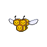 | [Combee](../pokemon/combee.md) | 10% |
| 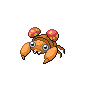 | [Paras](../pokemon/paras.md) | 10% |
| 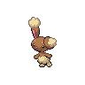 | [Buneary](../pokemon/buneary.md) | 5% |
|  | [Pawniard](../pokemon/pawniard.md) | 5% |
|  | [Drifloon](../pokemon/drifloon.md) | 5% |
|  | [Spoink](../pokemon/spoink.md) | 5% |

##  Grass, Doubles
| Sprite | Pokemon | Rate |
| --- | --- | --- |
|  | [Zangoose](../pokemon/zangoose.md) | 20% |
|  | [Seviper](../pokemon/seviper.md) | 20% |
|  | [Stunky](../pokemon/stunky.md) | 10% |
|  | [Glameow](../pokemon/glameow.md) | 10% |
| 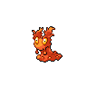 | [Slugma](../pokemon/slugma.md) | 10% |
|  | [Vespiquen](../pokemon/vespiquen.md) | 10% |
| 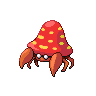 | [Parasect](../pokemon/parasect.md) | 10% |
|  | [Girafarig](../pokemon/girafarig.md) | 5% |
|  | [Castform](../pokemon/castform.md) | 5% |

##  Grass, Special
| Sprite | Pokemon | Rate |
| --- | --- | --- |
|  | [Audino](../pokemon/audino.md) | 70% |
| 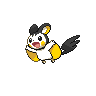 | [Emolga](../pokemon/emolga.md) | 10% |
|  | [Bisharp](../pokemon/bisharp.md) | 10% |
| 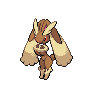 | [Lopunny](../pokemon/lopunny.md) | 10% |

## Trainers
### Cycling Hector
| Sprite | Pokemon | Level | Ability | Item | Moves |
| --- | --- | --- | --- | --- | --- |
|  | Staravia | 30 | - | - |  |
|  | Ponyta | 30 | - | - |  |

### Backpacker Peter
| Sprite | Pokemon | Level | Ability | Item | Moves |
| --- | --- | --- | --- | --- | --- |
|  | Klink | 30 | - | - |  |
| 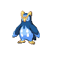 | Prinplup | 30 | - | - |  |

### Cycling Krissa
| Sprite | Pokemon | Level | Ability | Item | Moves |
| --- | --- | --- | --- | --- | --- |
|  | Archen | 30 | - | - |  |
|  | Grotle | 30 | - | - |  |

### Policeman Daniel
| Sprite | Pokemon | Level | Ability | Item | Moves |
| --- | --- | --- | --- | --- | --- |
|  | Houndoom | 30 | - | - |  |
| 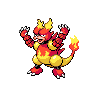 | Magmar | 30 | - | - |  |

### Backpacker Lora
| Sprite | Pokemon | Level | Ability | Item | Moves |
| --- | --- | --- | --- | --- | --- |
| 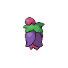 | Cherrim | 30 | - | - |  |
| 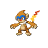 | Monferno | 30 | - | - |  |

### Backpacker Stephen
| Sprite | Pokemon | Level | Ability | Item | Moves |
| --- | --- | --- | --- | --- | --- |
|  | Corphish | 30 | - | - |  |
|  | Ariados | 30 | - | - |  |

