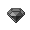
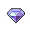
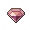
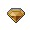
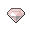
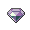
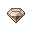
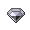
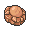

# Twist Mountain

## Encounters
### 1F - All Seasons
####  Cave, Normal
| Sprite | Pokemon | Rate |
| --- | --- | --- |
|  | [Phanpy](../pokemon/phanpy.md) | 20% |
|  | [Teddiursa](../pokemon/teddiursa.md) | 20% |
|  | [Cubchoo](../pokemon/cubchoo.md) | 10% |
|  | [Sneasel](../pokemon/sneasel.md) | 10% |
|  | [Delibird](../pokemon/delibird.md) | 10% |
|  | [Swinub](../pokemon/swinub.md) | 10% |
|  | [Graveler](../pokemon/graveler.md) | 5% |
|  | [Boldore](../pokemon/boldore.md) | 5% |
|  | [Cryogonal](../pokemon/cryogonal.md) | 5% |
|  | [Gurdurr](../pokemon/gurdurr.md) | 5% |

####  Cave, Special
| Sprite | Pokemon | Rate |
| --- | --- | --- |
|  | [Excadrill](../pokemon/excadrill.md) | 50% |
|  | [Dugtrio](../pokemon/dugtrio.md) | 50% |

### Not 1F - All Seasons
####  Cave, Normal
| Sprite | Pokemon | Rate |
| --- | --- | --- |
|  | [Donphan](../pokemon/donphan.md) | 20% |
|  | [Ursaring](../pokemon/ursaring.md) | 20% |
|  | [Beartic](../pokemon/beartic.md) | 10% |
|  | [Sneasel](../pokemon/sneasel.md) | 10% |
|  | [Delibird](../pokemon/delibird.md) | 10% |
|  | [Piloswine](../pokemon/piloswine.md) | 10% |
|  | [Mawile](../pokemon/mawile.md) | 5% |
|  | [Sableye](../pokemon/sableye.md) | 5% |
|  | [Cryogonal](../pokemon/cryogonal.md) | 5% |
|  | [Durant](../pokemon/durant.md) | 5% |

####  Cave, Special
| Sprite | Pokemon | Rate |
| --- | --- | --- |
|  | [Excadrill](../pokemon/excadrill.md) | 50% |
|  | [Dugtrio](../pokemon/dugtrio.md) | 50% |

## Special Encounters
### [Regice](../pokemon/regice.md)
| Sprite | Level | Location | Method | Rate |
| --- | --- | --- | --- | --- |
|  | 50 | Twist Mountain, Ice Rock Room, Winter |  Cave, Normal | 1% |

*Unlike its brothers, Regice prefers only the very coldest of climates. Try your luck in a harsh Winter at the depths of the area, and you might just have a chance at finding it.*

## Items
### General
| Item |
| --- |
|  [Elixir](../items/elixir.md) (With Dowsing Machine) |
|  [Ether](../items/ether.md) |
|  [Full Heal](../items/full-heal.md) |
|  [Hyper Potion](../items/hyper-potion.md) (With Dowsing Machine) |
|  [Max Potion](../items/max-potion.md) |
|  [Revive](../items/revive.md) (With Dowsing Machine) |
|  [Revive](../items/revive.md) |
|  [Bug Gem](../items/bug-gem.md) |
|  [Dark Gem](../items/dark-gem.md) |
|  [Dragon Gem](../items/dragon-gem.md) |
|  [Electric Gem](../items/electric-gem.md) |
|  [Fighting Gem](../items/fighting-gem.md) |
|  [Fire Gem](../items/fire-gem.md) |
|  [Flying Gem](../items/flying-gem.md) |
|  [Ghost Gem](../items/ghost-gem.md) |
|  [Grass Gem](../items/grass-gem.md) |
|  [Ground Gem](../items/ground-gem.md) |
|  [Ice Gem](../items/ice-gem.md) |
|  [Normal Gem](../items/normal-gem.md) |
|  [Poison Gem](../items/poison-gem.md) |
|  [Psychic Gem](../items/psychic-gem.md) |
|  [Rock Gem](../items/rock-gem.md) |
|  [Steel Gem](../items/steel-gem.md) |
|  [Water Gem](../items/water-gem.md) |
|  [Dawn Stone](../items/dawn-stone.md) (Dustcloud) |
|  [Dusk Stone](../items/dusk-stone.md) (Dustcloud) |
|  [Fire Stone](../items/fire-stone.md) (Dustcloud) |
|  [Leaf Stone](../items/leaf-stone.md) (Dustcloud) |
|  [Moon Stone](../items/moon-stone.md) |
|  [Moon Stone](../items/moon-stone.md) (Dustcloud) |
|  [Shiny Stone](../items/shiny-stone.md) (Dustcloud) |
|  [Thunderstone](../items/thunderstone.md) (Dustcloud) |
|  [Water Stone](../items/water-stone.md) (Dustcloud) |
|  [Iron](../items/iron.md) (With Dowsing Machine) |
|  [PP Up](../items/pp-up.md) |
|  [Protein](../items/protein.md) (With Dowsing Machine) |
|  [Rare Candy](../items/rare-candy.md) (With Dowsing Machine) |
|  [Nugget](../items/nugget.md) |
|  [Stardust](../items/stardust.md) (With Dowsing Machine) |
|  [Stardust](../items/stardust.md) (With Dowsing Machine) |
|  [Stardust](../items/stardust.md) (With Dowsing Machine) |
|  [Ultra Ball](../items/ultra-ball.md) |
|  [Ultra Ball](../items/ultra-ball.md) (With Dowsing Machine) |
|  [Armor Fossil](../items/armor-fossil.md) |
|  [Claw Fossil](../items/claw-fossil.md) |
|  [Dome Fossil](../items/dome-fossil.md) |
|  [Helix Fossil](../items/helix-fossil.md) |
|  [Old Amber](../items/old-amber.md) |
|  [Root Fossil](../items/root-fossil.md) |
|  [Skull Fossil](../items/skull-fossil.md) |
|  [TM90 Substitute](../items/tm90.md) (Winter Only) |
|  [TM91 Flash Cannon](../items/tm91.md) |
|  [HM03 Surf](../items/hm03.md) (From Alder) |

### Shop
| Item |
| --- |
|  [Antidote](../items/antidote.md) |
|  [Awakening](../items/awakening.md) |
|  [Berry Juice](../items/berry-juice.md) |
|  [Burn Heal](../items/burn-heal.md) |
|  [Casteliacone](../items/casteliacone.md) |
|  [Elixir](../items/elixir.md) |
|  [Energy Root](../items/energy-root.md) |
|  [Energy Powder](../items/energy-powder.md) |
|  [Ether](../items/ether.md) |
|  [Fresh Water](../items/fresh-water.md) |
|  [Full Heal](../items/full-heal.md) |
|  [Full Restore](../items/full-restore.md) |
|  [Heal Powder](../items/heal-powder.md) |
|  [Hyper Potion](../items/hyper-potion.md) |
|  [Ice Heal](../items/ice-heal.md) |
|  [Lava Cookie](../items/lava-cookie.md) |
|  [Lemonade](../items/lemonade.md) |
|  [Max Elixir](../items/max-elixir.md) |
|  [Max Ether](../items/max-ether.md) |
|  [Max Potion](../items/max-potion.md) |
|  [Max Revive](../items/max-revive.md) |
|  [Moomoo Milk](../items/moomoo-milk.md) |
|  [Old Gateau](../items/old-gateau.md) |
|  [Parlyz Heal](../items/parlyz-heal.md) |
|  [Potion](../items/potion.md) |
|  [Ragecandybar](../items/ragecandybar.md) |
|  [Revival Herb](../items/revival-herb.md) |
|  [Revive](../items/revive.md) |
|  [Sacred Ash](../items/sacred-ash.md) |
|  [Soda Pop](../items/soda-pop.md) |

## Trainers
### Rival Cheren – 1
**Battle Type:** Single Battle  

#### Cheren’s Team
| Sprite | Pokemon | Level | Ability | Item | Moves |
| --- | --- | --- | --- | --- | --- |
|  | [Snivy](../pokemon/snivy.md) | 5 | - | - |  |

### Hiker Terrell
| Sprite | Pokemon | Level | Ability | Item | Moves |
| --- | --- | --- | --- | --- | --- |
|  | [Magcargo](../pokemon/magcargo.md) | 45 | - | - |  |
|  | [Swampert](../pokemon/swampert.md) | 45 | - | - |  |

### Black Belt Teppei
| Sprite | Pokemon | Level | Ability | Item | Moves |
| --- | --- | --- | --- | --- | --- |
|  | [Machamp](../pokemon/machamp.md) | 54 | - | - |  |

### Worker Rich
| Sprite | Pokemon | Level | Ability | Item | Moves |
| --- | --- | --- | --- | --- | --- |
|  | [Glalie](../pokemon/glalie.md) | 53 | - | - |  |
|  | [Kangaskhan](../pokemon/kangaskhan.md) | 53 | - | - |  |

### Worker Rob
| Sprite | Pokemon | Level | Ability | Item | Moves |
| --- | --- | --- | --- | --- | --- |
|  | [Metang](../pokemon/metang.md) | 54 | - | - |  |
|  | [Toxicroak](../pokemon/toxicroak.md) | 54 | - | - |  |
|  | [Medicham](../pokemon/medicham.md) | 54 | - | - |  |

### Worker Cairn
| Sprite | Pokemon | Level | Ability | Item | Moves |
| --- | --- | --- | --- | --- | --- |
|  | [Excadrill](../pokemon/excadrill.md) | 53 | - | - |  |
|  | [Hariyama](../pokemon/hariyama.md) | 53 | - | - |  |
|  | [Dugtrio](../pokemon/dugtrio.md) | 53 | - | - |  |

### Doctor Hank
| Sprite | Pokemon | Level | Ability | Item | Moves |
| --- | --- | --- | --- | --- | --- |
|  | [Jynx](../pokemon/jynx.md) | 53 | - | - |  |
|  | [Mr. Mime](../pokemon/mr-mime.md) | 53 | - | - |  |
|  | [Wobbuffet](../pokemon/wobbuffet.md) | 53 | - | - |  |

### Hiker Neil
| Sprite | Pokemon | Level | Ability | Item | Moves |
| --- | --- | --- | --- | --- | --- |
|  | [Boldore](../pokemon/boldore.md) | 52 | - | - |  |
|  | [Probopass](../pokemon/probopass.md) | 52 | - | - |  |
|  | [Gigalith](../pokemon/gigalith.md) | 52 | - | - |  |

### Hiker Darrell
| Sprite | Pokemon | Level | Ability | Item | Moves |
| --- | --- | --- | --- | --- | --- |
|  | [Sudowoodo](../pokemon/sudowoodo.md) | 52 | - | - |  |
|  | [Golbat](../pokemon/golbat.md) | 52 | - | - |  |
|  | [Crustle](../pokemon/crustle.md) | 52 | - | - |  |

### Battle Girl Sharon
| Sprite | Pokemon | Level | Ability | Item | Moves |
| --- | --- | --- | --- | --- | --- |
|  | [Mienshao](../pokemon/mienshao.md) | 54 | - | - |  |
|  | [Breloom](../pokemon/breloom.md) | 54 | - | - |  |

### Ace Trainer Caroll
| Sprite | Pokemon | Level | Ability | Item | Moves |
| --- | --- | --- | --- | --- | --- |
|  | [Gorebyss](../pokemon/gorebyss.md) | 55 | - | - |  |
|  | [Typhlosion](../pokemon/typhlosion.md) | 55 | - | - |  |
|  | [Scizor](../pokemon/scizor.md) | 55 | - | - |  |

### Worker Brand
| Sprite | Pokemon | Level | Ability | Item | Moves |
| --- | --- | --- | --- | --- | --- |
|  | [Sandslash](../pokemon/sandslash.md) | 53 | - | - |  |
|  | [Swoobat](../pokemon/swoobat.md) | 53 | - | - |  |

### Worker Heath
| Sprite | Pokemon | Level | Ability | Item | Moves |
| --- | --- | --- | --- | --- | --- |
|  | [Machoke](../pokemon/machoke.md) | 53 | - | - |  |
|  | [Darmanitan](../pokemon/darmanitan.md) | 53 | - | - |  |

### Ace Trainer Jordan
| Sprite | Pokemon | Level | Ability | Item | Moves |
| --- | --- | --- | --- | --- | --- |
|  | [Zebstrika](../pokemon/zebstrika.md) | 55 | - | - |  |
|  | [Simisage](../pokemon/simisage.md) | 55 | - | - |  |
|  | [Yanmega](../pokemon/yanmega.md) | 55 | - | - |  |

