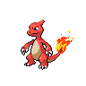

# 005 - Charmeleon

## Types

| Version | Type                           |
| :-----: | -----------------------------: |
| Classic |  |

## Defenses

| Immune x0 | Resistant ×¼ | Resistant ×½                                                                                                                                                                                                    | Normal ×1                                                                                                                                                                                                                                                                                                                                                      | Weak ×2                                                                                                    | Weak ×4 |
| --------- | ------------ | --------------------------------------------------------------------------------------------------------------------------------------------------------------------------------------------------------------- | -------------------------------------------------------------------------------------------------------------------------------------------------------------------------------------------------------------------------------------------------------------------------------------------------------------------------------------------------------------- | ---------------------------------------------------------------------------------------------------------- | ------- |
|           |              |       |          |    |         |

## Abilities

| Version | Ability             |
| ------- | ------------------- |
| Base Game | [Blaze](#/abilities/blaze) / Solar Power |
| All     | [Blaze](#/abilities/blaze) / [Solar-Power](#/abilities/solarpower) |

## Base Stats

| Version | HP | Atk | Def | SAtk | SDef | Spd | BST |
| ------- | -- | --- | --- | ---- | ---- | --- | --- |
| Base Game | 58 | 64 | 58 | 80 | 65 | 80 | 405 |
| All     | 58 | 64  | 58  | 80   | 65   | 80  | 405 |

## Level Up Moves

| Level | Name         | Power | Accuracy | PP | Type                               | Damage Class                           |
| ----- | ------------ | ----- | -------- | -- | ---------------------------------- | -------------------------------------- |
| 1      | [Scratch](#/moves/scratch) | 40    | 100%     | 35 |  |  || 1      | [Growl](#/moves/growl) | -     | 100%     | 40 |  |      || 1      | [Ember](#/moves/ember) | 40    | 100%     | 25 |      |    || 10     | [Smokescreen](#/moves/smokescreen) | -     | 100%     | 20 |  |      || 17     | [Dragon-Rage](#/moves/dragonrage) | -     | 100%     | 10 |  |    || 21     | [Scary-Face](#/moves/scaryface) | -     | 90%      | 10 |  |      || 28     | [Fire-Fang](#/moves/firefang) | 75    | 95%      | 15 |      |  || 32     | [Flame-Burst](#/moves/flameburst) | 70    | 100%     | 15 |      |    || 39     | [Slash](#/moves/slash) | 70    | 100%     | 20 |  |  || 43     | [Flamethrower](#/moves/flamethrower) | 95    | 100%     | 15 |      |    || 50     | [Fire-Spin](#/moves/firespin) | 15    | 70%      | 15 |      |    || 54     | [Inferno](#/moves/inferno) | 100   | 50%      | 5  |      |    || 61     | [Belly-Drum](#/moves/bellydrum) | -     | -        | 10 |  |      |
## Learnable Moves

| Machine | Name         | Power | Accuracy | PP | Type                                   | Damage Class                           |
| ------- | ------------ | ----- | -------- | -- | -------------------------------------- | -------------------------------------- |
| HM01 | [Cut](#/moves/cut) | 60    | 100%     | 20 |        |  || HM04 | [Strength](#/moves/strength) | 85    | 100%     | 15 |          |  || TM01 | [Hone-Claws](#/moves/honeclaws) | -     | -        | 15 |          |      || TM02 | [Dragon-Claw](#/moves/dragonclaw) | 80    | 100%     | 15 |      |  || TM06 | [Toxic](#/moves/toxic) | -     | 85%      | 10 |      |      || TM10 | [Hidden-Power](#/moves/hiddenpower) | 60    | 100%     | 15 |      |    || TM11 | [Sunny-Day](#/moves/sunnyday) | -     | -        | 5  |          |      || TM17 | [Protect](#/moves/protect) | -     | -        | 10 |      |      || TM21 | [Frustration](#/moves/frustration) | -     | 100%     | 20 |      |  || TM27 | [Return](#/moves/return) | -     | 100%     | 20 |      |  || TM28 | [Dig](#/moves/dig) | 100   | 100%     | 10 |      |  || TM31 | [Brick-Break](#/moves/brickbreak) | 75    | 100%     | 15 |  |  || TM32 | [Double-Team](#/moves/doubleteam) | -     | -        | 15 |      |      || TM38 | [Fire-Blast](#/moves/fireblast) | 110   | 85%      | 5  |          |    || TM39 | [Rock-Tomb](#/moves/rocktomb) | 60    | 95%      | 15 |          |  || TM40 | [Aerial-Ace](#/moves/aerialace) | 60    | -        | 20 |      |  || TM42 | [Facade](#/moves/facade) | 70    | 100%     | 20 |      |  || TM43 | [Flame-Charge](#/moves/flamecharge) | 50    | 100%     | 20 |          |  || TM44 | [Rest](#/moves/rest) | -     | -        | 10 |    |      || TM45 | [Attract](#/moves/attract) | -     | 100%     | 15 |      |      || TM48 | [Round](#/moves/round) | 60    | 100%     | 15 |      |    || TM49 | [Echoed-Voice](#/moves/echoedvoice) | 40    | 100%     | 15 |      |    || TM50 | [Overheat](#/moves/overheat) | 130   | 90%      | 5  |          |    || TM56 | [Fling](#/moves/fling) | -     | 100%     | 10 |          |  || TM59 | [Incinerate](#/moves/incinerate) | 50    | 100%     | 15 |          |    || TM61 | [Will-O-Wisp](#/moves/willowisp) | -     | 85%      | 15 |          |      || TM65 | [Shadow-Claw](#/moves/shadowclaw) | 80    | 100%     | 15 |        |  || TM75 | [Swords-Dance](#/moves/swordsdance) | -     | -        | 20 |      |      || TM80 | [Rock-Slide](#/moves/rockslide) | 80    | 95%      | 10 |          |  || TM87 | [Swagger](#/moves/swagger) | -     | 85%      | 15 |      |      || TM90 | [Substitute](#/moves/substitute) | -     | -        | 10 |      |      || TM94    | Rock-Smash   | 40    | 100%     | 15 |  |  |