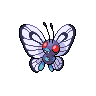

# 012 - Butterfree

## Types

| Version | Type                                                            |
| :-----: | --------------------------------------------------------------: |
| Classic |   |

## Defenses

| Immune x0                          | Resistant ×¼                                                                | Resistant ×½                 | Normal ×1                                                                                                                                                                                                                                                                                                                                        | Weak ×2                                                                                                                                           | Weak ×4                        |
| ---------------------------------- | --------------------------------------------------------------------------- | ---------------------------- | ------------------------------------------------------------------------------------------------------------------------------------------------------------------------------------------------------------------------------------------------------------------------------------------------------------------------------------------------ | ------------------------------------------------------------------------------------------------------------------------------------------------- | ------------------------------ |
|  |   |  |          |     |  |

## Abilities

| Version | Ability                  |
| ------- | ------------------------ |
| All     | [Shed-Skin](#/abilities/shedskin) / [Battle-Armor](#/abilities/battlearmor) |

## Base Stats

| Version | HP | Atk | Def | SAtk | SDef | Spd | BST |
| ------- | -- | --- | --- | ---- | ---- | --- | --- |
| Base Game | 60 | 45 | 50 | 90 | 80 | 70 | 395 |
| All     | 60 | 45  | 50  | 95   | 80   | 90  | 420 |

## Level Up Moves

| Level | Name          | Power | Accuracy | PP | Type                                 | Damage Class                         |
| ----- | ------------- | ----- | -------- | -- | ------------------------------------ | ------------------------------------ |
| 1      | [Confusion](#/moves/confusion) | 50    | 100%     | 25 |  |  || 1      | [Struggle-Bug](#/moves/strugglebug) | 50    | 100%     | 20 |          |  || 10     | [Air-Cutter](#/moves/aircutter) | 60    | 95%      | 25 |    |  || 12     | [Poison-Powder](#/moves/poisonpowder) | -     | 75%      | 35 |    |    || 12     | [Stun-Spore](#/moves/stunspore) | -     | 75%      | 30 |      |    || 12     | [Sleep-Powder](#/moves/sleeppowder) | -     | 75%      | 15 |      |    || 16     | [Gust](#/moves/gust) | 40    | 100%     | 35 |    |  || 18     | [Supersonic](#/moves/supersonic) | -     | 55%      | 20 |    |    || 22     | [Whirlwind](#/moves/whirlwind) | -     | -        | 20 |    |    || 24     | [Psybeam](#/moves/psybeam) | 65    | 100%     | 20 |  |  || 26     | [Giga-Drain](#/moves/gigadrain) | 60    | 100%     | 60 |      |  || 28     | [Silver-Wind](#/moves/silverwind) | 60    | 100%     | 5  |          |  || 30     | [Tailwind](#/moves/tailwind) | -     | -        | 15 |    |    || 32     | [Air-Slash](#/moves/airslash) | 75    | 95%      | 15 |    |  || 34     | [Rage-Powder](#/moves/ragepowder) | -     | -        | 20 |          |    || 36     | [Safeguard](#/moves/safeguard) | -     | -        | 25 |    |    || 38     | [Roost](#/moves/roost) | -     | -        | 10 |    |    || 40     | [Captivate](#/moves/captivate) | -     | 100%     | 20 |    |    || 42     | [Bug-Buzz](#/moves/bugbuzz) | 90    | 100%     | 10 |          |  || 46     | [Quiver-Dance](#/moves/quiverdance) | -     | -        | 20 |          |    || 50     | [Baton-Pass](#/moves/batonpass) | -     | -        | 40 |    |    |
## Learnable Moves

| Machine | Name         | Power | Accuracy | PP | Type                                 | Damage Class                           |
| ------- | ------------ | ----- | -------- | -- | ------------------------------------ | -------------------------------------- |
| TM06 | [Toxic](#/moves/toxic) | -     | 85%      | 10 |    |      || TM09 | [Venoshock](#/moves/venoshock) | 65    | 100%     | 10 |    |    || TM10 | [Hidden-Power](#/moves/hiddenpower) | 60    | 100%     | 15 |    |    || TM11 | [Sunny-Day](#/moves/sunnyday) | -     | -        | 5  |        |      || TM15 | [Hyper-Beam](#/moves/hyperbeam) | 150   | 90%      | 5  |    |    || TM17 | [Protect](#/moves/protect) | -     | -        | 10 |    |      || TM18 | [Rain-Dance](#/moves/raindance) | -     | -        | 5  |      |      || TM21 | [Frustration](#/moves/frustration) | -     | 100%     | 20 |    |  || TM22 | [Solar-Beam](#/moves/solarbeam) | 120   | 100%     | 10 |      |    || TM27 | [Return](#/moves/return) | -     | 100%     | 20 |    |  || TM29 | [Psychic](#/moves/psychic) | 90    | 100%     | 10 |  |    || TM30 | [Shadow-Ball](#/moves/shadowball) | 90    | 100%     | 15 |      |    || TM32 | [Double-Team](#/moves/doubleteam) | -     | -        | 15 |    |      || TM40 | [Aerial-Ace](#/moves/aerialace) | 60    | -        | 20 |    |  || TM42 | [Facade](#/moves/facade) | 70    | 100%     | 20 |    |  || TM44 | [Rest](#/moves/rest) | -     | -        | 10 |  |      || TM45 | [Attract](#/moves/attract) | -     | 100%     | 15 |    |      || TM46 | [Thief](#/moves/thief) | 60    | 100%     | 25 |        |  || TM48 | [Round](#/moves/round) | 60    | 100%     | 15 |    |    || TM53 | [Energy-Ball](#/moves/energyball) | 90    | 100%     | 10 |      |    || TM62 | [Acrobatics](#/moves/acrobatics) | 55    | 100%     | 15 |    |  || TM68 | [Giga-Impact](#/moves/gigaimpact) | 150   | 90%      | 5  |    |  || TM70 | [Flash](#/moves/flash) | -     | 100%     | 20 |    |      || TM77 | [Psych-Up](#/moves/psychup) | -     | -        | 10 |    |      || TM85 | [Dream-Eater](#/moves/dreameater) | 100   | 100%     | 15 |  |    || TM87 | [Swagger](#/moves/swagger) | -     | 85%      | 15 |    |      || TM89 | [U-Turn](#/moves/uturn) | 70    | 100%     | 20 |          |  || TM90    | Substitute   | -     | -        | 10 |    |      |
## Locations

- [Route 12](routes/Route%2012/index.md)
- [Route 2](routes/Route%202/index.md)
