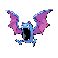

# 042 - Golbat

## Types

| Version | Type                                                                  |
| :-----: | --------------------------------------------------------------------: |
| Classic |   |

## Defenses

| Immune x0                          | Resistant ×¼                                                                                                 | Resistant ×½                                                            | Normal ×1                                                                                                                                                                                                                                                                                             | Weak ×2                                                                                                                                             | Weak ×4 |
| ---------------------------------- | ------------------------------------------------------------------------------------------------------------ | ----------------------------------------------------------------------- | ----------------------------------------------------------------------------------------------------------------------------------------------------------------------------------------------------------------------------------------------------------------------------------------------------- | --------------------------------------------------------------------------------------------------------------------------------------------------- | ------- |
|  |    |   |         |     |         |

## Abilities

| Version | Ability                   |
| ------- | ------------------------- |
| All     | [Inner-Focus](#/abilities/innerfocus) / [Infiltrator](#/abilities/infiltrator) |

## Base Stats

| Version | HP | Atk | Def | SAtk | SDef | Spd | BST |
| ------- | -- | --- | --- | ---- | ---- | --- | --- |
| Base Game | 75 | 80 | 70 | 65 | 75 | 90 | 455 |
| All     | 75 | 80  | 70  | 65   | 75   | 90  | 455 |

## Level Up Moves

| Level | Name        | Power | Accuracy | PP | Type                                 | Damage Class                           |
| ----- | ----------- | ----- | -------- | -- | ------------------------------------ | -------------------------------------- |
| 1      | [Supersonic](#/moves/supersonic) | -     | 55%      | 20 |    |      || 1      | [Screech](#/moves/screech) | -     | 85%      | 40 |    |      || 1      | [Leech-Life](#/moves/leechlife) | 80    | 100%     | 10 |          |  || 1      | [Astonish](#/moves/astonish) | 30    | 100%     | 15 |      |  || 13     | [Bite](#/moves/bite) | 60    | 100%     | 25 |        |  || 16     | [Wing-Attack](#/moves/wingattack) | 75    | 100%     | 35 |    |  || 18     | [Hypnosis](#/moves/hypnosis) | -     | 60%      | 20 |  |      || 21     | [Confuse-Ray](#/moves/confuseray) | -     | 100%     | 10 |      |      || 22     | [Roost](#/moves/roost) | -     | -        | 10 |    |      || 27     | [Air-Cutter](#/moves/aircutter) | 60    | 95%      | 25 |    |    || 33     | [Mean-Look](#/moves/meanlook) | -     | -        | 5  |    |      || 39     | [Acrobatics](#/moves/acrobatics) | 55    | 100%     | 15 |    |  || 45     | [Poison-Fang](#/moves/poisonfang) | 50    | 100%     | 15 |    |  || 51     | [Haze](#/moves/haze) | -     | -        | 30 |          |      || 57     | [Air-Slash](#/moves/airslash) | 75    | 95%      | 15 |    |    || 63     | [Nasty-Plot](#/moves/nastyplot) | -     | -        | 20 |        |      || 69     | [Brave-Bird](#/moves/bravebird) | 120   | 100%     | 15 |    |  |
## Learnable Moves

| Machine | Name         | Power | Accuracy | PP | Type                                 | Damage Class                           |
| ------- | ------------ | ----- | -------- | -- | ------------------------------------ | -------------------------------------- |
| HM02 | [Fly](#/moves/fly) | 100   | 100%     | 15 |    |  || TM06 | [Toxic](#/moves/toxic) | -     | 85%      | 10 |    |      || TM09 | [Venoshock](#/moves/venoshock) | 65    | 100%     | 10 |    |    || TM10 | [Hidden-Power](#/moves/hiddenpower) | 60    | 100%     | 15 |    |    || TM11 | [Sunny-Day](#/moves/sunnyday) | -     | -        | 5  |        |      || TM12 | [Taunt](#/moves/taunt) | -     | 100%     | 20 |        |      || TM15 | [Hyper-Beam](#/moves/hyperbeam) | 150   | 90%      | 5  |    |    || TM17 | [Protect](#/moves/protect) | -     | -        | 10 |    |      || TM18 | [Rain-Dance](#/moves/raindance) | -     | -        | 5  |      |      || TM21 | [Frustration](#/moves/frustration) | -     | 100%     | 20 |    |  || TM27 | [Return](#/moves/return) | -     | 100%     | 20 |    |  || TM30 | [Shadow-Ball](#/moves/shadowball) | 90    | 100%     | 15 |      |    || TM32 | [Double-Team](#/moves/doubleteam) | -     | -        | 15 |    |      || TM36 | [Sludge-Bomb](#/moves/sludgebomb) | 90    | 100%     | 10 |    |    || TM40 | [Aerial-Ace](#/moves/aerialace) | 60    | -        | 20 |    |  || TM41 | [Torment](#/moves/torment) | -     | 100%     | 15 |        |      || TM42 | [Facade](#/moves/facade) | 70    | 100%     | 20 |    |  || TM44 | [Rest](#/moves/rest) | -     | -        | 10 |  |      || TM45 | [Attract](#/moves/attract) | -     | 100%     | 15 |    |      || TM46 | [Thief](#/moves/thief) | 60    | 100%     | 25 |        |  || TM48 | [Round](#/moves/round) | 60    | 100%     | 15 |    |    || TM66 | [Payback](#/moves/payback) | 50    | 100%     | 10 |        |  || TM68 | [Giga-Impact](#/moves/gigaimpact) | 150   | 90%      | 5  |    |  || TM87 | [Swagger](#/moves/swagger) | -     | 85%      | 15 |    |      || TM88 | [Pluck](#/moves/pluck) | 60    | 100%     | 20 |    |  || TM89 | [U-Turn](#/moves/uturn) | 70    | 100%     | 20 |          |  || TM90    | Substitute   | -     | -        | 10 |    |      |
## Locations

- [Challenger's Cave - B1F](routes/Challenger's%20Cave%20-%20B1F/index.md)
- [Challenger's Cave - B2F](routes/Challenger's%20Cave%20-%20B2F/index.md)
- [Giant Chasm - Inside Plains](routes/Giant%20Chasm%20-%20Inside%20Plains/index.md)
- [Giant Chasm - Outside Area](routes/Giant%20Chasm%20-%20Outside%20Area/index.md)
- [Route 13](routes/Route%2013/index.md)
- [Victory Road - Inside](routes/Victory%20Road%20-%20Inside/index.md)
- [Wellspring Cave - B1F](routes/Wellspring%20Cave%20-%20B1F/index.md)
