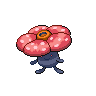

# 045 - Vileplume

## Types

| Version | Type                                                                |
| :-----: | ------------------------------------------------------------------: |
| Classic |   |

## Defenses

| Immune x0 | Resistant ×¼                     | Resistant ×½                                                                                                                                                | Normal ×1                                                                                                                                                                                                                                                                                                                                | Weak ×2                                                                                                                                         | Weak ×4 |
| --------- | -------------------------------- | ----------------------------------------------------------------------------------------------------------------------------------------------------------- | ---------------------------------------------------------------------------------------------------------------------------------------------------------------------------------------------------------------------------------------------------------------------------------------------------------------------------------------- | ----------------------------------------------------------------------------------------------------------------------------------------------- | ------- |
|           |  |     |          |     |         |

## Abilities

| Version | Ability                    |
| ------- | -------------------------- |
| All     | [Chlorophyll](#/abilities/chlorophyll) / [Effect-Spore](#/abilities/effectspore) |

## Base Stats

| Version | HP | Atk | Def | SAtk | SDef | Spd | BST |
| ------- | -- | --- | --- | ---- | ---- | --- | --- |
| Base Game | 75 | 80 | 85 | 110 | 90 | 50 | 490 |
| All     | 85 | 80  | 85  | 110  | 100  | 50  | 510 |

## Level Up Moves

| Level | Name          | Power | Accuracy | PP | Type                               | Damage Class                         |
| ----- | ------------- | ----- | -------- | -- | ---------------------------------- | ------------------------------------ |
| 1      | [Mega-Drain](#/moves/megadrain) | 50    | 100%     | 15 |    |  || 1      | [Poison-Powder](#/moves/poisonpowder) | -     | 75%      | 35 |  |    || 1      | [Stun-Spore](#/moves/stunspore) | -     | 75%      | 30 |    |    || 1      | [Aromatherapy](#/moves/aromatherapy) | -     | -        | 5  |    |    || 38     | [Earth-Power](#/moves/earthpower) | 90    | 100%     | 10 |  |  || 53     | [Petal-Dance](#/moves/petaldance) | 90    | 100%     | 90 |    |  || 65     | [Solar-Beam](#/moves/solarbeam) | 120   | 100%     | 10 |    |  |
## Learnable Moves

| Machine | Name         | Power | Accuracy | PP | Type                                 | Damage Class                           |
| ------- | ------------ | ----- | -------- | -- | ------------------------------------ | -------------------------------------- |
| HM01 | [Cut](#/moves/cut) | 60    | 100%     | 20 |      |  || TM06 | [Toxic](#/moves/toxic) | -     | 85%      | 10 |    |      || TM09 | [Venoshock](#/moves/venoshock) | 65    | 100%     | 10 |    |    || TM10 | [Hidden-Power](#/moves/hiddenpower) | 60    | 100%     | 15 |    |    || TM11 | [Sunny-Day](#/moves/sunnyday) | -     | -        | 5  |        |      || TM15 | [Hyper-Beam](#/moves/hyperbeam) | 150   | 90%      | 5  |    |    || TM17 | [Protect](#/moves/protect) | -     | -        | 10 |    |      || TM21 | [Frustration](#/moves/frustration) | -     | 100%     | 20 |    |  || TM27 | [Return](#/moves/return) | -     | 100%     | 20 |    |  || TM32 | [Double-Team](#/moves/doubleteam) | -     | -        | 15 |    |      || TM36 | [Sludge-Bomb](#/moves/sludgebomb) | 90    | 100%     | 10 |    |    || TM42 | [Facade](#/moves/facade) | 70    | 100%     | 20 |    |  || TM44 | [Rest](#/moves/rest) | -     | -        | 10 |  |      || TM45 | [Attract](#/moves/attract) | -     | 100%     | 15 |    |      || TM48 | [Round](#/moves/round) | 60    | 100%     | 15 |    |    || TM53 | [Energy-Ball](#/moves/energyball) | 90    | 100%     | 10 |      |    || TM56 | [Fling](#/moves/fling) | -     | 100%     | 10 |        |  || TM68 | [Giga-Impact](#/moves/gigaimpact) | 150   | 90%      | 5  |    |  || TM70 | [Flash](#/moves/flash) | -     | 100%     | 20 |    |      || TM75 | [Swords-Dance](#/moves/swordsdance) | -     | -        | 20 |    |      || TM86 | [Grass-Knot](#/moves/grassknot) | -     | 100%     | 20 |      |    || TM87 | [Swagger](#/moves/swagger) | -     | 85%      | 15 |    |      || TM90    | Substitute   | -     | -        | 10 |    |      |