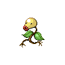

# 069 - Bellsprout

## Types

| Version | Type                                                                |
| :-----: | ------------------------------------------------------------------: |
| Classic |   |

## Defenses

| Immune x0 | Resistant ×¼                     | Resistant ×½                                                                                                                                                | Normal ×1                                                                                                                                                                                                                                                                                                                                | Weak ×2                                                                                                                                         | Weak ×4 |
| --------- | -------------------------------- | ----------------------------------------------------------------------------------------------------------------------------------------------------------- | ---------------------------------------------------------------------------------------------------------------------------------------------------------------------------------------------------------------------------------------------------------------------------------------------------------------------------------------- | ----------------------------------------------------------------------------------------------------------------------------------------------- | ------- |
|           |  |     |          |     |         |

## Abilities

| Version | Ability              |
| ------- | -------------------- |
| All     | [Chlorophyll](#/abilities/chlorophyll) / [Limber](#/abilities/limber) |

## Base Stats

| Version | HP | Atk | Def | SAtk | SDef | Spd | BST |
| ------- | -- | --- | --- | ---- | ---- | --- | --- |
| Base Game | 50 | 75 | 35 | 70 | 30 | 40 | 300 |
| All     | 90 | 105 | 95  | 70   | 90   | 70  | 520 |

## Level Up Moves

| Level | Name          | Power | Accuracy | PP | Type                               | Damage Class                           |
| ----- | ------------- | ----- | -------- | -- | ---------------------------------- | -------------------------------------- |
| 1      | [Vine-Whip](#/moves/vinewhip) | 45    | 100%     | 25 |    |  || 3      | [Sweet-Kiss](#/moves/sweetkiss) | -     | 75%      | 10 |    |      || 5      | [Lovely-Kiss](#/moves/lovelykiss) | -     | 75%      | 10 |  |      || 7      | [Growth](#/moves/growth) | -     | -        | 20 |  |      || 9      | [Leech-Life](#/moves/leechlife) | 80    | 100%     | 10 |        |  || 11     | [Wrap](#/moves/wrap) | 15    | 85%      | 20 |  |  || 13     | [Sleep-Powder](#/moves/sleeppowder) | -     | 75%      | 15 |    |      || 15     | [Poison-Powder](#/moves/poisonpowder) | -     | 75%      | 35 |  |      || 17     | [Stun-Spore](#/moves/stunspore) | -     | 75%      | 30 |    |      || 19     | [Razor-Leaf](#/moves/razorleaf) | 55    | 95%      | 25 |    |  || 21     | [Clear-Smog](#/moves/clearsmog) | 50    | -        | 15 |  |    || 23     | [Acid](#/moves/acid) | 40    | 100%     | 30 |  |    || 27     | [Knock-Off](#/moves/knockoff) | 65    | 100%     | 20 |      |  || 29     | [Sweet-Scent](#/moves/sweetscent) | -     | 100%     | 20 |  |      || 35     | [Gastro-Acid](#/moves/gastroacid) | -     | 100%     | 10 |  |      || 41     | [Slam](#/moves/slam) | 80    | 75%      | 20 |  |  || 47     | [Wring-Out](#/moves/wringout) | -     | 100%     | 5  |  |    || 51     | [Power-Whip](#/moves/powerwhip) | 120   | 85%      | 10 |    |  |
## Learnable Moves

| Machine | Name         | Power | Accuracy | PP | Type                                 | Damage Class                           |
| ------- | ------------ | ----- | -------- | -- | ------------------------------------ | -------------------------------------- |
| HM01 | [Cut](#/moves/cut) | 60    | 100%     | 20 |      |  || TM06 | [Toxic](#/moves/toxic) | -     | 85%      | 10 |    |      || TM09 | [Venoshock](#/moves/venoshock) | 65    | 100%     | 10 |    |    || TM10 | [Hidden-Power](#/moves/hiddenpower) | 60    | 100%     | 15 |    |    || TM11 | [Sunny-Day](#/moves/sunnyday) | -     | -        | 5  |        |      || TM17 | [Protect](#/moves/protect) | -     | -        | 10 |    |      || TM21 | [Frustration](#/moves/frustration) | -     | 100%     | 20 |    |  || TM22 | [Solar-Beam](#/moves/solarbeam) | 120   | 100%     | 10 |      |    || TM27 | [Return](#/moves/return) | -     | 100%     | 20 |    |  || TM32 | [Double-Team](#/moves/doubleteam) | -     | -        | 15 |    |      || TM33 | [Reflect](#/moves/reflect) | -     | -        | 20 |  |      || TM36 | [Sludge-Bomb](#/moves/sludgebomb) | 90    | 100%     | 10 |    |    || TM42 | [Facade](#/moves/facade) | 70    | 100%     | 20 |    |  || TM44 | [Rest](#/moves/rest) | -     | -        | 10 |  |      || TM45 | [Attract](#/moves/attract) | -     | 100%     | 15 |    |      || TM46 | [Thief](#/moves/thief) | 60    | 100%     | 25 |        |  || TM48 | [Round](#/moves/round) | 60    | 100%     | 15 |    |    || TM53 | [Energy-Ball](#/moves/energyball) | 90    | 100%     | 10 |      |    || TM70 | [Flash](#/moves/flash) | -     | 100%     | 20 |    |      || TM75 | [Swords-Dance](#/moves/swordsdance) | -     | -        | 20 |    |      || TM86 | [Grass-Knot](#/moves/grassknot) | -     | 100%     | 20 |      |    || TM87 | [Swagger](#/moves/swagger) | -     | 85%      | 15 |    |      || TM90    | Substitute   | -     | -        | 10 |    |      |
## Locations

- [Pinwheel Forest - Inside](routes/Pinwheel%20Forest%20-%20Inside/index.md)
