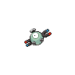

# 081 - Magnemite

## Types

| Version | Type                                                                    |
| :-----: | ----------------------------------------------------------------------: |
| Classic |   |

## Defenses

| Immune x0                          | Resistant ×¼                                                            | Resistant ×½                                                                                                                                                                                                                                                                                                                                 | Normal ×1                                                                                                | Weak ×2                                                                   | Weak ×4                            |
| ---------------------------------- | ----------------------------------------------------------------------- | -------------------------------------------------------------------------------------------------------------------------------------------------------------------------------------------------------------------------------------------------------------------------------------------------------------------------------------------- | -------------------------------------------------------------------------------------------------------- | ------------------------------------------------------------------------- | ---------------------------------- |
|  |   |          |    |   |  |

## Abilities

| Version | Ability                |
| ------- | ---------------------- |
| All     | [Magnet-Pull](#/abilities/magnetpull) / [Analytic](#/abilities/analytic) |

## Base Stats

| Version | HP | Atk | Def | SAtk | SDef | Spd | BST |
| ------- | -- | --- | --- | ---- | ---- | --- | --- |
| Base Game | 25 | 35 | 70 | 95 | 55 | 45 | 325 |
| All     | 90 | 120 | 130 | 55   | 65   | 45  | 505 |

## Level Up Moves

| Level | Name          | Power | Accuracy | PP | Type                                   | Damage Class                           |
| ----- | ------------- | ----- | -------- | -- | -------------------------------------- | -------------------------------------- |
| 1      | [Tackle](#/moves/tackle) | 35    | 95%      | 35 |      |  || 1      | [Metal-Sound](#/moves/metalsound) | -     | 85%      | 40 |        |      || 1      | [Agility](#/moves/agility) | -     | -        | 30 |    |      || 6      | [Thunder-Shock](#/moves/thundershock) | 40    | 100%     | 30 |  |    || 11     | [Supersonic](#/moves/supersonic) | -     | 55%      | 20 |      |      || 14     | [Sonic-Boom](#/moves/sonicboom) | -     | 90%      | 20 |      |    || 17     | [Thunder-Wave](#/moves/thunderwave) | -     | 90%      | 20 |  |      || 22     | [Spark](#/moves/spark) | 65    | 100%     | 20 |  |  || 25     | [Signal-Beam](#/moves/signalbeam) | 75    | 100%     | 15 |            |    || 27     | [Electro-Ball](#/moves/electroball) | -     | 100%     | 10 |  |    || 30     | [Lock-On](#/moves/lockon) | -     | -        | 5  |      |      || 33     | [Magnet-Bomb](#/moves/magnetbomb) | 70    | -        | 20 |        |  || 38     | [Screech](#/moves/screech) | -     | 85%      | 40 |      |      || 43     | [Discharge](#/moves/discharge) | 80    | 100%     | 15 |  |    || 46     | [Mirror-Shot](#/moves/mirrorshot) | 65    | 85%      | 10 |        |    || 49     | [Magnet-Rise](#/moves/magnetrise) | -     | -        | 10 |  |      || 54     | [Gyro-Ball](#/moves/gyroball) | -     | 100%     | 5  |        |  || 59     | [Zap-Cannon](#/moves/zapcannon) | 120   | 50%      | 5  |  |    |
## Learnable Moves

| Machine | Name         | Power | Accuracy | PP | Type                                   | Damage Class                           |
| ------- | ------------ | ----- | -------- | -- | -------------------------------------- | -------------------------------------- |
| TM06 | [Toxic](#/moves/toxic) | -     | 85%      | 10 |      |      || TM10 | [Hidden-Power](#/moves/hiddenpower) | 60    | 100%     | 15 |      |    || TM11 | [Sunny-Day](#/moves/sunnyday) | -     | -        | 5  |          |      || TM16 | [Light-Screen](#/moves/lightscreen) | -     | -        | 30 |    |      || TM17 | [Protect](#/moves/protect) | -     | -        | 10 |      |      || TM18 | [Rain-Dance](#/moves/raindance) | -     | -        | 5  |        |      || TM21 | [Frustration](#/moves/frustration) | -     | 100%     | 20 |      |  || TM24 | [Thunderbolt](#/moves/thunderbolt) | 90    | 100%     | 15 |  |    || TM25 | [Thunder](#/moves/thunder) | 110   | 70%      | 10 |  |    || TM27 | [Return](#/moves/return) | -     | 100%     | 20 |      |  || TM32 | [Double-Team](#/moves/doubleteam) | -     | -        | 15 |      |      || TM33 | [Reflect](#/moves/reflect) | -     | -        | 20 |    |      || TM42 | [Facade](#/moves/facade) | 70    | 100%     | 20 |      |  || TM44 | [Rest](#/moves/rest) | -     | -        | 10 |    |      || TM48 | [Round](#/moves/round) | 60    | 100%     | 15 |      |    || TM57 | [Charge-Beam](#/moves/chargebeam) | 50    | 90%      | 10 |  |    || TM64 | [Explosion](#/moves/explosion) | 250   | 100%     | 5  |      |  || TM70 | [Flash](#/moves/flash) | -     | 100%     | 20 |      |      || TM72 | [Volt-Switch](#/moves/voltswitch) | 70    | 100%     | 20 |  |    || TM77 | [Psych-Up](#/moves/psychup) | -     | -        | 10 |      |      || TM87 | [Swagger](#/moves/swagger) | -     | 85%      | 15 |      |      || TM90 | [Substitute](#/moves/substitute) | -     | -        | 10 |      |      || TM91 | [Flash-Cannon](#/moves/flashcannon) | 80    | 100%     | 10 |        |    || TM93    | Wild-Charge  | 90    | 100%     | 15 |  |  |
## Locations

- [Chargestone Cave - 1F](routes/Chargestone%20Cave%20-%201F/index.md)
