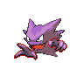

# 093 - Haunter

## Types

| Version | Type                                                                |
| :-----: | ------------------------------------------------------------------: |
| Classic |   |

## Defenses

| Immune x0                                                                     | Resistant ×¼                                                        | Resistant ×½                                                          | Normal ×1                                                                                                                                                                                                                                                                                             | Weak ×2                                                                                                                                             | Weak ×4 |
| ----------------------------------------------------------------------------- | ------------------------------------------------------------------- | --------------------------------------------------------------------- | ----------------------------------------------------------------------------------------------------------------------------------------------------------------------------------------------------------------------------------------------------------------------------------------------------- | --------------------------------------------------------------------------------------------------------------------------------------------------- | ------- |
|   |   |   |         |     |         |

## Abilities

| Version | Ability    |
| ------- | ---------- |
| All     | [Levitate /](#/abilities/levitate) |

## Base Stats

| Version | HP | Atk | Def | SAtk | SDef | Spd | BST |
| ------- | -- | --- | --- | ---- | ---- | --- | --- |
| Base Game | 45 | 50 | 45 | 115 | 55 | 95 | 405 |
| All     | 90 | 70  | 80  | 85   | 95   | 70  | 490 |

## Evolution Change

Evolves into Gengar at level 36

## Level Up Moves

| Level | Name         | Power | Accuracy | PP | Type                                 | Damage Class                           |
| ----- | ------------ | ----- | -------- | -- | ------------------------------------ | -------------------------------------- |
| 1      | [Hypnosis](#/moves/hypnosis) | -     | 60%      | 20 |  |      || 1      | [Lick](#/moves/lick) | 30    | 100%     | 30 |      |  || 1      | [Spite](#/moves/spite) | -     | 100%     | 10 |      |      || 8      | [Mean-Look](#/moves/meanlook) | -     | -        | 5  |    |      || 12     | [Curse](#/moves/curse) | -     | -        | 10 |      |      || 15     | [Night-Shade](#/moves/nightshade) | -     | 100%     | 15 |      |    || 17     | [Ominous-Wind](#/moves/ominouswind) | 60    | 100%     | 5  |      |    || 19     | [Confuse-Ray](#/moves/confuseray) | -     | 100%     | 10 |      |      || 22     | [Sucker-Punch](#/moves/suckerpunch) | 70    | 100%     | 5  |        |  || 24     | [Clear-Smog](#/moves/clearsmog) | 50    | -        | 15 |    |    || 25     | [Shadow-Punch](#/moves/shadowpunch) | 70    | -        | 20 |      |  || 28     | [Payback](#/moves/payback) | 50    | 100%     | 10 |        |  || 33     | [Shadow-Ball](#/moves/shadowball) | 90    | 100%     | 15 |      |    || 36     | [Icy-Wind](#/moves/icywind) | 55    | 95%      | 15 |          |    || 39     | [Dream-Eater](#/moves/dreameater) | 100   | 100%     | 15 |  |    || 44     | [Dark-Pulse](#/moves/darkpulse) | 90    | 100%     | 15 |        |    || 50     | [Destiny-Bond](#/moves/destinybond) | -     | -        | 5  |      |      || 55     | [Hex](#/moves/hex) | 65    | 100%     | 10 |      |    || 61     | [Nightmare](#/moves/nightmare) | -     | 100%     | 15 |      |      |
## Learnable Moves

| Machine | Name         | Power | Accuracy | PP | Type                                   | Damage Class                           |
| ------- | ------------ | ----- | -------- | -- | -------------------------------------- | -------------------------------------- |
| TM06 | [Toxic](#/moves/toxic) | -     | 85%      | 10 |      |      || TM09 | [Venoshock](#/moves/venoshock) | 65    | 100%     | 10 |      |    || TM10 | [Hidden-Power](#/moves/hiddenpower) | 60    | 100%     | 15 |      |    || TM11 | [Sunny-Day](#/moves/sunnyday) | -     | -        | 5  |          |      || TM12 | [Taunt](#/moves/taunt) | -     | 100%     | 20 |          |      || TM17 | [Protect](#/moves/protect) | -     | -        | 10 |      |      || TM18 | [Rain-Dance](#/moves/raindance) | -     | -        | 5  |        |      || TM19 | [Telekinesis](#/moves/telekinesis) | -     | -        | 15 |    |      || TM21 | [Frustration](#/moves/frustration) | -     | 100%     | 20 |      |  || TM24 | [Thunderbolt](#/moves/thunderbolt) | 90    | 100%     | 15 |  |    || TM27 | [Return](#/moves/return) | -     | 100%     | 20 |      |  || TM29 | [Psychic](#/moves/psychic) | 90    | 100%     | 10 |    |    || TM32 | [Double-Team](#/moves/doubleteam) | -     | -        | 15 |      |      || TM34 | [Sludge-Wave](#/moves/sludgewave) | 95    | 100%     | 10 |      |    || TM36 | [Sludge-Bomb](#/moves/sludgebomb) | 90    | 100%     | 10 |      |    || TM41 | [Torment](#/moves/torment) | -     | 100%     | 15 |          |      || TM42 | [Facade](#/moves/facade) | 70    | 100%     | 20 |      |  || TM44 | [Rest](#/moves/rest) | -     | -        | 10 |    |      || TM45 | [Attract](#/moves/attract) | -     | 100%     | 15 |      |      || TM46 | [Thief](#/moves/thief) | 60    | 100%     | 25 |          |  || TM48 | [Round](#/moves/round) | 60    | 100%     | 15 |      |    || TM53 | [Energy-Ball](#/moves/energyball) | 90    | 100%     | 10 |        |    || TM56 | [Fling](#/moves/fling) | -     | 100%     | 10 |          |  || TM61 | [Will-O-Wisp](#/moves/willowisp) | -     | 85%      | 15 |          |      || TM63 | [Embargo](#/moves/embargo) | -     | 100%     | 15 |          |      || TM64 | [Explosion](#/moves/explosion) | 250   | 100%     | 5  |      |  || TM65 | [Shadow-Claw](#/moves/shadowclaw) | 80    | 100%     | 15 |        |  || TM77 | [Psych-Up](#/moves/psychup) | -     | -        | 10 |      |      || TM84 | [Poison-Jab](#/moves/poisonjab) | 80    | 100%     | 20 |      |  || TM87 | [Swagger](#/moves/swagger) | -     | 85%      | 15 |      |      || TM90 | [Substitute](#/moves/substitute) | -     | -        | 10 |      |      || TM92    | Trick-Room   | -     | -        | 5  |    |      |
## Locations

- [Celestial Tower - 4F](routes/Celestial%20Tower%20-%204F/index.md)
