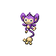

# 190 - Aipom

## Types

| Version | Type                               |
| :-----: | ---------------------------------: |
| Classic |  |

## Defenses

| Immune x0                        | Resistant ×¼ | Resistant ×½ | Normal ×1                                                                                                                                                                                                                                                                                                                                                                                                                                                                                                                                                                                                         | Weak ×2                                | Weak ×4 |
| -------------------------------- | ------------ | ------------ | ----------------------------------------------------------------------------------------------------------------------------------------------------------------------------------------------------------------------------------------------------------------------------------------------------------------------------------------------------------------------------------------------------------------------------------------------------------------------------------------------------------------------------------------------------------------------------------------------------------------- | -------------------------------------- | ------- |
|  |              |              |                 |  |         |

## Abilities

| Version | Ability             |
| ------- | ------------------- |
| Base Game | Run Away / [Pickup](#/abilities/pickup) / Skill Link |
| All     | [Skill-Link](#/abilities/skilllink) / [Pickup](#/abilities/pickup) |

## Base Stats

| Version | HP | Atk | Def | SAtk | SDef | Spd | BST |
| ------- | -- | --- | --- | ---- | ---- | --- | --- |
| Base Game | 55 | 70 | 55 | 40 | 55 | 85 | 360 |
| All     | 55 | 70  | 55  | 40   | 55   | 85  | 360 |

## Level Up Moves

| Level | Name        | Power | Accuracy | PP  | Type                                 | Damage Class                           |
| ----- | ----------- | ----- | -------- | --- | ------------------------------------ | -------------------------------------- |
| 1      | [Scratch](#/moves/scratch) | 40    | 100%     | 35  |    |  || 1      | [Tail-Whip](#/moves/tailwhip) | -     | 100%     | 30  |    |      || 4      | [Sand-Attack](#/moves/sandattack) | -     | 100%     | 15  |    |      || 8      | [Astonish](#/moves/astonish) | 30    | 100%     | 15  |      |  || 11     | [Baton-Pass](#/moves/batonpass) | -     | -        | 40  |    |      || 15     | [Tickle](#/moves/tickle) | -     | 100%     | 20  |    |      || 18     | [Fury-Swipes](#/moves/furyswipes) | 18    | 80%      | 15  |    |  || 22     | [Swift](#/moves/swift) | 60    | -        | 20  |    |    || 25     | [Screech](#/moves/screech) | -     | 85%      | 40  |    |      || 29     | [Agility](#/moves/agility) | -     | -        | 30  |  |      || 32     | [Double-Hit](#/moves/doublehit) | 35    | 90%      | 10  |    |  || 36     | [Fling](#/moves/fling) | -     | 100%     | 10  |        |  || 39     | [Nasty-Plot](#/moves/nastyplot) | -     | -        | 20  |        |      || 43     | [Last-Resort](#/moves/lastresort) | 130   | 100%     | 130 |    |  || 47     | [Fake-Out](#/moves/fakeout) | 40    | 100%     | 10  |    |  |
## Learnable Moves

| Machine | Name         | Power | Accuracy | PP | Type                                   | Damage Class                           |
| ------- | ------------ | ----- | -------- | -- | -------------------------------------- | -------------------------------------- |
| HM01 | [Cut](#/moves/cut) | 60    | 100%     | 20 |        |  || HM04 | [Strength](#/moves/strength) | 85    | 100%     | 15 |          |  || TM01 | [Hone-Claws](#/moves/honeclaws) | -     | -        | 15 |          |      || TM06 | [Toxic](#/moves/toxic) | -     | 85%      | 10 |      |      || TM10 | [Hidden-Power](#/moves/hiddenpower) | 60    | 100%     | 15 |      |    || TM11 | [Sunny-Day](#/moves/sunnyday) | -     | -        | 5  |          |      || TM12 | [Taunt](#/moves/taunt) | -     | 100%     | 20 |          |      || TM17 | [Protect](#/moves/protect) | -     | -        | 10 |      |      || TM18 | [Rain-Dance](#/moves/raindance) | -     | -        | 5  |        |      || TM21 | [Frustration](#/moves/frustration) | -     | 100%     | 20 |      |  || TM22 | [Solar-Beam](#/moves/solarbeam) | 120   | 100%     | 10 |        |    || TM24 | [Thunderbolt](#/moves/thunderbolt) | 90    | 100%     | 15 |  |    || TM25 | [Thunder](#/moves/thunder) | 110   | 70%      | 10 |  |    || TM27 | [Return](#/moves/return) | -     | 100%     | 20 |      |  || TM28 | [Dig](#/moves/dig) | 100   | 100%     | 10 |      |  || TM30 | [Shadow-Ball](#/moves/shadowball) | 90    | 100%     | 15 |        |    || TM31 | [Brick-Break](#/moves/brickbreak) | 75    | 100%     | 15 |  |  || TM32 | [Double-Team](#/moves/doubleteam) | -     | -        | 15 |      |      || TM40 | [Aerial-Ace](#/moves/aerialace) | 60    | -        | 20 |      |  || TM42 | [Facade](#/moves/facade) | 70    | 100%     | 20 |      |  || TM44 | [Rest](#/moves/rest) | -     | -        | 10 |    |      || TM45 | [Attract](#/moves/attract) | -     | 100%     | 15 |      |      || TM46 | [Thief](#/moves/thief) | 60    | 100%     | 25 |          |  || TM47 | [Low-Sweep](#/moves/lowsweep) | 65    | 100%     | 20 |  |  || TM48 | [Round](#/moves/round) | 60    | 100%     | 15 |      |    || TM62 | [Acrobatics](#/moves/acrobatics) | 55    | 100%     | 15 |      |  || TM65 | [Shadow-Claw](#/moves/shadowclaw) | 80    | 100%     | 15 |        |  || TM66 | [Payback](#/moves/payback) | 50    | 100%     | 10 |          |  || TM67 | [Retaliate](#/moves/retaliate) | 70    | 100%     | 5  |      |  || TM73 | [Thunder-Wave](#/moves/thunderwave) | -     | 90%      | 20 |  |      || TM83 | [Work-Up](#/moves/workup) | -     | -        | 30 |      |      || TM85 | [Dream-Eater](#/moves/dreameater) | 100   | 100%     | 15 |    |    || TM86 | [Grass-Knot](#/moves/grassknot) | -     | 100%     | 20 |        |    || TM87 | [Swagger](#/moves/swagger) | -     | 85%      | 15 |      |      || TM89 | [U-Turn](#/moves/uturn) | 70    | 100%     | 20 |            |  || TM90 | [Substitute](#/moves/substitute) | -     | -        | 10 |      |      || TM94    | Rock-Smash   | 40    | 100%     | 15 |  |  |
## Locations

- [Pinwheel Forest - Outside](routes/Pinwheel%20Forest%20-%20Outside/index.md)
- [Route 7](routes/Route%207/index.md)
