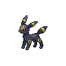

# 197 - Umbreon

## Types

| Version | Type                           |
| :-----: | -----------------------------: |
| Classic |  |

## Defenses

| Immune x0                            | Resistant ×¼ | Resistant ×½                                                        | Normal ×1                                                                                                                                                                                                                                                                                                                                                                                                                                                       | Weak ×2                                                                                                      | Weak ×4 |
| ------------------------------------ | ------------ | ------------------------------------------------------------------- | --------------------------------------------------------------------------------------------------------------------------------------------------------------------------------------------------------------------------------------------------------------------------------------------------------------------------------------------------------------------------------------------------------------------------------------------------------------- | ------------------------------------------------------------------------------------------------------------ | ------- |
|  |              |   |             |    |         |

## Abilities

| Version | Ability                 |
| ------- | ----------------------- |
| All     | [Synchronize](#/abilities/synchronize) / [Prankster](#/abilities/prankster) |

## Base Stats

| Version | HP | Atk | Def | SAtk | SDef | Spd | BST |
| ------- | -- | --- | --- | ---- | ---- | --- | --- |
| Base Game | 95 | 65 | 110 | 60 | 130 | 65 | 525 |
| All     | 95 | 65  | 110 | 60   | 130  | 65  | 525 |

## Level Up Moves

| Level | Name         | Power | Accuracy | PP  | Type                                 | Damage Class                           |
| ----- | ------------ | ----- | -------- | --- | ------------------------------------ | -------------------------------------- |
| 1      | [Tackle](#/moves/tackle) | 35    | 95%      | 35  |    |  || 1      | [Tail-Whip](#/moves/tailwhip) | -     | 100%     | 30  |    |      || 1      | [Helping-Hand](#/moves/helpinghand) | -     | -        | 20  |    |      || 1      | [Growth](#/moves/growth) | -     | -        | 20  |    |      || 8      | [Sand-Attack](#/moves/sandattack) | -     | 100%     | 15  |    |      || 13     | [Pursuit](#/moves/pursuit) | 40    | 100%     | 20  |        |  || 18     | [Quick-Attack](#/moves/quickattack) | 40    | 100%     | 30  |    |  || 23     | [Confuse-Ray](#/moves/confuseray) | -     | 100%     | 10  |      |      || 28     | [Tickle](#/moves/tickle) | -     | 100%     | 20  |    |      || 36     | [Feint-Attack](#/moves/feintattack) | 60    | -        | 20  |        |  || 38     | [Assurance](#/moves/assurance) | 60    | 100%     | 10  |        |  || 43     | [Foul-Play](#/moves/foulplay) | 95    | 100%     | 15  |        |  || 48     | [Last-Resort](#/moves/lastresort) | 130   | 100%     | 130 |    |  || 53     | [Mean-Look](#/moves/meanlook) | -     | -        | 5   |    |      || 58     | [Screech](#/moves/screech) | -     | 85%      | 40  |    |      || 63     | [Moonlight](#/moves/moonlight) | -     | -        | 5   |      |      || 68     | [Guard-Swap](#/moves/guardswap) | -     | -        | 10  |  |      || 73     | [Power-Trick](#/moves/powertrick) | -     | -        | 10  |  |      |
## Learnable Moves

| Machine | Name         | Power | Accuracy | PP | Type                                 | Damage Class                           |
| ------- | ------------ | ----- | -------- | -- | ------------------------------------ | -------------------------------------- |
| HM01 | [Cut](#/moves/cut) | 60    | 100%     | 20 |      |  || TM06 | [Toxic](#/moves/toxic) | -     | 85%      | 10 |    |      || TM10 | [Hidden-Power](#/moves/hiddenpower) | 60    | 100%     | 15 |    |    || TM11 | [Sunny-Day](#/moves/sunnyday) | -     | -        | 5  |        |      || TM12 | [Taunt](#/moves/taunt) | -     | 100%     | 20 |        |      || TM15 | [Hyper-Beam](#/moves/hyperbeam) | 150   | 90%      | 5  |    |    || TM17 | [Protect](#/moves/protect) | -     | -        | 10 |    |      || TM18 | [Rain-Dance](#/moves/raindance) | -     | -        | 5  |      |      || TM21 | [Frustration](#/moves/frustration) | -     | 100%     | 20 |    |  || TM27 | [Return](#/moves/return) | -     | 100%     | 20 |    |  || TM28 | [Dig](#/moves/dig) | 100   | 100%     | 10 |    |  || TM29 | [Psychic](#/moves/psychic) | 90    | 100%     | 10 |  |    || TM30 | [Shadow-Ball](#/moves/shadowball) | 90    | 100%     | 15 |      |    || TM32 | [Double-Team](#/moves/doubleteam) | -     | -        | 15 |    |      || TM41 | [Torment](#/moves/torment) | -     | 100%     | 15 |        |      || TM42 | [Facade](#/moves/facade) | 70    | 100%     | 20 |    |  || TM44 | [Rest](#/moves/rest) | -     | -        | 10 |  |      || TM45 | [Attract](#/moves/attract) | -     | 100%     | 15 |    |      || TM48 | [Round](#/moves/round) | 60    | 100%     | 15 |    |    || TM49 | [Echoed-Voice](#/moves/echoedvoice) | 40    | 100%     | 15 |    |    || TM66 | [Payback](#/moves/payback) | 50    | 100%     | 10 |        |  || TM67 | [Retaliate](#/moves/retaliate) | 70    | 100%     | 5  |    |  || TM68 | [Giga-Impact](#/moves/gigaimpact) | 150   | 90%      | 5  |    |  || TM70 | [Flash](#/moves/flash) | -     | 100%     | 20 |    |      || TM77 | [Psych-Up](#/moves/psychup) | -     | -        | 10 |    |      || TM83 | [Work-Up](#/moves/workup) | -     | -        | 30 |    |      || TM85 | [Dream-Eater](#/moves/dreameater) | 100   | 100%     | 15 |  |    || TM86 | [Grass-Knot](#/moves/grassknot) | -     | 100%     | 20 |      |    || TM87 | [Swagger](#/moves/swagger) | -     | 85%      | 15 |    |      || TM90 | [Substitute](#/moves/substitute) | -     | -        | 10 |    |      || TM95    | Snarl        | 60    | 95%      | 15 |        |    |