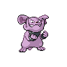

# 210 - Granbull

## Types

| Version | Type                             |
| :-----: | -------------------------------: |
| Classic |  |

## Defenses

| Immune x0                          | Resistant ×¼ | Resistant ×½                                                                                               | Normal ×1                                                                                                                                                                                                                                                                                                                                                                                                                                                       | Weak ×2                                                                 | Weak ×4 |
| ---------------------------------- | ------------ | ---------------------------------------------------------------------------------------------------------- | --------------------------------------------------------------------------------------------------------------------------------------------------------------------------------------------------------------------------------------------------------------------------------------------------------------------------------------------------------------------------------------------------------------------------------------------------------------- | ----------------------------------------------------------------------- | ------- |
|  |              |    |             |   |         |

## Abilities

| Version | Ability              |
| ------- | -------------------- |
| All     | [Intimidate](#/abilities/intimidate) / [Rattled](#/abilities/rattled) |

## Base Stats

| Version | HP  | Atk | Def | SAtk | SDef | Spd | BST |
| ------- | --- | --- | --- | ---- | ---- | --- | --- |
| All     | 105 | 120 | 75  | 60   | 60   | 45  | 465 |

## Level Up Moves

| Level | Name         | Power | Accuracy | PP | Type                                   | Damage Class                           |
| ----- | ------------ | ----- | -------- | -- | -------------------------------------- | -------------------------------------- |
| 1      | [Tackle](#/moves/tackle) | 35    | 95%      | 35 |      |  || 1      | [Tail-Whip](#/moves/tailwhip) | -     | 100%     | 30 |      |      || 1      | [Scary-Face](#/moves/scaryface) | -     | 90%      | 10 |      |      || 1      | [Charm](#/moves/charm) | -     | 100%     | 20 |        |      || 1      | [Thunder-Fang](#/moves/thunderfang) | 75    | 95%      | 15 |  |  || 1      | [Ice-Fang](#/moves/icefang) | 75    | 95%      | 15 |            |  || 1      | [Fire-Fang](#/moves/firefang) | 75    | 95%      | 15 |          |  || 1      | [Metronome](#/moves/metronome) | -     | -        | 10 |      |      || 7      | [Bite](#/moves/bite) | 60    | 100%     | 25 |          |  || 13     | [Lick](#/moves/lick) | 30    | 100%     | 30 |        |  || 19     | [Headbutt](#/moves/headbutt) | 70    | 100%     | 15 |      |  || 27     | [Roar](#/moves/roar) | -     | -        | 20 |      |      || 35     | [Rage](#/moves/rage) | 20    | 100%     | 20 |      |  || 43     | [Take-Down](#/moves/takedown) | 90    | 85%      | 20 |      |  || 51     | [Payback](#/moves/payback) | 50    | 100%     | 10 |          |  || 59     | [Crunch](#/moves/crunch) | 80    | 100%     | 15 |          |  || 61     | [Close-Combat](#/moves/closecombat) | 120   | 100%     | 5  |  |  || 67     | [Outrage](#/moves/outrage) | 120   | 100%     | 10 |      |  |
## Learnable Moves

| Machine | Name         | Power | Accuracy | PP | Type                                   | Damage Class                           |
| ------- | ------------ | ----- | -------- | -- | -------------------------------------- | -------------------------------------- |
| HM04 | [Strength](#/moves/strength) | 85    | 100%     | 15 |          |  || TM06 | [Toxic](#/moves/toxic) | -     | 85%      | 10 |      |      || TM08 | [Bulk-Up](#/moves/bulkup) | -     | -        | 20 |  |      || TM10 | [Hidden-Power](#/moves/hiddenpower) | 60    | 100%     | 15 |      |    || TM11 | [Sunny-Day](#/moves/sunnyday) | -     | -        | 5  |          |      || TM12 | [Taunt](#/moves/taunt) | -     | 100%     | 20 |          |      || TM15 | [Hyper-Beam](#/moves/hyperbeam) | 150   | 90%      | 5  |      |    || TM17 | [Protect](#/moves/protect) | -     | -        | 10 |      |      || TM18 | [Rain-Dance](#/moves/raindance) | -     | -        | 5  |        |      || TM21 | [Frustration](#/moves/frustration) | -     | 100%     | 20 |      |  || TM22 | [Solar-Beam](#/moves/solarbeam) | 120   | 100%     | 10 |        |    || TM24 | [Thunderbolt](#/moves/thunderbolt) | 90    | 100%     | 15 |  |    || TM25 | [Thunder](#/moves/thunder) | 110   | 70%      | 10 |  |    || TM26 | [Earthquake](#/moves/earthquake) | 100   | 100%     | 10 |      |  || TM27 | [Return](#/moves/return) | -     | 100%     | 20 |      |  || TM28 | [Dig](#/moves/dig) | 100   | 100%     | 10 |      |  || TM30 | [Shadow-Ball](#/moves/shadowball) | 90    | 100%     | 15 |        |    || TM31 | [Brick-Break](#/moves/brickbreak) | 75    | 100%     | 15 |  |  || TM32 | [Double-Team](#/moves/doubleteam) | -     | -        | 15 |      |      || TM33 | [Reflect](#/moves/reflect) | -     | -        | 20 |    |      || TM35 | [Flamethrower](#/moves/flamethrower) | 95    | 100%     | 15 |          |    || TM36 | [Sludge-Bomb](#/moves/sludgebomb) | 90    | 100%     | 10 |      |    || TM38 | [Fire-Blast](#/moves/fireblast) | 110   | 85%      | 5  |          |    || TM39 | [Rock-Tomb](#/moves/rocktomb) | 60    | 95%      | 15 |          |  || TM41 | [Torment](#/moves/torment) | -     | 100%     | 15 |          |      || TM42 | [Facade](#/moves/facade) | 70    | 100%     | 20 |      |  || TM44 | [Rest](#/moves/rest) | -     | -        | 10 |    |      || TM45 | [Attract](#/moves/attract) | -     | 100%     | 15 |      |      || TM46 | [Thief](#/moves/thief) | 60    | 100%     | 25 |          |  || TM48 | [Round](#/moves/round) | 60    | 100%     | 15 |      |    || TM50 | [Overheat](#/moves/overheat) | 130   | 90%      | 5  |          |    || TM52 | [Focus-Blast](#/moves/focusblast) | 120   | 70%      | 5  |  |    || TM56 | [Fling](#/moves/fling) | -     | 100%     | 10 |          |  || TM59 | [Incinerate](#/moves/incinerate) | 50    | 100%     | 15 |          |    || TM67 | [Retaliate](#/moves/retaliate) | 70    | 100%     | 5  |      |  || TM68 | [Giga-Impact](#/moves/gigaimpact) | 150   | 90%      | 5  |      |  || TM71 | [Stone-Edge](#/moves/stoneedge) | 100   | 80%      | 5  |          |  || TM73 | [Thunder-Wave](#/moves/thunderwave) | -     | 90%      | 20 |  |      || TM78 | [Bulldoze](#/moves/bulldoze) | 80    | 100%     | 20 |      |  || TM80 | [Rock-Slide](#/moves/rockslide) | 80    | 95%      | 10 |          |  || TM83 | [Work-Up](#/moves/workup) | -     | -        | 30 |      |      || TM87 | [Swagger](#/moves/swagger) | -     | 85%      | 15 |      |      || TM90 | [Substitute](#/moves/substitute) | -     | -        | 10 |      |      || TM93 | [Wild-Charge](#/moves/wildcharge) | 90    | 100%     | 15 |  |  || TM94 | [Rock-Smash](#/moves/rocksmash) | 40    | 100%     | 15 |  |  || TM95    | Snarl        | 60    | 95%      | 15 |          |    |
## Locations

- [Route 9](routes/Route%209/index.md)
