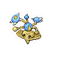

# 237 - Hitmontop

## Types

| Version | Type                                   |
| :-----: | -------------------------------------: |
| Classic |  |

## Defenses

| Immune x0 | Resistant ×¼ | Resistant ×½                                                                                       | Normal ×1                                                                                                                                                                                                                                                                                                                                                                                                                                                             | Weak ×2                                                                                                          | Weak ×4 |
| --------- | ------------ | -------------------------------------------------------------------------------------------------- | --------------------------------------------------------------------------------------------------------------------------------------------------------------------------------------------------------------------------------------------------------------------------------------------------------------------------------------------------------------------------------------------------------------------------------------------------------------------- | ---------------------------------------------------------------------------------------------------------------- | ------- |
|           |              |    |             |    |         |

## Abilities

| Version | Ability                             |
| ------- | ----------------------------------- |
| All     | [Intimidate](#/abilities/intimidate) / [Technician](#/abilities/technician) / [Steadfast](#/abilities/steadfast) |

## Base Stats

| Version | HP | Atk | Def | SAtk | SDef | Spd | BST |
| ------- | -- | --- | --- | ---- | ---- | --- | --- |
| Base Game | 50 | 95 | 95 | 35 | 110 | 70 | 455 |
| All     | 50 | 95  | 95  | 35   | 110  | 70  | 455 |

## Level Up Moves

| Level | Name         | Power | Accuracy | PP | Type                                   | Damage Class                           |
| ----- | ------------ | ----- | -------- | -- | -------------------------------------- | -------------------------------------- |
| 1      | [Rolling-Kick](#/moves/rollingkick) | 60    | 85%      | 15 |  |  || 1      | [Revenge](#/moves/revenge) | 60    | 100%     | 10 |  |  || 6      | [Focus-Energy](#/moves/focusenergy) | -     | -        | 30 |      |      || 10     | [Pursuit](#/moves/pursuit) | 40    | 100%     | 20 |          |  || 15     | [Quick-Attack](#/moves/quickattack) | 40    | 100%     | 30 |      |  || 19     | [Triple-Kick](#/moves/triplekick) | 10    | 90%      | 10 |  |  || 24     | [Rapid-Spin](#/moves/rapidspin) | 50    | 100%     | 40 |      |  || 28     | [Counter](#/moves/counter) | -     | 100%     | 20 |  |  || 33     | [Feint](#/moves/feint) | 50    | 100%     | 50 |      |  || 37     | [Agility](#/moves/agility) | -     | -        | 30 |    |      || 42     | [Gyro-Ball](#/moves/gyroball) | -     | 100%     | 5  |        |  || 46     | [Wide-Guard](#/moves/wideguard) | -     | -        | 10 |          |      || 46     | [Quick-Guard](#/moves/quickguard) | -     | -        | 15 |  |      || 51     | [Detect](#/moves/detect) | -     | -        | 5  |  |      || 55     | [Close-Combat](#/moves/closecombat) | 120   | 100%     | 5  |  |  || 60     | [Endeavor](#/moves/endeavor) | -     | 100%     | 5  |      |  |
## Learnable Moves

| Machine | Name         | Power | Accuracy | PP | Type                                   | Damage Class                           |
| ------- | ------------ | ----- | -------- | -- | -------------------------------------- | -------------------------------------- |
| HM04 | [Strength](#/moves/strength) | 85    | 100%     | 15 |          |  || TM06 | [Toxic](#/moves/toxic) | -     | 85%      | 10 |      |      || TM08 | [Bulk-Up](#/moves/bulkup) | -     | -        | 20 |  |      || TM10 | [Hidden-Power](#/moves/hiddenpower) | 60    | 100%     | 15 |      |    || TM11 | [Sunny-Day](#/moves/sunnyday) | -     | -        | 5  |          |      || TM17 | [Protect](#/moves/protect) | -     | -        | 10 |      |      || TM18 | [Rain-Dance](#/moves/raindance) | -     | -        | 5  |        |      || TM21 | [Frustration](#/moves/frustration) | -     | 100%     | 20 |      |  || TM26 | [Earthquake](#/moves/earthquake) | 100   | 100%     | 10 |      |  || TM27 | [Return](#/moves/return) | -     | 100%     | 20 |      |  || TM28 | [Dig](#/moves/dig) | 100   | 100%     | 10 |      |  || TM31 | [Brick-Break](#/moves/brickbreak) | 75    | 100%     | 15 |  |  || TM32 | [Double-Team](#/moves/doubleteam) | -     | -        | 15 |      |      || TM37 | [Sandstorm](#/moves/sandstorm) | -     | -        | 10 |          |      || TM40 | [Aerial-Ace](#/moves/aerialace) | 60    | -        | 20 |      |  || TM42 | [Facade](#/moves/facade) | 70    | 100%     | 20 |      |  || TM44 | [Rest](#/moves/rest) | -     | -        | 10 |    |      || TM45 | [Attract](#/moves/attract) | -     | 100%     | 15 |      |      || TM46 | [Thief](#/moves/thief) | 60    | 100%     | 25 |          |  || TM47 | [Low-Sweep](#/moves/lowsweep) | 65    | 100%     | 20 |  |  || TM48 | [Round](#/moves/round) | 60    | 100%     | 15 |      |    || TM67 | [Retaliate](#/moves/retaliate) | 70    | 100%     | 5  |      |  || TM71 | [Stone-Edge](#/moves/stoneedge) | 100   | 80%      | 5  |          |  || TM78 | [Bulldoze](#/moves/bulldoze) | 80    | 100%     | 20 |      |  || TM80 | [Rock-Slide](#/moves/rockslide) | 80    | 95%      | 10 |          |  || TM83 | [Work-Up](#/moves/workup) | -     | -        | 30 |      |      || TM87 | [Swagger](#/moves/swagger) | -     | 85%      | 15 |      |      || TM90 | [Substitute](#/moves/substitute) | -     | -        | 10 |      |      || TM94    | Rock-Smash   | 40    | 100%     | 15 |  |  |