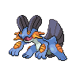

# 260 - Swampert

## Types

| Version | Type                                                                |
| :-----: | ------------------------------------------------------------------: |
| Classic |   |

## Defenses

| Immune x0                              | Resistant ×¼ | Resistant ×½                                                                                                                                  | Normal ×1                                                                                                                                                                                                                                                                                                                                                                                                                                                       | Weak ×2 | Weak ×4                          |
| -------------------------------------- | ------------ | --------------------------------------------------------------------------------------------------------------------------------------------- | --------------------------------------------------------------------------------------------------------------------------------------------------------------------------------------------------------------------------------------------------------------------------------------------------------------------------------------------------------------------------------------------------------------------------------------------------------------- | ------- | -------------------------------- |
|  |              |     |             |         |  |

## Abilities

| Version | Ability                |
| ------- | ---------------------- |
| All     | [Torrent](#/abilities/torrent) / [Mold-Breaker](#/abilities/moldbreaker) |

## Base Stats

| Version | HP  | Atk | Def | SAtk | SDef | Spd | BST |
| ------- | --- | --- | --- | ---- | ---- | --- | --- |
| All     | 100 | 110 | 90  | 85   | 90   | 60  | 535 |

## Level Up Moves

| Level | Name        | Power | Accuracy | PP | Type                                   | Damage Class                           |
| ----- | ----------- | ----- | -------- | -- | -------------------------------------- | -------------------------------------- |
| 1      | [Tackle](#/moves/tackle) | 35    | 95%      | 35 |      |  || 1      | [Growl](#/moves/growl) | -     | 100%     | 40 |      |      || 1      | [Water-Gun](#/moves/watergun) | 40    | 100%     | 25 |        |    || 1      | [Mud-Slap](#/moves/mudslap) | 20    | 100%     | 10 |      |    || 1      | [Yawn](#/moves/yawn) | -     | -        | 10 |      |      || 1      | [Counter](#/moves/counter) | -     | 100%     | 20 |  |  || 1      | [Mirror-Coat](#/moves/mirrorcoat) | -     | 100%     | 20 |    |    || 15     | [Bide](#/moves/bide) | -     | -        | 10 |      |  || 16     | [Mud-Shot](#/moves/mudshot) | 55    | 95%      | 15 |      |    || 20     | [Foresight](#/moves/foresight) | -     | -        | 40 |      |      || 25     | [Mud-Bomb](#/moves/mudbomb) | 65    | 85%      | 10 |      |    || 31     | [Take-Down](#/moves/takedown) | 90    | 85%      | 20 |      |  || 39     | [Muddy-Water](#/moves/muddywater) | 90    | 85%      | 10 |        |    || 46     | [Protect](#/moves/protect) | -     | -        | 10 |      |      || 52     | [Earthquake](#/moves/earthquake) | 100   | 100%     | 10 |      |  || 61     | [Endeavor](#/moves/endeavor) | -     | 100%     | 5  |      |  || 69     | [Hammer-Arm](#/moves/hammerarm) | 100   | 90%      | 10 |  |  || 77     | [Superpower](#/moves/superpower) | 120   | 100%     | 5  |  |  |
## Learnable Moves

| Machine | Name         | Power | Accuracy | PP | Type                                   | Damage Class                           |
| ------- | ------------ | ----- | -------- | -- | -------------------------------------- | -------------------------------------- |
| HM03 | [Surf](#/moves/surf) | 90    | 100%     | 15 |        |    || HM04 | [Strength](#/moves/strength) | 85    | 100%     | 15 |          |  || HM05 | [Waterfall](#/moves/waterfall) | 85    | 100%     | 15 |        |  || HM06 | [Dive](#/moves/dive) | 100   | 100%     | 10 |        |  || TM05 | [Roar](#/moves/roar) | -     | -        | 20 |      |      || TM06 | [Toxic](#/moves/toxic) | -     | 85%      | 10 |      |      || TM07 | [Hail](#/moves/hail) | -     | -        | 10 |            |      || TM10 | [Hidden-Power](#/moves/hiddenpower) | 60    | 100%     | 15 |      |    || TM13 | [Ice-Beam](#/moves/icebeam) | 90    | 100%     | 10 |            |    || TM14 | [Blizzard](#/moves/blizzard) | 110   | 70%      | 5  |            |    || TM15 | [Hyper-Beam](#/moves/hyperbeam) | 150   | 90%      | 5  |      |    || TM18 | [Rain-Dance](#/moves/raindance) | -     | -        | 5  |        |      || TM21 | [Frustration](#/moves/frustration) | -     | 100%     | 20 |      |  || TM27 | [Return](#/moves/return) | -     | 100%     | 20 |      |  || TM28 | [Dig](#/moves/dig) | 100   | 100%     | 10 |      |  || TM31 | [Brick-Break](#/moves/brickbreak) | 75    | 100%     | 15 |  |  || TM32 | [Double-Team](#/moves/doubleteam) | -     | -        | 15 |      |      || TM34 | [Sludge-Wave](#/moves/sludgewave) | 95    | 100%     | 10 |      |    || TM39 | [Rock-Tomb](#/moves/rocktomb) | 60    | 95%      | 15 |          |  || TM42 | [Facade](#/moves/facade) | 70    | 100%     | 20 |      |  || TM44 | [Rest](#/moves/rest) | -     | -        | 10 |    |      || TM45 | [Attract](#/moves/attract) | -     | 100%     | 15 |      |      || TM48 | [Round](#/moves/round) | 60    | 100%     | 15 |      |    || TM49 | [Echoed-Voice](#/moves/echoedvoice) | 40    | 100%     | 15 |      |    || TM52 | [Focus-Blast](#/moves/focusblast) | 120   | 70%      | 5  |  |    || TM55 | [Scald](#/moves/scald) | 80    | 100%     | 15 |        |    || TM56 | [Fling](#/moves/fling) | -     | 100%     | 10 |          |  || TM68 | [Giga-Impact](#/moves/gigaimpact) | 150   | 90%      | 5  |      |  || TM71 | [Stone-Edge](#/moves/stoneedge) | 100   | 80%      | 5  |          |  || TM78 | [Bulldoze](#/moves/bulldoze) | 80    | 100%     | 20 |      |  || TM80 | [Rock-Slide](#/moves/rockslide) | 80    | 95%      | 10 |          |  || TM87 | [Swagger](#/moves/swagger) | -     | 85%      | 15 |      |      || TM90 | [Substitute](#/moves/substitute) | -     | -        | 10 |      |      || TM94    | Rock-Smash   | 40    | 100%     | 15 |  |  |