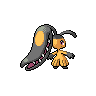

# 303 - Mawile

## Types

| Version | Type                                                              |
| :-----: | ----------------------------------------------------------------: |
| Classic |   |

## Defenses

| Immune x0                                                                 | Resistant ×¼                 | Resistant ×½                                                                                                                                                                                                                                                                                        | Normal ×1                                                                                                                                                                                        | Weak ×2                                                               | Weak ×4 |
| ------------------------------------------------------------------------- | ---------------------------- | --------------------------------------------------------------------------------------------------------------------------------------------------------------------------------------------------------------------------------------------------------------------------------------------------- | ------------------------------------------------------------------------------------------------------------------------------------------------------------------------------------------------ | --------------------------------------------------------------------- | ------- |
|   |  |         |      |   |         |

## Abilities

| Version | Ability                  |
| ------- | ------------------------ |
| All     | [Sheer-Force](#/abilities/sheerforce) / [Intimidate](#/abilities/intimidate) |

## Base Stats

| Version | HP | Atk | Def | SAtk | SDef | Spd | BST |
| ------- | -- | --- | --- | ---- | ---- | --- | --- |
| Base Game | 50 | 85 | 85 | 55 | 55 | 50 | 380 |
| All     | 70 | 105 | 90  | 55   | 90   | 50  | 460 |

## Level Up Moves

| Level | Name          | Power | Accuracy | PP | Type                                   | Damage Class                           |
| ----- | ------------- | ----- | -------- | -- | -------------------------------------- | -------------------------------------- |
| 1      | [Astonish](#/moves/astonish) | 30    | 100%     | 15 |        |  || 1      | [Thunder-Fang](#/moves/thunderfang) | 75    | 95%      | 15 |  |  || 1      | [Ice-Fang](#/moves/icefang) | 75    | 95%      | 15 |            |  || 1      | [Fire-Fang](#/moves/firefang) | 75    | 95%      | 15 |          |  || 1      | [Metal-Claw](#/moves/metalclaw) | 50    | 95%      | 35 |        |  || 6      | [Fake-Tears](#/moves/faketears) | -     | 100%     | 20 |          |      || 11     | [Bite](#/moves/bite) | 60    | 100%     | 25 |          |  || 16     | [Sweet-Scent](#/moves/sweetscent) | -     | 100%     | 20 |      |      || 21     | [Vice-Grip](#/moves/vicegrip) | 55    | 100%     | 30 |      |  || 21     | [Thunder-Punch](#/moves/thunderpunch) | 80    | 100%     | 15 |  |  || 21     | [Ice-Punch](#/moves/icepunch) | 80    | 100%     | 15 |            |  || 26     | [Feint-Attack](#/moves/feintattack) | 60    | -        | 20 |          |  || 31     | [Baton-Pass](#/moves/batonpass) | -     | -        | 40 |      |      || 36     | [Crunch](#/moves/crunch) | 80    | 100%     | 15 |          |  || 41     | [Iron-Defense](#/moves/irondefense) | -     | -        | 15 |        |      || 46     | [Sucker-Punch](#/moves/suckerpunch) | 70    | 100%     | 5  |          |  || 51     | [Stockpile](#/moves/stockpile) | -     | -        | 20 |      |      || 51     | [Spit-Up](#/moves/spitup) | -     | 100%     | 10 |      |    || 51     | [Swallow](#/moves/swallow) | -     | -        | 10 |      |      || 56     | [Iron-Head](#/moves/ironhead) | 80    | 100%     | 15 |        |  || 61     | [Metal-Burst](#/moves/metalburst) | -     | 100%     | 10 |        |  |
## Learnable Moves

| Machine | Name         | Power | Accuracy | PP | Type                                   | Damage Class                           |
| ------- | ------------ | ----- | -------- | -- | -------------------------------------- | -------------------------------------- |
| HM04 | [Strength](#/moves/strength) | 85    | 100%     | 15 |          |  || TM06 | [Toxic](#/moves/toxic) | -     | 85%      | 10 |      |      || TM10 | [Hidden-Power](#/moves/hiddenpower) | 60    | 100%     | 15 |      |    || TM11 | [Sunny-Day](#/moves/sunnyday) | -     | -        | 5  |          |      || TM12 | [Taunt](#/moves/taunt) | -     | 100%     | 20 |          |      || TM13 | [Ice-Beam](#/moves/icebeam) | 90    | 100%     | 10 |            |    || TM15 | [Hyper-Beam](#/moves/hyperbeam) | 150   | 90%      | 5  |      |    || TM17 | [Protect](#/moves/protect) | -     | -        | 10 |      |      || TM18 | [Rain-Dance](#/moves/raindance) | -     | -        | 5  |        |      || TM21 | [Frustration](#/moves/frustration) | -     | 100%     | 20 |      |  || TM22 | [Solar-Beam](#/moves/solarbeam) | 120   | 100%     | 10 |        |    || TM27 | [Return](#/moves/return) | -     | 100%     | 20 |      |  || TM30 | [Shadow-Ball](#/moves/shadowball) | 90    | 100%     | 15 |        |    || TM31 | [Brick-Break](#/moves/brickbreak) | 75    | 100%     | 15 |  |  || TM32 | [Double-Team](#/moves/doubleteam) | -     | -        | 15 |      |      || TM35 | [Flamethrower](#/moves/flamethrower) | 95    | 100%     | 15 |          |    || TM36 | [Sludge-Bomb](#/moves/sludgebomb) | 90    | 100%     | 10 |      |    || TM37 | [Sandstorm](#/moves/sandstorm) | -     | -        | 10 |          |      || TM38 | [Fire-Blast](#/moves/fireblast) | 110   | 85%      | 5  |          |    || TM39 | [Rock-Tomb](#/moves/rocktomb) | 60    | 95%      | 15 |          |  || TM41 | [Torment](#/moves/torment) | -     | 100%     | 15 |          |      || TM42 | [Facade](#/moves/facade) | 70    | 100%     | 20 |      |  || TM44 | [Rest](#/moves/rest) | -     | -        | 10 |    |      || TM45 | [Attract](#/moves/attract) | -     | 100%     | 15 |      |      || TM48 | [Round](#/moves/round) | 60    | 100%     | 15 |      |    || TM52 | [Focus-Blast](#/moves/focusblast) | 120   | 70%      | 5  |  |    || TM54 | [False-Swipe](#/moves/falseswipe) | 40    | 100%     | 40 |      |  || TM56 | [Fling](#/moves/fling) | -     | 100%     | 10 |          |  || TM57 | [Charge-Beam](#/moves/chargebeam) | 50    | 90%      | 10 |  |    || TM59 | [Incinerate](#/moves/incinerate) | 50    | 100%     | 15 |          |    || TM63 | [Embargo](#/moves/embargo) | -     | 100%     | 15 |          |      || TM66 | [Payback](#/moves/payback) | 50    | 100%     | 10 |          |  || TM68 | [Giga-Impact](#/moves/gigaimpact) | 150   | 90%      | 5  |      |  || TM71 | [Stone-Edge](#/moves/stoneedge) | 100   | 80%      | 5  |          |  || TM75 | [Swords-Dance](#/moves/swordsdance) | -     | -        | 20 |      |      || TM77 | [Psych-Up](#/moves/psychup) | -     | -        | 10 |      |      || TM80 | [Rock-Slide](#/moves/rockslide) | 80    | 95%      | 10 |          |  || TM86 | [Grass-Knot](#/moves/grassknot) | -     | 100%     | 20 |        |    || TM87 | [Swagger](#/moves/swagger) | -     | 85%      | 15 |      |      || TM90 | [Substitute](#/moves/substitute) | -     | -        | 10 |      |      || TM91 | [Flash-Cannon](#/moves/flashcannon) | 80    | 100%     | 10 |        |    || TM94    | Rock-Smash   | 40    | 100%     | 15 |  |  |
## Locations

- [Challenger's Cave - All Floors](routes/Challenger's%20Cave%20-%20All%20Floors/index.md)
- [Challenger's Cave - B1F](routes/Challenger's%20Cave%20-%20B1F/index.md)
- [Challenger's Cave - B2F](routes/Challenger's%20Cave%20-%20B2F/index.md)
- [Chargestone Cave - B1F](routes/Chargestone%20Cave%20-%20B1F/index.md)
- [Twist Mountain - Not 1F](routes/Twist%20Mountain%20-%20Not%201F/index.md)
