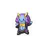

# 314 - Illumise

## Types

| Version | Type                                                                |
| :-----: | ------------------------------------------------------------------: |
| Classic |   |

## Defenses

| Immune x0 | Resistant ×¼ | Resistant ×½                                                                                                                                                | Normal ×1                                                                                                                                                                                                                                                                                                                                                                                                                                                   | Weak ×2                                                           | Weak ×4 |
| --------- | ------------ | ----------------------------------------------------------------------------------------------------------------------------------------------------------- | ----------------------------------------------------------------------------------------------------------------------------------------------------------------------------------------------------------------------------------------------------------------------------------------------------------------------------------------------------------------------------------------------------------------------------------------------------------- | ----------------------------------------------------------------- | ------- |
|           |              |     |             |   |         |

## Abilities

| Version | Ability                 |
| ------- | ----------------------- |
| All     | [Prankster](#/abilities/prankster) / [Tinted-Lens](#/abilities/tintedlens) |

## Base Stats

| Version | HP | Atk | Def | SAtk | SDef | Spd | BST |
| ------- | -- | --- | --- | ---- | ---- | --- | --- |
| Base Game | 65 | 47 | 75 | 73 | 85 | 85 | 430 |
| All     | 80 | 30  | 60  | 80   | 90   | 90  | 430 |

## Level Up Moves

| Level | Name          | Power | Accuracy | PP | Type                                   | Damage Class                           |
| ----- | ------------- | ----- | -------- | -- | -------------------------------------- | -------------------------------------- |
| 1      | [Tackle](#/moves/tackle) | 35    | 95%      | 35 |      |  || 5      | [Sweet-Scent](#/moves/sweetscent) | -     | 100%     | 20 |      |      || 9      | [Charm](#/moves/charm) | -     | 100%     | 20 |        |      || 13     | [Moonlight](#/moves/moonlight) | -     | -        | 5  |        |      || 15     | [Thunder-Shock](#/moves/thundershock) | 40    | 100%     | 30 |  |    || 17     | [Quick-Attack](#/moves/quickattack) | 40    | 100%     | 30 |      |  || 19     | [Struggle-Bug](#/moves/strugglebug) | 50    | 100%     | 20 |            |    || 21     | [Wish](#/moves/wish) | -     | -        | 10 |      |      || 23     | [Shock-Wave](#/moves/shockwave) | 70    | -        | 20 |  |    || 25     | [Encore](#/moves/encore) | -     | 100%     | 5  |      |      || 29     | [Flatter](#/moves/flatter) | -     | 100%     | 15 |          |      || 31     | [Quiver-Dance](#/moves/quiverdance) | -     | -        | 20 |            |      || 33     | [Helping-Hand](#/moves/helpinghand) | -     | -        | 20 |      |      || 35     | [Thunderbolt](#/moves/thunderbolt) | 90    | 100%     | 15 |  |    || 37     | [Zen-Headbutt](#/moves/zenheadbutt) | 80    | 90%      | 15 |    |  || 41     | [Bug-Buzz](#/moves/bugbuzz) | 90    | 100%     | 10 |            |    || 45     | [Covet](#/moves/covet) | 40    | 100%     | 40 |      |  || 49     | [Baton-Pass](#/moves/batonpass) | -     | -        | 40 |      |      || 53     | [Tailwind](#/moves/tailwind) | -     | -        | 15 |      |      |
## Learnable Moves

| Machine | Name         | Power | Accuracy | PP | Type                                   | Damage Class                           |
| ------- | ------------ | ----- | -------- | -- | -------------------------------------- | -------------------------------------- |
| TM06 | [Toxic](#/moves/toxic) | -     | 85%      | 10 |      |      || TM10 | [Hidden-Power](#/moves/hiddenpower) | 60    | 100%     | 15 |      |    || TM11 | [Sunny-Day](#/moves/sunnyday) | -     | -        | 5  |          |      || TM16 | [Light-Screen](#/moves/lightscreen) | -     | -        | 30 |    |      || TM17 | [Protect](#/moves/protect) | -     | -        | 10 |      |      || TM18 | [Rain-Dance](#/moves/raindance) | -     | -        | 5  |        |      || TM21 | [Frustration](#/moves/frustration) | -     | 100%     | 20 |      |  || TM22 | [Solar-Beam](#/moves/solarbeam) | 120   | 100%     | 10 |        |    || TM25 | [Thunder](#/moves/thunder) | 110   | 70%      | 10 |  |    || TM27 | [Return](#/moves/return) | -     | 100%     | 20 |      |  || TM30 | [Shadow-Ball](#/moves/shadowball) | 90    | 100%     | 15 |        |    || TM31 | [Brick-Break](#/moves/brickbreak) | 75    | 100%     | 15 |  |  || TM32 | [Double-Team](#/moves/doubleteam) | -     | -        | 15 |      |      || TM40 | [Aerial-Ace](#/moves/aerialace) | 60    | -        | 20 |      |  || TM42 | [Facade](#/moves/facade) | 70    | 100%     | 20 |      |  || TM44 | [Rest](#/moves/rest) | -     | -        | 10 |    |      || TM45 | [Attract](#/moves/attract) | -     | 100%     | 15 |      |      || TM46 | [Thief](#/moves/thief) | 60    | 100%     | 25 |          |  || TM48 | [Round](#/moves/round) | 60    | 100%     | 15 |      |    || TM56 | [Fling](#/moves/fling) | -     | 100%     | 10 |          |  || TM57 | [Charge-Beam](#/moves/chargebeam) | 50    | 90%      | 10 |  |    || TM62 | [Acrobatics](#/moves/acrobatics) | 55    | 100%     | 15 |      |  || TM70 | [Flash](#/moves/flash) | -     | 100%     | 20 |      |      || TM73 | [Thunder-Wave](#/moves/thunderwave) | -     | 90%      | 20 |  |      || TM77 | [Psych-Up](#/moves/psychup) | -     | -        | 10 |      |      || TM87 | [Swagger](#/moves/swagger) | -     | 85%      | 15 |      |      || TM89 | [U-Turn](#/moves/uturn) | 70    | 100%     | 20 |            |  || TM90    | Substitute   | -     | -        | 10 |      |      |
## Locations

- [Route 3](routes/Route%203/index.md)
- [Village Bridge](routes/Village%20Bridge/index.md)
