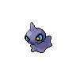

# 353 - Shuppet

## Types

| Version | Type                             |
| :-----: | -------------------------------: |
| Classic |  |

## Defenses

| Immune x0                                                                     | Resistant ×¼ | Resistant ×½                                                        | Normal ×1                                                                                                                                                                                                                                                                                                                                                                                                                                                       | Weak ×2                                                             | Weak ×4 |
| ----------------------------------------------------------------------------- | ------------ | ------------------------------------------------------------------- | --------------------------------------------------------------------------------------------------------------------------------------------------------------------------------------------------------------------------------------------------------------------------------------------------------------------------------------------------------------------------------------------------------------------------------------------------------------- | ------------------------------------------------------------------- | ------- |
|   |              |   |             |   |         |

## Abilities

| Version | Ability                |
| ------- | ---------------------- |
| All     | [Insomnia](#/abilities/insomnia) / [Cursed-Body](#/abilities/cursedbody) |

## Base Stats

| Version | HP | Atk | Def | SAtk | SDef | Spd | BST |
| ------- | -- | --- | --- | ---- | ---- | --- | --- |
| Base Game | 44 | 75 | 35 | 63 | 33 | 45 | 295 |
| All     | 44 | 75  | 35  | 63   | 33   | 45  | 295 |

## Level Up Moves

| Level | Name         | Power | Accuracy | PP | Type                                 | Damage Class                           |
| ----- | ------------ | ----- | -------- | -- | ------------------------------------ | -------------------------------------- |
| 1      | [Knock-Off](#/moves/knockoff) | 65    | 100%     | 20 |        |  || 1      | [Shadow-Sneak](#/moves/shadowsneak) | 40    | 100%     | 30 |      |  || 5      | [Screech](#/moves/screech) | -     | 85%      | 40 |    |      || 8      | [Night-Shade](#/moves/nightshade) | -     | 100%     | 15 |      |    || 13     | [Curse](#/moves/curse) | -     | -        | 10 |      |      || 16     | [Spite](#/moves/spite) | -     | 100%     | 10 |      |      || 16     | [Pain-Split](#/moves/painsplit) | -     | -        | 20 |    |      || 23     | [Will-O-Wisp](#/moves/willowisp) | -     | 85%      | 15 |        |      || 28     | [Feint-Attack](#/moves/feintattack) | 60    | -        | 20 |        |  || 31     | [Hex](#/moves/hex) | 65    | 100%     | 10 |      |    || 35     | [Shadow-Ball](#/moves/shadowball) | 90    | 100%     | 15 |      |    || 38     | [Sucker-Punch](#/moves/suckerpunch) | 70    | 100%     | 5  |        |  || 43     | [Embargo](#/moves/embargo) | -     | 100%     | 15 |        |      || 46     | [Snatch](#/moves/snatch) | -     | -        | 10 |        |      || 50     | [Grudge](#/moves/grudge) | -     | -        | 5  |      |      || 55     | [Trick](#/moves/trick) | -     | 100%     | 10 |  |      || 58     | [Gunk-Shot](#/moves/gunkshot) | 120   | 80%      | 5  |    |  |
## Learnable Moves

| Machine | Name         | Power | Accuracy | PP | Type                                   | Damage Class                           |
| ------- | ------------ | ----- | -------- | -- | -------------------------------------- | -------------------------------------- |
| TM04 | [Calm-Mind](#/moves/calmmind) | -     | -        | 20 |    |      || TM06 | [Toxic](#/moves/toxic) | -     | 85%      | 10 |      |      || TM10 | [Hidden-Power](#/moves/hiddenpower) | 60    | 100%     | 15 |      |    || TM11 | [Sunny-Day](#/moves/sunnyday) | -     | -        | 5  |          |      || TM12 | [Taunt](#/moves/taunt) | -     | 100%     | 20 |          |      || TM17 | [Protect](#/moves/protect) | -     | -        | 10 |      |      || TM18 | [Rain-Dance](#/moves/raindance) | -     | -        | 5  |        |      || TM19 | [Telekinesis](#/moves/telekinesis) | -     | -        | 15 |    |      || TM21 | [Frustration](#/moves/frustration) | -     | 100%     | 20 |      |  || TM24 | [Thunderbolt](#/moves/thunderbolt) | 90    | 100%     | 15 |  |    || TM25 | [Thunder](#/moves/thunder) | 110   | 70%      | 10 |  |    || TM27 | [Return](#/moves/return) | -     | 100%     | 20 |      |  || TM29 | [Psychic](#/moves/psychic) | 90    | 100%     | 10 |    |    || TM32 | [Double-Team](#/moves/doubleteam) | -     | -        | 15 |      |      || TM41 | [Torment](#/moves/torment) | -     | 100%     | 15 |          |      || TM42 | [Facade](#/moves/facade) | 70    | 100%     | 20 |      |  || TM44 | [Rest](#/moves/rest) | -     | -        | 10 |    |      || TM45 | [Attract](#/moves/attract) | -     | 100%     | 15 |      |      || TM46 | [Thief](#/moves/thief) | 60    | 100%     | 25 |          |  || TM48 | [Round](#/moves/round) | 60    | 100%     | 15 |      |    || TM57 | [Charge-Beam](#/moves/chargebeam) | 50    | 90%      | 10 |  |    || TM66 | [Payback](#/moves/payback) | 50    | 100%     | 10 |          |  || TM70 | [Flash](#/moves/flash) | -     | 100%     | 20 |      |      || TM73 | [Thunder-Wave](#/moves/thunderwave) | -     | 90%      | 20 |  |      || TM77 | [Psych-Up](#/moves/psychup) | -     | -        | 10 |      |      || TM85 | [Dream-Eater](#/moves/dreameater) | 100   | 100%     | 15 |    |    || TM87 | [Swagger](#/moves/swagger) | -     | 85%      | 15 |      |      || TM90 | [Substitute](#/moves/substitute) | -     | -        | 10 |      |      || TM92    | Trick-Room   | -     | -        | 5  |    |      |
## Locations

- [Celestial Tower - 2F](routes/Celestial%20Tower%20-%202F/index.md)
- [Celestial Tower - 3F](routes/Celestial%20Tower%20-%203F/index.md)
