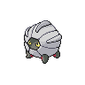

# 372 - Shelgon

## Types

| Version | Type                               |
| :-----: | ---------------------------------: |
| Classic |  |

## Defenses

| Immune x0 | Resistant ×¼ | Resistant ×½                                                                                                                                        | Normal ×1                                                                                                                                                                                                                                                                                                                                                                                                                    | Weak ×2                                                                                                  | Weak ×4 |
| --------- | ------------ | --------------------------------------------------------------------------------------------------------------------------------------------------- | ---------------------------------------------------------------------------------------------------------------------------------------------------------------------------------------------------------------------------------------------------------------------------------------------------------------------------------------------------------------------------------------------------------------------------- | -------------------------------------------------------------------------------------------------------- | ------- |
|           |              |     |            |    |         |

## Abilities

| Version | Ability              |
| ------- | -------------------- |
| All     | [Rock-Head](#/abilities/rockhead) / [Overcoat](#/abilities/overcoat) |

## Base Stats

| Version | HP | Atk | Def | SAtk | SDef | Spd | BST |
| ------- | -- | --- | --- | ---- | ---- | --- | --- |
| Base Game | 65 | 95 | 100 | 60 | 50 | 50 | 420 |
| All     | 65 | 95  | 100 | 60   | 50   | 50  | 420 |

## Level Up Moves

| Level | Name          | Power | Accuracy | PP | Type                                 | Damage Class                           |
| ----- | ------------- | ----- | -------- | -- | ------------------------------------ | -------------------------------------- |
| 1      | [Headbutt](#/moves/headbutt) | 70    | 100%     | 15 |    |  || 1      | [Leer](#/moves/leer) | -     | 100%     | 30 |    |      || 1      | [Bite](#/moves/bite) | 60    | 100%     | 25 |        |  || 1      | [Rage](#/moves/rage) | 20    | 100%     | 20 |    |  || 20     | [Focus-Energy](#/moves/focusenergy) | -     | -        | 30 |    |      || 25     | [Ember](#/moves/ember) | 40    | 100%     | 25 |        |    || 30     | [Protect](#/moves/protect) | -     | -        | 10 |    |      || 32     | [Dragon-Breath](#/moves/dragonbreath) | 60    | 100%     | 20 |    |    || 37     | [Zen-Headbutt](#/moves/zenheadbutt) | 80    | 90%      | 15 |  |  || 43     | [Scary-Face](#/moves/scaryface) | -     | 90%      | 10 |    |      || 50     | [Crunch](#/moves/crunch) | 80    | 100%     | 15 |        |  || 55     | [Dragon-Claw](#/moves/dragonclaw) | 80    | 100%     | 15 |    |  || 61     | [Double-Edge](#/moves/doubleedge) | 120   | 100%     | 15 |    |  || 66     | [Dragon-Dance](#/moves/dragondance) | -     | -        | 20 |    |      || 72     | [Outrage](#/moves/outrage) | 120   | 100%     | 10 |    |  |
## Learnable Moves

| Machine | Name         | Power | Accuracy | PP | Type                                   | Damage Class                           |
| ------- | ------------ | ----- | -------- | -- | -------------------------------------- | -------------------------------------- |
| HM01 | [Cut](#/moves/cut) | 60    | 100%     | 20 |        |  || HM04 | [Strength](#/moves/strength) | 85    | 100%     | 15 |          |  || TM01 | [Hone-Claws](#/moves/honeclaws) | -     | -        | 15 |          |      || TM05 | [Roar](#/moves/roar) | -     | -        | 20 |      |      || TM06 | [Toxic](#/moves/toxic) | -     | 85%      | 10 |      |      || TM10 | [Hidden-Power](#/moves/hiddenpower) | 60    | 100%     | 15 |      |    || TM11 | [Sunny-Day](#/moves/sunnyday) | -     | -        | 5  |          |      || TM18 | [Rain-Dance](#/moves/raindance) | -     | -        | 5  |        |      || TM21 | [Frustration](#/moves/frustration) | -     | 100%     | 20 |      |  || TM27 | [Return](#/moves/return) | -     | 100%     | 20 |      |  || TM31 | [Brick-Break](#/moves/brickbreak) | 75    | 100%     | 15 |  |  || TM32 | [Double-Team](#/moves/doubleteam) | -     | -        | 15 |      |      || TM35 | [Flamethrower](#/moves/flamethrower) | 95    | 100%     | 15 |          |    || TM38 | [Fire-Blast](#/moves/fireblast) | 110   | 85%      | 5  |          |    || TM39 | [Rock-Tomb](#/moves/rocktomb) | 60    | 95%      | 15 |          |  || TM40 | [Aerial-Ace](#/moves/aerialace) | 60    | -        | 20 |      |  || TM42 | [Facade](#/moves/facade) | 70    | 100%     | 20 |      |  || TM44 | [Rest](#/moves/rest) | -     | -        | 10 |    |      || TM45 | [Attract](#/moves/attract) | -     | 100%     | 15 |      |      || TM48 | [Round](#/moves/round) | 60    | 100%     | 15 |      |    || TM59 | [Incinerate](#/moves/incinerate) | 50    | 100%     | 15 |          |    || TM65 | [Shadow-Claw](#/moves/shadowclaw) | 80    | 100%     | 15 |        |  || TM80 | [Rock-Slide](#/moves/rockslide) | 80    | 95%      | 10 |          |  || TM87 | [Swagger](#/moves/swagger) | -     | 85%      | 15 |      |      || TM90 | [Substitute](#/moves/substitute) | -     | -        | 10 |      |      || TM94    | Rock-Smash   | 40    | 100%     | 15 |  |  |
## Locations

- [Mistralton Cave - 3F (Guidance Chamber)](routes/Mistralton%20Cave%20-%203F%20(Guidance%20Chamber)/index.md)
