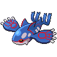

# 382 - Kyogre

## Types

| Version | Type                             |
| :-----: | -------------------------------: |
| Classic |  |

## Defenses

| Immune x0 | Resistant ×¼ | Resistant ×½                                                                                                                              | Normal ×1                                                                                                                                                                                                                                                                                                                                                                                                                                                           | Weak ×2                                                                     | Weak ×4 |
| --------- | ------------ | ----------------------------------------------------------------------------------------------------------------------------------------- | ------------------------------------------------------------------------------------------------------------------------------------------------------------------------------------------------------------------------------------------------------------------------------------------------------------------------------------------------------------------------------------------------------------------------------------------------------------------- | --------------------------------------------------------------------------- | ------- |
|           |              |     |             |   |         |

## Abilities

| Version | Ability |
| ------- | ------- |
| All     | [Drizzle](#/abilities/drizzle) |

## Base Stats

| Version | HP  | Atk | Def | SAtk | SDef | Spd | BST |
| ------- | --- | --- | --- | ---- | ---- | --- | --- |
| All     | 100 | 100 | 90  | 150  | 140  | 90  | 670 |

## Level Up Moves

| Level | Name          | Power | Accuracy | PP | Type                                 | Damage Class                           |
| ----- | ------------- | ----- | -------- | -- | ------------------------------------ | -------------------------------------- |
| 1      | [Water-Pulse](#/moves/waterpulse) | 60    | 100%     | 20 |      |    || 5      | [Scary-Face](#/moves/scaryface) | -     | 90%      | 10 |    |      || 15     | [Body-Slam](#/moves/bodyslam) | 85    | 100%     | 15 |    |  || 20     | [Muddy-Water](#/moves/muddywater) | 90    | 85%      | 10 |      |    || 30     | [Aqua-Ring](#/moves/aquaring) | -     | -        | 20 |      |      || 35     | [Ice-Beam](#/moves/icebeam) | 90    | 100%     | 10 |          |    || 45     | [Ancient-Power](#/moves/ancientpower) | 60    | 100%     | 5  |        |    || 50     | [Water-Spout](#/moves/waterspout) | 150   | 100%     | 5  |      |    || 60     | [Calm-Mind](#/moves/calmmind) | -     | -        | 20 |  |      || 65     | [Aqua-Tail](#/moves/aquatail) | 90    | 90%      | 10 |      |  || 75     | [Sheer-Cold](#/moves/sheercold) | -     | 30%      | 5  |          |    || 80     | [Double-Edge](#/moves/doubleedge) | 120   | 100%     | 15 |    |  || 90     | [Hydro-Pump](#/moves/hydropump) | 110   | 80%      | 5  |      |    |
## Learnable Moves

| Machine | Name         | Power | Accuracy | PP | Type                                   | Damage Class                           |
| ------- | ------------ | ----- | -------- | -- | -------------------------------------- | -------------------------------------- |
| HM03 | [Surf](#/moves/surf) | 90    | 100%     | 15 |        |    || HM04 | [Strength](#/moves/strength) | 85    | 100%     | 15 |          |  || HM05 | [Waterfall](#/moves/waterfall) | 85    | 100%     | 15 |        |  || HM06 | [Dive](#/moves/dive) | 100   | 100%     | 10 |        |  || TM05 | [Roar](#/moves/roar) | -     | -        | 20 |      |      || TM06 | [Toxic](#/moves/toxic) | -     | 85%      | 10 |      |      || TM07 | [Hail](#/moves/hail) | -     | -        | 10 |            |      || TM10 | [Hidden-Power](#/moves/hiddenpower) | 60    | 100%     | 15 |      |    || TM14 | [Blizzard](#/moves/blizzard) | 110   | 70%      | 5  |            |    || TM15 | [Hyper-Beam](#/moves/hyperbeam) | 150   | 90%      | 5  |      |    || TM17 | [Protect](#/moves/protect) | -     | -        | 10 |      |      || TM18 | [Rain-Dance](#/moves/raindance) | -     | -        | 5  |        |      || TM20 | [Safeguard](#/moves/safeguard) | -     | -        | 25 |      |      || TM21 | [Frustration](#/moves/frustration) | -     | 100%     | 20 |      |  || TM24 | [Thunderbolt](#/moves/thunderbolt) | 90    | 100%     | 15 |  |    || TM25 | [Thunder](#/moves/thunder) | 110   | 70%      | 10 |  |    || TM26 | [Earthquake](#/moves/earthquake) | 100   | 100%     | 10 |      |  || TM27 | [Return](#/moves/return) | -     | 100%     | 20 |      |  || TM31 | [Brick-Break](#/moves/brickbreak) | 75    | 100%     | 15 |  |  || TM32 | [Double-Team](#/moves/doubleteam) | -     | -        | 15 |      |      || TM39 | [Rock-Tomb](#/moves/rocktomb) | 60    | 95%      | 15 |          |  || TM42 | [Facade](#/moves/facade) | 70    | 100%     | 20 |      |  || TM44 | [Rest](#/moves/rest) | -     | -        | 10 |    |      || TM48 | [Round](#/moves/round) | 60    | 100%     | 15 |      |    || TM55 | [Scald](#/moves/scald) | 80    | 100%     | 15 |        |    || TM68 | [Giga-Impact](#/moves/gigaimpact) | 150   | 90%      | 5  |      |  || TM73 | [Thunder-Wave](#/moves/thunderwave) | -     | 90%      | 20 |  |      || TM77 | [Psych-Up](#/moves/psychup) | -     | -        | 10 |      |      || TM78 | [Bulldoze](#/moves/bulldoze) | 80    | 100%     | 20 |      |  || TM80 | [Rock-Slide](#/moves/rockslide) | 80    | 95%      | 10 |          |  || TM87 | [Swagger](#/moves/swagger) | -     | 85%      | 15 |      |      || TM90 | [Substitute](#/moves/substitute) | -     | -        | 10 |      |      || TM94    | Rock-Smash   | 40    | 100%     | 15 |  |  |
## Locations

- [Undella Bay](routes/Undella%20Bay/index.md)
