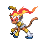

# 392 - Infernape

## Types

| Version | Type                                                                  |
| :-----: | --------------------------------------------------------------------: |
| Classic |   |

## Defenses

| Immune x0 | Resistant ×¼                 | Resistant ×½                                                                                                                                                                 | Normal ×1                                                                                                                                                                                                                                                                                                           | Weak ×2                                                                                                                                                 | Weak ×4 |
| --------- | ---------------------------- | ---------------------------------------------------------------------------------------------------------------------------------------------------------------------------- | ------------------------------------------------------------------------------------------------------------------------------------------------------------------------------------------------------------------------------------------------------------------------------------------------------------------- | ------------------------------------------------------------------------------------------------------------------------------------------------------- | ------- |
|           |  |      |         |     |         |

## Abilities

| Version | Ability           |
| ------- | ----------------- |
| All     | [Blaze](#/abilities/blaze) / [Iron-Fist](#/abilities/ironfist) |

## Base Stats

| Version | HP | Atk | Def | SAtk | SDef | Spd | BST |
| ------- | -- | --- | --- | ---- | ---- | --- | --- |
| Base Game | 76 | 104 | 71 | 104 | 71 | 108 | 534 |
| All     | 76 | 104 | 71  | 104  | 71   | 108 | 534 |

## Level Up Moves

| Level | Name          | Power | Accuracy | PP | Type                                   | Damage Class                           |
| ----- | ------------- | ----- | -------- | -- | -------------------------------------- | -------------------------------------- |
| 1      | [Scratch](#/moves/scratch) | 40    | 100%     | 35 |      |  || 1      | [Leer](#/moves/leer) | -     | 100%     | 30 |      |      || 1      | [Ember](#/moves/ember) | 40    | 100%     | 25 |          |    || 1      | [Taunt](#/moves/taunt) | -     | 100%     | 20 |          |      || 1      | [Fire-Punch](#/moves/firepunch) | 80    | 100%     | 15 |          |  || 1      | [Thunder-Punch](#/moves/thunderpunch) | 80    | 100%     | 15 |  |  || 1      | [Fake-Out](#/moves/fakeout) | 40    | 100%     | 10 |      |  || 14     | [Mach-Punch](#/moves/machpunch) | 40    | 100%     | 30 |  |  || 16     | [Fury-Swipes](#/moves/furyswipes) | 18    | 80%      | 15 |      |  || 19     | [Flame-Wheel](#/moves/flamewheel) | 75    | 100%     | 25 |          |  || 26     | [Feint](#/moves/feint) | 50    | 100%     | 50 |      |  || 29     | [Punishment](#/moves/punishment) | 60    | 100%     | 60 |          |  || 36     | [Close-Combat](#/moves/closecombat) | 120   | 100%     | 5  |  |  || 42     | [Fire-Spin](#/moves/firespin) | 15    | 70%      | 15 |          |    || 52     | [Acrobatics](#/moves/acrobatics) | 55    | 100%     | 15 |      |  || 58     | [Calm-Mind](#/moves/calmmind) | -     | -        | 20 |    |      || 68     | [Flare-Blitz](#/moves/flareblitz) | 120   | 100%     | 15 |          |  |
## Learnable Moves

| Machine | Name         | Power | Accuracy | PP | Type                                   | Damage Class                           |
| ------- | ------------ | ----- | -------- | -- | -------------------------------------- | -------------------------------------- |
| HM01 | [Cut](#/moves/cut) | 60    | 100%     | 20 |        |  || HM04 | [Strength](#/moves/strength) | 85    | 100%     | 15 |          |  || TM01 | [Hone-Claws](#/moves/honeclaws) | -     | -        | 15 |          |      || TM05 | [Roar](#/moves/roar) | -     | -        | 20 |      |      || TM06 | [Toxic](#/moves/toxic) | -     | 85%      | 10 |      |      || TM08 | [Bulk-Up](#/moves/bulkup) | -     | -        | 20 |  |      || TM10 | [Hidden-Power](#/moves/hiddenpower) | 60    | 100%     | 15 |      |    || TM11 | [Sunny-Day](#/moves/sunnyday) | -     | -        | 5  |          |      || TM15 | [Hyper-Beam](#/moves/hyperbeam) | 150   | 90%      | 5  |      |    || TM17 | [Protect](#/moves/protect) | -     | -        | 10 |      |      || TM21 | [Frustration](#/moves/frustration) | -     | 100%     | 20 |      |  || TM22 | [Solar-Beam](#/moves/solarbeam) | 120   | 100%     | 10 |        |    || TM26 | [Earthquake](#/moves/earthquake) | 100   | 100%     | 10 |      |  || TM27 | [Return](#/moves/return) | -     | 100%     | 20 |      |  || TM28 | [Dig](#/moves/dig) | 100   | 100%     | 10 |      |  || TM31 | [Brick-Break](#/moves/brickbreak) | 75    | 100%     | 15 |  |  || TM32 | [Double-Team](#/moves/doubleteam) | -     | -        | 15 |      |      || TM35 | [Flamethrower](#/moves/flamethrower) | 95    | 100%     | 15 |          |    || TM38 | [Fire-Blast](#/moves/fireblast) | 110   | 85%      | 5  |          |    || TM39 | [Rock-Tomb](#/moves/rocktomb) | 60    | 95%      | 15 |          |  || TM40 | [Aerial-Ace](#/moves/aerialace) | 60    | -        | 20 |      |  || TM41 | [Torment](#/moves/torment) | -     | 100%     | 15 |          |      || TM42 | [Facade](#/moves/facade) | 70    | 100%     | 20 |      |  || TM43 | [Flame-Charge](#/moves/flamecharge) | 50    | 100%     | 20 |          |  || TM44 | [Rest](#/moves/rest) | -     | -        | 10 |    |      || TM45 | [Attract](#/moves/attract) | -     | 100%     | 15 |      |      || TM47 | [Low-Sweep](#/moves/lowsweep) | 65    | 100%     | 20 |  |  || TM48 | [Round](#/moves/round) | 60    | 100%     | 15 |      |    || TM50 | [Overheat](#/moves/overheat) | 130   | 90%      | 5  |          |    || TM52 | [Focus-Blast](#/moves/focusblast) | 120   | 70%      | 5  |  |    || TM56 | [Fling](#/moves/fling) | -     | 100%     | 10 |          |  || TM59 | [Incinerate](#/moves/incinerate) | 50    | 100%     | 15 |          |    || TM61 | [Will-O-Wisp](#/moves/willowisp) | -     | 85%      | 15 |          |      || TM65 | [Shadow-Claw](#/moves/shadowclaw) | 80    | 100%     | 15 |        |  || TM67 | [Retaliate](#/moves/retaliate) | 70    | 100%     | 5  |      |  || TM68 | [Giga-Impact](#/moves/gigaimpact) | 150   | 90%      | 5  |      |  || TM71 | [Stone-Edge](#/moves/stoneedge) | 100   | 80%      | 5  |          |  || TM75 | [Swords-Dance](#/moves/swordsdance) | -     | -        | 20 |      |      || TM78 | [Bulldoze](#/moves/bulldoze) | 80    | 100%     | 20 |      |  || TM80 | [Rock-Slide](#/moves/rockslide) | 80    | 95%      | 10 |          |  || TM83 | [Work-Up](#/moves/workup) | -     | -        | 30 |      |      || TM84 | [Poison-Jab](#/moves/poisonjab) | 80    | 100%     | 20 |      |  || TM86 | [Grass-Knot](#/moves/grassknot) | -     | 100%     | 20 |        |    || TM87 | [Swagger](#/moves/swagger) | -     | 85%      | 15 |      |      || TM89 | [U-Turn](#/moves/uturn) | 70    | 100%     | 20 |            |  || TM90 | [Substitute](#/moves/substitute) | -     | -        | 10 |      |      || TM94    | Rock-Smash   | 40    | 100%     | 15 |  |  |