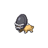

# 410 - Shieldon

## Types

| Version | Type                                                            |
| :-----: | --------------------------------------------------------------: |
| Classic |   |

## Defenses

| Immune x0                          | Resistant ×¼                                                              | Resistant ×½                                                                                                                                                                                                          | Normal ×1                                                                                                                                                                                                                   | Weak ×2                          | Weak ×4                                                                       |
| ---------------------------------- | ------------------------------------------------------------------------- | --------------------------------------------------------------------------------------------------------------------------------------------------------------------------------------------------------------------- | --------------------------------------------------------------------------------------------------------------------------------------------------------------------------------------------------------------------------- | -------------------------------- | ----------------------------------------------------------------------------- |
|  |   |       |       |  |   |

## Abilities

| Version | Ability             |
| ------- | ------------------- |
| Base Game | [Sturdy](#/abilities/sturdy) / [Soundproof](#/abilities/soundproof) |
| All     | [Sturdy](#/abilities/sturdy) / [Soundproof](#/abilities/soundproof) |

## Base Stats

| Version | HP | Atk | Def | SAtk | SDef | Spd | BST |
| ------- | -- | --- | --- | ---- | ---- | --- | --- |
| Base Game | 30 | 42 | 118 | 42 | 88 | 30 | 350 |
| All     | 30 | 42  | 118 | 42   | 88   | 30  | 350 |

## Level Up Moves

| Level | Name          | Power | Accuracy | PP | Type                               | Damage Class                           |
| ----- | ------------- | ----- | -------- | -- | ---------------------------------- | -------------------------------------- |
| 1      | [Tackle](#/moves/tackle) | 35    | 95%      | 35 |  |  || 1      | [Protect](#/moves/protect) | -     | -        | 10 |  |      || 6      | [Taunt](#/moves/taunt) | -     | 100%     | 20 |      |      || 10     | [Metal-Sound](#/moves/metalsound) | -     | 85%      | 40 |    |      || 15     | [Take-Down](#/moves/takedown) | 90    | 85%      | 20 |  |  || 19     | [Iron-Defense](#/moves/irondefense) | -     | -        | 15 |    |      || 24     | [Swagger](#/moves/swagger) | -     | 85%      | 15 |  |      || 28     | [Ancient-Power](#/moves/ancientpower) | 60    | 100%     | 5  |      |    || 33     | [Endure](#/moves/endure) | -     | -        | 10 |  |      || 37     | [Metal-Burst](#/moves/metalburst) | -     | 100%     | 10 |    |  || 42     | [Iron-Head](#/moves/ironhead) | 80    | 100%     | 15 |    |  || 46     | [Heavy-Slam](#/moves/heavyslam) | -     | 100%     | 10 |    |  |
## Learnable Moves

| Machine | Name         | Power | Accuracy | PP | Type                                   | Damage Class                           |
| ------- | ------------ | ----- | -------- | -- | -------------------------------------- | -------------------------------------- |
| HM04 | [Strength](#/moves/strength) | 85    | 100%     | 15 |          |  || TM05 | [Roar](#/moves/roar) | -     | -        | 20 |      |      || TM06 | [Toxic](#/moves/toxic) | -     | 85%      | 10 |      |      || TM10 | [Hidden-Power](#/moves/hiddenpower) | 60    | 100%     | 15 |      |    || TM11 | [Sunny-Day](#/moves/sunnyday) | -     | -        | 5  |          |      || TM13 | [Ice-Beam](#/moves/icebeam) | 90    | 100%     | 10 |            |    || TM14 | [Blizzard](#/moves/blizzard) | 110   | 70%      | 5  |            |    || TM18 | [Rain-Dance](#/moves/raindance) | -     | -        | 5  |        |      || TM21 | [Frustration](#/moves/frustration) | -     | 100%     | 20 |      |  || TM23 | [Smack-Down](#/moves/smackdown) | 50    | 100%     | 15 |          |  || TM24 | [Thunderbolt](#/moves/thunderbolt) | 90    | 100%     | 15 |  |    || TM25 | [Thunder](#/moves/thunder) | 110   | 70%      | 10 |  |    || TM26 | [Earthquake](#/moves/earthquake) | 100   | 100%     | 10 |      |  || TM27 | [Return](#/moves/return) | -     | 100%     | 20 |      |  || TM28 | [Dig](#/moves/dig) | 100   | 100%     | 10 |      |  || TM32 | [Double-Team](#/moves/doubleteam) | -     | -        | 15 |      |      || TM35 | [Flamethrower](#/moves/flamethrower) | 95    | 100%     | 15 |          |    || TM37 | [Sandstorm](#/moves/sandstorm) | -     | -        | 10 |          |      || TM38 | [Fire-Blast](#/moves/fireblast) | 110   | 85%      | 5  |          |    || TM39 | [Rock-Tomb](#/moves/rocktomb) | 60    | 95%      | 15 |          |  || TM41 | [Torment](#/moves/torment) | -     | 100%     | 15 |          |      || TM42 | [Facade](#/moves/facade) | 70    | 100%     | 20 |      |  || TM44 | [Rest](#/moves/rest) | -     | -        | 10 |    |      || TM45 | [Attract](#/moves/attract) | -     | 100%     | 15 |      |      || TM48 | [Round](#/moves/round) | 60    | 100%     | 15 |      |    || TM59 | [Incinerate](#/moves/incinerate) | 50    | 100%     | 15 |          |    || TM69 | [Rock-Polish](#/moves/rockpolish) | -     | -        | 20 |          |      || TM71 | [Stone-Edge](#/moves/stoneedge) | 100   | 80%      | 5  |          |  || TM78 | [Bulldoze](#/moves/bulldoze) | 80    | 100%     | 20 |      |  || TM80 | [Rock-Slide](#/moves/rockslide) | 80    | 95%      | 10 |          |  || TM90 | [Substitute](#/moves/substitute) | -     | -        | 10 |      |      || TM91 | [Flash-Cannon](#/moves/flashcannon) | 80    | 100%     | 10 |        |    || TM94    | Rock-Smash   | 40    | 100%     | 15 |  |  |