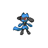

# 447 - Riolu

## Types

| Version | Type                                   |
| :-----: | -------------------------------------: |
| Classic |  |

## Defenses

| Immune x0 | Resistant ×¼ | Resistant ×½                                                                                       | Normal ×1                                                                                                                                                                                                                                                                                                                                                                                                                                                             | Weak ×2                                                                                                          | Weak ×4 |
| --------- | ------------ | -------------------------------------------------------------------------------------------------- | --------------------------------------------------------------------------------------------------------------------------------------------------------------------------------------------------------------------------------------------------------------------------------------------------------------------------------------------------------------------------------------------------------------------------------------------------------------------- | ---------------------------------------------------------------------------------------------------------------- | ------- |
|           |              |    |             |    |         |

## Abilities

| Version | Ability               |
| ------- | --------------------- |
| All     | [Steadfast](#/abilities/steadfast) / [Prankster](#/abilities/prankster) |

## Base Stats

| Version | HP | Atk | Def | SAtk | SDef | Spd | BST |
| ------- | -- | --- | --- | ---- | ---- | --- | --- |
| Base Game | 40 | 70 | 40 | 35 | 40 | 60 | 285 |
| All     | 40 | 70  | 40  | 35   | 40   | 60  | 285 |

## Level Up Moves

| Level | Name           | Power | Accuracy | PP  | Type                                   | Damage Class                           |
| ----- | -------------- | ----- | -------- | --- | -------------------------------------- | -------------------------------------- |
| 1      | [Quick-Attack](#/moves/quickattack) | 40    | 100%     | 30  |      |  || 1      | [Foresight](#/moves/foresight) | -     | -        | 40  |      |      || 1      | [Endure](#/moves/endure) | -     | -        | 10  |      |      || 1      | [Vacuum-Wave](#/moves/vacuumwave) | 40    | 100%     | 30  |  |    || 6      | [Counter](#/moves/counter) | -     | 100%     | 20  |  |  || 11     | [Force-Palm](#/moves/forcepalm) | 60    | 100%     | 10  |  |  || 15     | [Feint](#/moves/feint) | 50    | 100%     | 50  |      |  || 19     | [Reversal](#/moves/reversal) | -     | 100%     | 15  |  |  || 22     | [Crunch](#/moves/crunch) | 80    | 100%     | 15  |          |  || 24     | [Screech](#/moves/screech) | -     | 85%      | 40  |      |      || 26     | [Low-Kick](#/moves/lowkick) | -     | 100%     | 20  |  |  || 29     | [Copycat](#/moves/copycat) | -     | -        | 20  |      |      || 33     | [High-Jump-Kick](#/moves/highjumpkick) | 100   | 90%      | 100 |  |  || 47     | [Nasty-Plot](#/moves/nastyplot) | -     | -        | 20  |          |      || 55     | [Final-Gambit](#/moves/finalgambit) | -     | 100%     | 5   |  |    |
## Learnable Moves

| Machine | Name         | Power | Accuracy | PP | Type                                   | Damage Class                           |
| ------- | ------------ | ----- | -------- | -- | -------------------------------------- | -------------------------------------- |
| HM04 | [Strength](#/moves/strength) | 85    | 100%     | 15 |          |  || TM05 | [Roar](#/moves/roar) | -     | -        | 20 |      |      || TM06 | [Toxic](#/moves/toxic) | -     | 85%      | 10 |      |      || TM08 | [Bulk-Up](#/moves/bulkup) | -     | -        | 20 |  |      || TM10 | [Hidden-Power](#/moves/hiddenpower) | 60    | 100%     | 15 |      |    || TM11 | [Sunny-Day](#/moves/sunnyday) | -     | -        | 5  |          |      || TM17 | [Protect](#/moves/protect) | -     | -        | 10 |      |      || TM18 | [Rain-Dance](#/moves/raindance) | -     | -        | 5  |        |      || TM21 | [Frustration](#/moves/frustration) | -     | 100%     | 20 |      |  || TM26 | [Earthquake](#/moves/earthquake) | 100   | 100%     | 10 |      |  || TM27 | [Return](#/moves/return) | -     | 100%     | 20 |      |  || TM28 | [Dig](#/moves/dig) | 100   | 100%     | 10 |      |  || TM31 | [Brick-Break](#/moves/brickbreak) | 75    | 100%     | 15 |  |  || TM32 | [Double-Team](#/moves/doubleteam) | -     | -        | 15 |      |      || TM39 | [Rock-Tomb](#/moves/rocktomb) | 60    | 95%      | 15 |          |  || TM42 | [Facade](#/moves/facade) | 70    | 100%     | 20 |      |  || TM44 | [Rest](#/moves/rest) | -     | -        | 10 |    |      || TM45 | [Attract](#/moves/attract) | -     | 100%     | 15 |      |      || TM47 | [Low-Sweep](#/moves/lowsweep) | 65    | 100%     | 20 |  |  || TM48 | [Round](#/moves/round) | 60    | 100%     | 15 |      |    || TM52 | [Focus-Blast](#/moves/focusblast) | 120   | 70%      | 5  |  |    || TM56 | [Fling](#/moves/fling) | -     | 100%     | 10 |          |  || TM65 | [Shadow-Claw](#/moves/shadowclaw) | 80    | 100%     | 15 |        |  || TM66 | [Payback](#/moves/payback) | 50    | 100%     | 10 |          |  || TM67 | [Retaliate](#/moves/retaliate) | 70    | 100%     | 5  |      |  || TM75 | [Swords-Dance](#/moves/swordsdance) | -     | -        | 20 |      |      || TM78 | [Bulldoze](#/moves/bulldoze) | 80    | 100%     | 20 |      |  || TM80 | [Rock-Slide](#/moves/rockslide) | 80    | 95%      | 10 |          |  || TM83 | [Work-Up](#/moves/workup) | -     | -        | 30 |      |      || TM84 | [Poison-Jab](#/moves/poisonjab) | 80    | 100%     | 20 |      |  || TM87 | [Swagger](#/moves/swagger) | -     | 85%      | 15 |      |      || TM90 | [Substitute](#/moves/substitute) | -     | -        | 10 |      |      || TM94    | Rock-Smash   | 40    | 100%     | 15 |  |  |
## Locations

- [Pinwheel Forest - Outside](routes/Pinwheel%20Forest%20-%20Outside/index.md)
