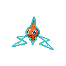

# 479 - Rotom

## Types

| Version | Type                                                                    |
| :-----: | ----------------------------------------------------------------------: |
| Classic |   |

## Defenses

| Immune x0                                                                     | Resistant ×¼ | Resistant ×½                                                                                                                                                                               | Normal ×1                                                                                                                                                                                                                                                                                         | Weak ×2                                                                                                    | Weak ×4 |
| ----------------------------------------------------------------------------- | ------------ | ------------------------------------------------------------------------------------------------------------------------------------------------------------------------------------------ | ------------------------------------------------------------------------------------------------------------------------------------------------------------------------------------------------------------------------------------------------------------------------------------------------- | ---------------------------------------------------------------------------------------------------------- | ------- |
|   |              |      |         |    |         |

## Abilities

| Version | Ability  |
| ------- | -------- |
| All     | [Levitate](#/abilities/levitate) |

## Base Stats

| Version | HP | Atk | Def | SAtk | SDef | Spd | BST |
| ------- | -- | --- | --- | ---- | ---- | --- | --- |
| Base Game | 50 | 50 | 77 | 95 | 77 | 91 | 440 |
| All     | 50 | 50  | 77  | 95   | 77   | 111 | 460 |

## Level Up Moves

| Level | Name          | Power | Accuracy | PP | Type                                   | Damage Class                           |
| ----- | ------------- | ----- | -------- | -- | -------------------------------------- | -------------------------------------- |
| 1      | [Thunder-Shock](#/moves/thundershock) | 40    | 100%     | 30 |  |    || 1      | [Thunder-Wave](#/moves/thunderwave) | -     | 90%      | 20 |  |      || 1      | [Confuse-Ray](#/moves/confuseray) | -     | 100%     | 10 |        |      || 1      | [Trick](#/moves/trick) | -     | 100%     | 10 |    |      || 1      | [Astonish](#/moves/astonish) | 30    | 100%     | 15 |        |  || 1      | [Signal-Beam](#/moves/signalbeam) | 75    | 100%     | 15 |            |    || 8      | [Uproar](#/moves/uproar) | 50    | 100%     | 50 |      |    || 15     | [Double-Team](#/moves/doubleteam) | -     | -        | 15 |      |      || 22     | [Shock-Wave](#/moves/shockwave) | 70    | -        | 20 |  |    || 29     | [Ominous-Wind](#/moves/ominouswind) | 60    | 100%     | 5  |        |    || 36     | [Substitute](#/moves/substitute) | -     | -        | 10 |      |      || 43     | [Electro-Ball](#/moves/electroball) | -     | 100%     | 10 |  |    || 50     | [Hex](#/moves/hex) | 65    | 100%     | 10 |        |    || 57     | [Charge](#/moves/charge) | -     | -        | 20 |  |      || 64     | [Discharge](#/moves/discharge) | 80    | 100%     | 15 |  |    |
## Learnable Moves

| Machine | Name         | Power | Accuracy | PP | Type                                   | Damage Class                           |
| ------- | ------------ | ----- | -------- | -- | -------------------------------------- | -------------------------------------- |
| TM06 | [Toxic](#/moves/toxic) | -     | 85%      | 10 |      |      || TM10 | [Hidden-Power](#/moves/hiddenpower) | 60    | 100%     | 15 |      |    || TM11 | [Sunny-Day](#/moves/sunnyday) | -     | -        | 5  |          |      || TM16 | [Light-Screen](#/moves/lightscreen) | -     | -        | 30 |    |      || TM17 | [Protect](#/moves/protect) | -     | -        | 10 |      |      || TM18 | [Rain-Dance](#/moves/raindance) | -     | -        | 5  |        |      || TM19 | [Telekinesis](#/moves/telekinesis) | -     | -        | 15 |    |      || TM21 | [Frustration](#/moves/frustration) | -     | 100%     | 20 |      |  || TM24 | [Thunderbolt](#/moves/thunderbolt) | 90    | 100%     | 15 |  |    || TM25 | [Thunder](#/moves/thunder) | 110   | 70%      | 10 |  |    || TM27 | [Return](#/moves/return) | -     | 100%     | 20 |      |  || TM30 | [Shadow-Ball](#/moves/shadowball) | 90    | 100%     | 15 |        |    || TM33 | [Reflect](#/moves/reflect) | -     | -        | 20 |    |      || TM42 | [Facade](#/moves/facade) | 70    | 100%     | 20 |      |  || TM44 | [Rest](#/moves/rest) | -     | -        | 10 |    |      || TM46 | [Thief](#/moves/thief) | 60    | 100%     | 25 |          |  || TM48 | [Round](#/moves/round) | 60    | 100%     | 15 |      |    || TM57 | [Charge-Beam](#/moves/chargebeam) | 50    | 90%      | 10 |  |    || TM61 | [Will-O-Wisp](#/moves/willowisp) | -     | 85%      | 15 |          |      || TM70 | [Flash](#/moves/flash) | -     | 100%     | 20 |      |      || TM72 | [Volt-Switch](#/moves/voltswitch) | 70    | 100%     | 20 |  |    || TM77 | [Psych-Up](#/moves/psychup) | -     | -        | 10 |      |      || TM85 | [Dream-Eater](#/moves/dreameater) | 100   | 100%     | 15 |    |    || TM87    | Swagger      | -     | 85%      | 15 |      |      |
## Locations

- [Chargestone Cave - B2F](routes/Chargestone%20Cave%20-%20B2F/index.md)
