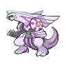

# 484 - Palkia

## Types

| Version | Type                                                                |
| :-----: | ------------------------------------------------------------------: |
| Classic |   |

## Defenses

| Immune x0 | Resistant ×¼                                                        | Resistant ×½                     | Normal ×1                                                                                                                                                                                                                                                                                                                                                                                                                                                                                                | Weak ×2                                                                 | Weak ×4 |
| --------- | ------------------------------------------------------------------- | -------------------------------- | -------------------------------------------------------------------------------------------------------------------------------------------------------------------------------------------------------------------------------------------------------------------------------------------------------------------------------------------------------------------------------------------------------------------------------------------------------------------------------------------------------- | ----------------------------------------------------------------------- | ------- |
|           |   |  |              |   |         |

## Abilities

| Version | Ability              |
| ------- | -------------------- |
| All     | [Pressure](#/abilities/pressure) / [Telepathy](#/abilities/telepathy) |

## Base Stats

| Version | HP | Atk | Def | SAtk | SDef | Spd | BST |
| ------- | -- | --- | --- | ---- | ---- | --- | --- |
| Base Game | 90 | 120 | 100 | 150 | 120 | 100 | 680 |
| All     | 90 | 120 | 100 | 150  | 120  | 100 | 680 |

## Level Up Moves

| Level | Name          | Power | Accuracy | PP | Type                                   | Damage Class                           |
| ----- | ------------- | ----- | -------- | -- | -------------------------------------- | -------------------------------------- |
| 1      | [Scary-Face](#/moves/scaryface) | -     | 90%      | 10 |      |      || 1      | [Dragon-Breath](#/moves/dragonbreath) | 60    | 100%     | 20 |      |    || 6      | [Water-Pulse](#/moves/waterpulse) | 60    | 100%     | 20 |        |    || 10     | [Ancient-Power](#/moves/ancientpower) | 60    | 100%     | 5  |          |    || 15     | [Slash](#/moves/slash) | 70    | 100%     | 20 |      |  || 19     | [Power-Gem](#/moves/powergem) | 90    | 100%     | 20 |          |    || 24     | [Aqua-Tail](#/moves/aquatail) | 90    | 90%      | 10 |        |  || 28     | [Dragon-Claw](#/moves/dragonclaw) | 80    | 100%     | 15 |      |  || 33     | [Earth-Power](#/moves/earthpower) | 90    | 100%     | 10 |      |    || 37     | [Aura-Sphere](#/moves/aurasphere) | 80    | -        | 20 |  |    || 46     | [Spacial-Rend](#/moves/spacialrend) | 100   | 95%      | 5  |      |    || 50     | [Hydro-Pump](#/moves/hydropump) | 110   | 80%      | 5  |        |    |
## Learnable Moves

| Machine | Name         | Power | Accuracy | PP | Type                                   | Damage Class                           |
| ------- | ------------ | ----- | -------- | -- | -------------------------------------- | -------------------------------------- |
| HM01 | [Cut](#/moves/cut) | 60    | 100%     | 20 |        |  || HM03 | [Surf](#/moves/surf) | 90    | 100%     | 15 |        |    || HM04 | [Strength](#/moves/strength) | 85    | 100%     | 15 |          |  || HM06 | [Dive](#/moves/dive) | 100   | 100%     | 10 |        |  || TM01 | [Hone-Claws](#/moves/honeclaws) | -     | -        | 15 |          |      || TM05 | [Roar](#/moves/roar) | -     | -        | 20 |      |      || TM06 | [Toxic](#/moves/toxic) | -     | 85%      | 10 |      |      || TM07 | [Hail](#/moves/hail) | -     | -        | 10 |            |      || TM08 | [Bulk-Up](#/moves/bulkup) | -     | -        | 20 |  |      || TM10 | [Hidden-Power](#/moves/hiddenpower) | 60    | 100%     | 15 |      |    || TM11 | [Sunny-Day](#/moves/sunnyday) | -     | -        | 5  |          |      || TM13 | [Ice-Beam](#/moves/icebeam) | 90    | 100%     | 10 |            |    || TM14 | [Blizzard](#/moves/blizzard) | 110   | 70%      | 5  |            |    || TM15 | [Hyper-Beam](#/moves/hyperbeam) | 150   | 90%      | 5  |      |    || TM17 | [Protect](#/moves/protect) | -     | -        | 10 |      |      || TM18 | [Rain-Dance](#/moves/raindance) | -     | -        | 5  |        |      || TM20 | [Safeguard](#/moves/safeguard) | -     | -        | 25 |      |      || TM21 | [Frustration](#/moves/frustration) | -     | 100%     | 20 |      |  || TM24 | [Thunderbolt](#/moves/thunderbolt) | 90    | 100%     | 15 |  |    || TM25 | [Thunder](#/moves/thunder) | 110   | 70%      | 10 |  |    || TM26 | [Earthquake](#/moves/earthquake) | 100   | 100%     | 10 |      |  || TM27 | [Return](#/moves/return) | -     | 100%     | 20 |      |  || TM31 | [Brick-Break](#/moves/brickbreak) | 75    | 100%     | 15 |  |  || TM32 | [Double-Team](#/moves/doubleteam) | -     | -        | 15 |      |      || TM35 | [Flamethrower](#/moves/flamethrower) | 95    | 100%     | 15 |          |    || TM37 | [Sandstorm](#/moves/sandstorm) | -     | -        | 10 |          |      || TM38 | [Fire-Blast](#/moves/fireblast) | 110   | 85%      | 5  |          |    || TM39 | [Rock-Tomb](#/moves/rocktomb) | 60    | 95%      | 15 |          |  || TM40 | [Aerial-Ace](#/moves/aerialace) | 60    | -        | 20 |      |  || TM42 | [Facade](#/moves/facade) | 70    | 100%     | 20 |      |  || TM44 | [Rest](#/moves/rest) | -     | -        | 10 |    |      || TM48 | [Round](#/moves/round) | 60    | 100%     | 15 |      |    || TM49 | [Echoed-Voice](#/moves/echoedvoice) | 40    | 100%     | 15 |      |    || TM52 | [Focus-Blast](#/moves/focusblast) | 120   | 70%      | 5  |  |    || TM56 | [Fling](#/moves/fling) | -     | 100%     | 10 |          |  || TM59 | [Incinerate](#/moves/incinerate) | 50    | 100%     | 15 |          |    || TM65 | [Shadow-Claw](#/moves/shadowclaw) | 80    | 100%     | 15 |        |  || TM68 | [Giga-Impact](#/moves/gigaimpact) | 150   | 90%      | 5  |      |  || TM71 | [Stone-Edge](#/moves/stoneedge) | 100   | 80%      | 5  |          |  || TM73 | [Thunder-Wave](#/moves/thunderwave) | -     | 90%      | 20 |  |      || TM77 | [Psych-Up](#/moves/psychup) | -     | -        | 10 |      |      || TM78 | [Bulldoze](#/moves/bulldoze) | 80    | 100%     | 20 |      |  || TM80 | [Rock-Slide](#/moves/rockslide) | 80    | 95%      | 10 |          |  || TM82 | [Dragon-Tail](#/moves/dragontail) | 60    | 90%      | 10 |      |  || TM87 | [Swagger](#/moves/swagger) | -     | 85%      | 15 |      |      || TM90 | [Substitute](#/moves/substitute) | -     | -        | 10 |      |      || TM92 | [Trick-Room](#/moves/trickroom) | -     | -        | 5  |    |      || TM94    | Rock-Smash   | 40    | 100%     | 15 |  |  |
## Locations

- [Giant Chasm - Inside Cave](routes/Giant%20Chasm%20-%20Inside%20Cave/index.md)
