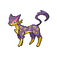

# 510 - Liepard

## Types

| Version | Type                           |
| :-----: | -----------------------------: |
| Classic |  |

## Defenses

| Immune x0                            | Resistant ×¼ | Resistant ×½                                                        | Normal ×1                                                                                                                                                                                                                                                                                                                                                                                                                                                       | Weak ×2                                                                                                      | Weak ×4 |
| ------------------------------------ | ------------ | ------------------------------------------------------------------- | --------------------------------------------------------------------------------------------------------------------------------------------------------------------------------------------------------------------------------------------------------------------------------------------------------------------------------------------------------------------------------------------------------------------------------------------------------------- | ------------------------------------------------------------------------------------------------------------ | ------- |
|  |              |   |             |    |         |

## Abilities

| Version | Ability            |
| ------- | ------------------ |
| All     | [Limber](#/abilities/limber) / [Prankster](#/abilities/prankster) |

## Base Stats

| Version | HP | Atk | Def | SAtk | SDef | Spd | BST |
| ------- | -- | --- | --- | ---- | ---- | --- | --- |
| Base Game | 64 | 88 | 50 | 88 | 50 | 106 | 446 |
| All     | 98 | 88  | 50  | 98   | 50   | 106 | 490 |

## Level Up Moves

| Level | Name         | Power | Accuracy | PP | Type                               | Damage Class                           |
| ----- | ------------ | ----- | -------- | -- | ---------------------------------- | -------------------------------------- |
| 1      | [Scratch](#/moves/scratch) | 40    | 100%     | 35 |  |  || 1      | [Sand-Attack](#/moves/sandattack) | -     | 100%     | 15 |  |      || 1      | [Growl](#/moves/growl) | -     | 100%     | 40 |  |      || 1      | [Assist](#/moves/assist) | -     | -        | 20 |  |      || 12     | [Fury-Swipes](#/moves/furyswipes) | 18    | 80%      | 15 |  |  || 15     | [Pursuit](#/moves/pursuit) | 40    | 100%     | 20 |      |  || 19     | [Torment](#/moves/torment) | -     | 100%     | 15 |      |      || 22     | [Fake-Out](#/moves/fakeout) | 40    | 100%     | 10 |  |  || 26     | [Hone-Claws](#/moves/honeclaws) | -     | -        | 15 |      |      || 31     | [Assurance](#/moves/assurance) | 60    | 100%     | 10 |      |  || 34     | [Slash](#/moves/slash) | 70    | 100%     | 20 |  |  || 38     | [Taunt](#/moves/taunt) | -     | 100%     | 20 |      |      || 43     | [Night-Slash](#/moves/nightslash) | 70    | 100%     | 15 |      |  || 43     | [Foul-Play](#/moves/foulplay) | 95    | 100%     | 15 |      |  || 47     | [Snatch](#/moves/snatch) | -     | -        | 10 |      |      || 50     | [Nasty-Plot](#/moves/nastyplot) | -     | -        | 20 |      |      || 55     | [Sucker-Punch](#/moves/suckerpunch) | 70    | 100%     | 5  |      |  || 60     | [Dark-Pulse](#/moves/darkpulse) | 90    | 100%     | 15 |      |    |
## Learnable Moves

| Machine | Name         | Power | Accuracy | PP | Type                                   | Damage Class                           |
| ------- | ------------ | ----- | -------- | -- | -------------------------------------- | -------------------------------------- |
| HM01 | [Cut](#/moves/cut) | 60    | 100%     | 20 |        |  || TM06 | [Toxic](#/moves/toxic) | -     | 85%      | 10 |      |      || TM10 | [Hidden-Power](#/moves/hiddenpower) | 60    | 100%     | 15 |      |    || TM11 | [Sunny-Day](#/moves/sunnyday) | -     | -        | 5  |          |      || TM15 | [Hyper-Beam](#/moves/hyperbeam) | 150   | 90%      | 5  |      |    || TM17 | [Protect](#/moves/protect) | -     | -        | 10 |      |      || TM18 | [Rain-Dance](#/moves/raindance) | -     | -        | 5  |        |      || TM21 | [Frustration](#/moves/frustration) | -     | 100%     | 20 |      |  || TM27 | [Return](#/moves/return) | -     | 100%     | 20 |      |  || TM30 | [Shadow-Ball](#/moves/shadowball) | 90    | 100%     | 15 |        |    || TM32 | [Double-Team](#/moves/doubleteam) | -     | -        | 15 |      |      || TM40 | [Aerial-Ace](#/moves/aerialace) | 60    | -        | 20 |      |  || TM42 | [Facade](#/moves/facade) | 70    | 100%     | 20 |      |  || TM43 | [Flame-Charge](#/moves/flamecharge) | 50    | 100%     | 20 |          |  || TM44 | [Rest](#/moves/rest) | -     | -        | 10 |    |      || TM45 | [Attract](#/moves/attract) | -     | 100%     | 15 |      |      || TM46 | [Thief](#/moves/thief) | 60    | 100%     | 25 |          |  || TM48 | [Round](#/moves/round) | 60    | 100%     | 15 |      |    || TM49 | [Echoed-Voice](#/moves/echoedvoice) | 40    | 100%     | 15 |      |    || TM63 | [Embargo](#/moves/embargo) | -     | 100%     | 15 |          |      || TM65 | [Shadow-Claw](#/moves/shadowclaw) | 80    | 100%     | 15 |        |  || TM66 | [Payback](#/moves/payback) | 50    | 100%     | 10 |          |  || TM68 | [Giga-Impact](#/moves/gigaimpact) | 150   | 90%      | 5  |      |  || TM73 | [Thunder-Wave](#/moves/thunderwave) | -     | 90%      | 20 |  |      || TM77 | [Psych-Up](#/moves/psychup) | -     | -        | 10 |      |      || TM85 | [Dream-Eater](#/moves/dreameater) | 100   | 100%     | 15 |    |    || TM86 | [Grass-Knot](#/moves/grassknot) | -     | 100%     | 20 |        |    || TM87 | [Swagger](#/moves/swagger) | -     | 85%      | 15 |      |      || TM90 | [Substitute](#/moves/substitute) | -     | -        | 10 |      |      || TM93 | [Wild-Charge](#/moves/wildcharge) | 90    | 100%     | 15 |  |  || TM94 | [Rock-Smash](#/moves/rocksmash) | 40    | 100%     | 15 |  |  || TM95    | Snarl        | 60    | 95%      | 15 |          |    |
## Locations

- [Route 9](routes/Route%209/index.md)
