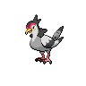

# 520 - Tranquill

## Types

| Version | Type                                                                  |
| :-----: | --------------------------------------------------------------------: |
| Classic |   |

## Defenses

| Immune x0                                                               | Resistant ×¼ | Resistant ×½                                                      | Normal ×1                                                                                                                                                                                                                                                                                                                                                                                                                        | Weak ×2                                                                                                    | Weak ×4 |
| ----------------------------------------------------------------------- | ------------ | ----------------------------------------------------------------- | -------------------------------------------------------------------------------------------------------------------------------------------------------------------------------------------------------------------------------------------------------------------------------------------------------------------------------------------------------------------------------------------------------------------------------- | ---------------------------------------------------------------------------------------------------------- | ------- |
|   |              |   |            |    |         |

## Abilities

| Version | Ability              |
| ------- | -------------------- |
| All     | [Rivalry](#/abilities/rivalry) / [Super-Luck](#/abilities/superluck) |

## Base Stats

| Version | HP | Atk | Def | SAtk | SDef | Spd | BST |
| ------- | -- | --- | --- | ---- | ---- | --- | --- |
| Base Game | 62 | 77 | 62 | 50 | 42 | 65 | 358 |
| All     | 62 | 50  | 42  | 77   | 62   | 65  | 358 |

## Level Up Moves

| Level | Name          | Power | Accuracy | PP | Type                                   | Damage Class                           |
| ----- | ------------- | ----- | -------- | -- | -------------------------------------- | -------------------------------------- |
| 1      | [Gust](#/moves/gust) | 40    | 100%     | 35 |      |    || 1      | [Leer](#/moves/leer) | -     | 100%     | 30 |      |      || 1      | [Growl](#/moves/growl) | -     | 100%     | 40 |      |      || 1      | [Quick-Attack](#/moves/quickattack) | 40    | 100%     | 30 |      |  || 11     | [Swift](#/moves/swift) | 60    | -        | 20 |      |    || 15     | [Air-Cutter](#/moves/aircutter) | 60    | 95%      | 25 |      |    || 18     | [Roost](#/moves/roost) | -     | -        | 10 |      |      || 23     | [Detect](#/moves/detect) | -     | -        | 5  |  |      || 27     | [Taunt](#/moves/taunt) | -     | 100%     | 20 |          |      || 32     | [Air-Slash](#/moves/airslash) | 75    | 95%      | 15 |      |    || 36     | [Razor-Wind](#/moves/razorwind) | 80    | 100%     | 10 |      |    || 36     | [Hyper-Voice](#/moves/hypervoice) | 90    | 100%     | 10 |      |    || 41     | [Feather-Dance](#/moves/featherdance) | -     | 100%     | 15 |      |      || 45     | [Swagger](#/moves/swagger) | -     | 85%      | 15 |      |      || 50     | [Facade](#/moves/facade) | 70    | 100%     | 20 |      |  || 54     | [Tailwind](#/moves/tailwind) | -     | -        | 15 |      |      || 59     | [Sky-Attack](#/moves/skyattack) | 140   | 90%      | 5  |      |  || 59     | [Hurricane](#/moves/hurricane) | 110   | 70%      | 10 |      |    |
## Learnable Moves

| Machine | Name         | Power | Accuracy | PP | Type                                 | Damage Class                           |
| ------- | ------------ | ----- | -------- | -- | ------------------------------------ | -------------------------------------- |
| HM02 | [Fly](#/moves/fly) | 100   | 100%     | 15 |    |  || TM06 | [Toxic](#/moves/toxic) | -     | 85%      | 10 |    |      || TM10 | [Hidden-Power](#/moves/hiddenpower) | 60    | 100%     | 15 |    |    || TM11 | [Sunny-Day](#/moves/sunnyday) | -     | -        | 5  |        |      || TM17 | [Protect](#/moves/protect) | -     | -        | 10 |    |      || TM18 | [Rain-Dance](#/moves/raindance) | -     | -        | 5  |      |      || TM21 | [Frustration](#/moves/frustration) | -     | 100%     | 20 |    |  || TM27 | [Return](#/moves/return) | -     | 100%     | 20 |    |  || TM32 | [Double-Team](#/moves/doubleteam) | -     | -        | 15 |    |      || TM40 | [Aerial-Ace](#/moves/aerialace) | 60    | -        | 20 |    |  || TM44 | [Rest](#/moves/rest) | -     | -        | 10 |  |      || TM45 | [Attract](#/moves/attract) | -     | 100%     | 15 |    |      || TM48 | [Round](#/moves/round) | 60    | 100%     | 15 |    |    || TM49 | [Echoed-Voice](#/moves/echoedvoice) | 40    | 100%     | 15 |    |    || TM83 | [Work-Up](#/moves/workup) | -     | -        | 30 |    |      || TM88 | [Pluck](#/moves/pluck) | 60    | 100%     | 20 |    |  || TM89 | [U-Turn](#/moves/uturn) | 70    | 100%     | 20 |          |  || TM90    | Substitute   | -     | -        | 10 |    |      |
## Locations

- [Route 10 - Main Route](routes/Route%2010%20-%20Main%20Route/index.md)
- [Route 12](routes/Route%2012/index.md)
