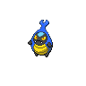

# 588 - Karrablast

## Types

| Version | Type                         |
| :-----: | ---------------------------: |
| Classic |  |

## Defenses

| Immune x0 | Resistant ×¼ | Resistant ×½                                                                                                       | Normal ×1                                                                                                                                                                                                                                                                                                                                                                                                                                                     | Weak ×2                                                                                                  | Weak ×4 |
| --------- | ------------ | ------------------------------------------------------------------------------------------------------------------ | ------------------------------------------------------------------------------------------------------------------------------------------------------------------------------------------------------------------------------------------------------------------------------------------------------------------------------------------------------------------------------------------------------------------------------------------------------------- | -------------------------------------------------------------------------------------------------------- | ------- |
|           |              |    |             |    |         |

## Abilities

| Version | Ability          |
| ------- | ---------------- |
| All     | [Swarm](#/abilities/swarm) / [No-Guard](#/abilities/noguard) |

## Base Stats

| Version | HP | Atk | Def | SAtk | SDef | Spd | BST |
| ------- | -- | --- | --- | ---- | ---- | --- | --- |
| Base Game | 50 | 75 | 45 | 40 | 45 | 60 | 315 |
| All     | 50 | 75  | 45  | 40   | 45   | 60  | 315 |

## Evolution Change

Level up with shelmet in the party

## Level Up Moves

| Level | Name         | Power | Accuracy | PP | Type                               | Damage Class                           |
| ----- | ------------ | ----- | -------- | -- | ---------------------------------- | -------------------------------------- |
| 1      | [Peck](#/moves/peck) | 35    | 100%     | 35 |  |  || 4      | [Leer](#/moves/leer) | -     | 100%     | 30 |  |      || 8      | [Endure](#/moves/endure) | -     | -        | 10 |  |      || 13     | [Fury-Cutter](#/moves/furycutter) | 10    | 95%      | 10 |        |  || 16     | [Fury-Attack](#/moves/furyattack) | 15    | 85%      | 20 |  |  || 20     | [Headbutt](#/moves/headbutt) | 70    | 100%     | 15 |  |  || 25     | [False-Swipe](#/moves/falseswipe) | 40    | 100%     | 40 |  |  || 28     | [Bug-Buzz](#/moves/bugbuzz) | 90    | 100%     | 10 |        |    || 32     | [Slash](#/moves/slash) | 70    | 100%     | 20 |  |  || 37     | [Take-Down](#/moves/takedown) | 90    | 85%      | 20 |  |  || 40     | [Scary-Face](#/moves/scaryface) | -     | 90%      | 10 |  |      || 44     | [X-Scissor](#/moves/xscissor) | 80    | 100%     | 15 |        |  || 49     | [Flail](#/moves/flail) | -     | 100%     | 15 |  |  || 52     | [Swords-Dance](#/moves/swordsdance) | -     | -        | 20 |  |      || 56     | [Double-Edge](#/moves/doubleedge) | 120   | 100%     | 15 |  |  || 60     | [Megahorn](#/moves/megahorn) | 120   | 85%      | 10 |        |  |
## Learnable Moves

| Machine | Name         | Power | Accuracy | PP | Type                                 | Damage Class                           |
| ------- | ------------ | ----- | -------- | -- | ------------------------------------ | -------------------------------------- |
| HM01 | [Cut](#/moves/cut) | 60    | 100%     | 20 |      |  || TM06 | [Toxic](#/moves/toxic) | -     | 85%      | 10 |    |      || TM10 | [Hidden-Power](#/moves/hiddenpower) | 60    | 100%     | 15 |    |    || TM17 | [Protect](#/moves/protect) | -     | -        | 10 |    |      || TM18 | [Rain-Dance](#/moves/raindance) | -     | -        | 5  |      |      || TM21 | [Frustration](#/moves/frustration) | -     | 100%     | 20 |    |  || TM27 | [Return](#/moves/return) | -     | 100%     | 20 |    |  || TM32 | [Double-Team](#/moves/doubleteam) | -     | -        | 15 |    |      || TM40 | [Aerial-Ace](#/moves/aerialace) | 60    | -        | 20 |    |  || TM42 | [Facade](#/moves/facade) | 70    | 100%     | 20 |    |  || TM44 | [Rest](#/moves/rest) | -     | -        | 10 |  |      || TM45 | [Attract](#/moves/attract) | -     | 100%     | 15 |    |      || TM48 | [Round](#/moves/round) | 60    | 100%     | 15 |    |    || TM53 | [Energy-Ball](#/moves/energyball) | 90    | 100%     | 10 |      |    || TM76 | [Struggle-Bug](#/moves/strugglebug) | 50    | 100%     | 20 |          |    || TM84 | [Poison-Jab](#/moves/poisonjab) | 80    | 100%     | 20 |    |  || TM87 | [Swagger](#/moves/swagger) | -     | 85%      | 15 |    |      || TM90    | Substitute   | -     | -        | 10 |    |      |
## Locations

- [Lostlorn Forest](routes/Lostlorn%20Forest/index.md)
