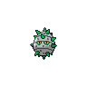

# 597 - Ferroseed

## Types

| Version | Type                                                              |
| :-----: | ----------------------------------------------------------------: |
| Classic |   |

## Defenses

| Immune x0                          | Resistant ×¼                     | Resistant ×½                                                                                                                                                                                                                                                                                                    | Normal ×1                                                                                                                                                                                                           | Weak ×2                                | Weak ×4                        |
| ---------------------------------- | -------------------------------- | --------------------------------------------------------------------------------------------------------------------------------------------------------------------------------------------------------------------------------------------------------------------------------------------------------------- | ------------------------------------------------------------------------------------------------------------------------------------------------------------------------------------------------------------------- | -------------------------------------- | ------------------------------ |
|  |  |         |       |  |  |

## Abilities

| Version | Ability    |
| ------- | ---------- |
| All     | [Iron-Barbs](#/abilities/ironbarbs) |

## Base Stats

| Version | HP | Atk | Def | SAtk | SDef | Spd | BST |
| ------- | -- | --- | --- | ---- | ---- | --- | --- |
| Base Game | 44 | 50 | 91 | 24 | 86 | 10 | 305 |
| All     | 44 | 50  | 91  | 24   | 86   | 10  | 305 |

## Level Up Moves

| Level | Name          | Power | Accuracy | PP | Type                               | Damage Class                           |
| ----- | ------------- | ----- | -------- | -- | ---------------------------------- | -------------------------------------- |
| 1      | [Tackle](#/moves/tackle) | 35    | 95%      | 35 |  |  || 1      | [Harden](#/moves/harden) | -     | -        | 30 |  |      || 1      | [Rapid-Spin](#/moves/rapidspin) | 50    | 100%     | 40 |  |  || 6      | [Rollout](#/moves/rollout) | 30    | 90%      | 20 |      |  || 9      | [Curse](#/moves/curse) | -     | -        | 10 |    |      || 14     | [Metal-Claw](#/moves/metalclaw) | 50    | 95%      | 35 |    |  || 18     | [Pin-Missile](#/moves/pinmissile) | 25    | 95%      | 20 |        |  || 21     | [Gyro-Ball](#/moves/gyroball) | -     | 100%     | 5  |    |  || 23     | [Bullet-Seed](#/moves/bulletseed) | 10    | 100%     | 10 |    |  || 26     | [Iron-Defense](#/moves/irondefense) | -     | -        | 15 |    |      || 28     | [Leech-Seed](#/moves/leechseed) | -     | 90%      | 10 |    |      || 30     | [Mirror-Shot](#/moves/mirrorshot) | 65    | 85%      | 10 |    |    || 32     | [Seed-Bomb](#/moves/seedbomb) | 80    | 100%     | 15 |    |  || 35     | [Ingrain](#/moves/ingrain) | -     | -        | 20 |    |      || 38     | [Self-Destruct](#/moves/selfdestruct) | 200   | 100%     | 5  |  |  || 43     | [Iron-Head](#/moves/ironhead) | 80    | 100%     | 15 |    |  || 47     | [Payback](#/moves/payback) | 50    | 100%     | 10 |      |  || 52     | [Flash-Cannon](#/moves/flashcannon) | 80    | 100%     | 10 |    |    || 55     | [Explosion](#/moves/explosion) | 250   | 100%     | 5  |  |  |
## Learnable Moves

| Machine | Name         | Power | Accuracy | PP | Type                                   | Damage Class                           |
| ------- | ------------ | ----- | -------- | -- | -------------------------------------- | -------------------------------------- |
| TM01 | [Hone-Claws](#/moves/honeclaws) | -     | -        | 15 |          |      || TM06 | [Toxic](#/moves/toxic) | -     | 85%      | 10 |      |      || TM10 | [Hidden-Power](#/moves/hiddenpower) | 60    | 100%     | 15 |      |    || TM11 | [Sunny-Day](#/moves/sunnyday) | -     | -        | 5  |          |      || TM17 | [Protect](#/moves/protect) | -     | -        | 10 |      |      || TM21 | [Frustration](#/moves/frustration) | -     | 100%     | 20 |      |  || TM22 | [Solar-Beam](#/moves/solarbeam) | 120   | 100%     | 10 |        |    || TM24 | [Thunderbolt](#/moves/thunderbolt) | 90    | 100%     | 15 |  |    || TM27 | [Return](#/moves/return) | -     | 100%     | 20 |      |  || TM32 | [Double-Team](#/moves/doubleteam) | -     | -        | 15 |      |      || TM42 | [Facade](#/moves/facade) | 70    | 100%     | 20 |      |  || TM44 | [Rest](#/moves/rest) | -     | -        | 10 |    |      || TM48 | [Round](#/moves/round) | 60    | 100%     | 15 |      |    || TM53 | [Energy-Ball](#/moves/energyball) | 90    | 100%     | 10 |        |    || TM69 | [Rock-Polish](#/moves/rockpolish) | -     | -        | 20 |          |      || TM70 | [Flash](#/moves/flash) | -     | 100%     | 20 |      |      || TM73 | [Thunder-Wave](#/moves/thunderwave) | -     | 90%      | 20 |  |      || TM84 | [Poison-Jab](#/moves/poisonjab) | 80    | 100%     | 20 |      |  || TM87 | [Swagger](#/moves/swagger) | -     | 85%      | 15 |      |      || TM90 | [Substitute](#/moves/substitute) | -     | -        | 10 |      |      || TM94    | Rock-Smash   | 40    | 100%     | 15 |  |  |
## Locations

- [Chargestone Cave - 1F](routes/Chargestone%20Cave%20-%201F/index.md)
