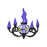

# 609 - Chandelure

## Types

| Version | Type                                                            |
| :-----: | --------------------------------------------------------------: |
| Classic |   |

## Defenses

| Immune x0                                                                     | Resistant ×¼                 | Resistant ×½                                                                                                                                                                                                          | Normal ×1                                                                                                                                                     | Weak ×2                                                                                                                                                                            | Weak ×4 |
| ----------------------------------------------------------------------------- | ---------------------------- | --------------------------------------------------------------------------------------------------------------------------------------------------------------------------------------------------------------------- | ------------------------------------------------------------------------------------------------------------------------------------------------------------- | ---------------------------------------------------------------------------------------------------------------------------------------------------------------------------------- | ------- |
|   |  |       |     |      |         |

## Abilities

| Version | Ability    |
| ------- | ---------- |
| All     | [Levitate /](#/abilities/levitate) |

## Base Stats

| Version | HP | Atk | Def | SAtk | SDef | Spd | BST |
| ------- | -- | --- | --- | ---- | ---- | --- | --- |
| Base Game | 60 | 55 | 90 | 145 | 90 | 80 | 520 |
| All     | 60 | 55  | 90  | 145  | 90   | 80  | 520 |

## Level Up Moves

| Level | Name        | Power | Accuracy | PP | Type                               | Damage Class                         |
| ----- | ----------- | ----- | -------- | -- | ---------------------------------- | ------------------------------------ |
| 1      | [Confuse-Ray](#/moves/confuseray) | -     | 100%     | 10 |    |    || 1      | [Smog](#/moves/smog) | 30    | 70%      | 20 |  |  || 1      | [Flame-Burst](#/moves/flameburst) | 70    | 100%     | 15 |      |  || 1      | [Hex](#/moves/hex) | 65    | 100%     | 10 |    |  |
## Learnable Moves

| Machine | Name         | Power | Accuracy | PP | Type                                 | Damage Class                           |
| ------- | ------------ | ----- | -------- | -- | ------------------------------------ | -------------------------------------- |
| TM04 | [Calm-Mind](#/moves/calmmind) | -     | -        | 20 |  |      || TM06 | [Toxic](#/moves/toxic) | -     | 85%      | 10 |    |      || TM10 | [Hidden-Power](#/moves/hiddenpower) | 60    | 100%     | 15 |    |    || TM11 | [Sunny-Day](#/moves/sunnyday) | -     | -        | 5  |        |      || TM12 | [Taunt](#/moves/taunt) | -     | 100%     | 20 |        |      || TM15 | [Hyper-Beam](#/moves/hyperbeam) | 150   | 90%      | 5  |    |    || TM17 | [Protect](#/moves/protect) | -     | -        | 10 |    |      || TM19 | [Telekinesis](#/moves/telekinesis) | -     | -        | 15 |  |      || TM20 | [Safeguard](#/moves/safeguard) | -     | -        | 25 |    |      || TM21 | [Frustration](#/moves/frustration) | -     | 100%     | 20 |    |  || TM22 | [Solar-Beam](#/moves/solarbeam) | 120   | 100%     | 10 |      |    || TM27 | [Return](#/moves/return) | -     | 100%     | 20 |    |  || TM29 | [Psychic](#/moves/psychic) | 90    | 100%     | 10 |  |    || TM30 | [Shadow-Ball](#/moves/shadowball) | 90    | 100%     | 15 |      |    || TM32 | [Double-Team](#/moves/doubleteam) | -     | -        | 15 |    |      || TM35 | [Flamethrower](#/moves/flamethrower) | 95    | 100%     | 15 |        |    || TM38 | [Fire-Blast](#/moves/fireblast) | 110   | 85%      | 5  |        |    || TM42 | [Facade](#/moves/facade) | 70    | 100%     | 20 |    |  || TM43 | [Flame-Charge](#/moves/flamecharge) | 50    | 100%     | 20 |        |  || TM44 | [Rest](#/moves/rest) | -     | -        | 10 |  |      || TM45 | [Attract](#/moves/attract) | -     | 100%     | 15 |    |      || TM46 | [Thief](#/moves/thief) | 60    | 100%     | 25 |        |  || TM48 | [Round](#/moves/round) | 60    | 100%     | 15 |    |    || TM50 | [Overheat](#/moves/overheat) | 130   | 90%      | 5  |        |    || TM53 | [Energy-Ball](#/moves/energyball) | 90    | 100%     | 10 |      |    || TM59 | [Incinerate](#/moves/incinerate) | 50    | 100%     | 15 |        |    || TM61 | [Will-O-Wisp](#/moves/willowisp) | -     | 85%      | 15 |        |      || TM63 | [Embargo](#/moves/embargo) | -     | 100%     | 15 |        |      || TM66 | [Payback](#/moves/payback) | 50    | 100%     | 10 |        |  || TM68 | [Giga-Impact](#/moves/gigaimpact) | 150   | 90%      | 5  |    |  || TM70 | [Flash](#/moves/flash) | -     | 100%     | 20 |    |      || TM77 | [Psych-Up](#/moves/psychup) | -     | -        | 10 |    |      || TM85 | [Dream-Eater](#/moves/dreameater) | 100   | 100%     | 15 |  |    || TM87 | [Swagger](#/moves/swagger) | -     | 85%      | 15 |    |      || TM90 | [Substitute](#/moves/substitute) | -     | -        | 10 |    |      || TM92    | Trick-Room   | -     | -        | 5  |  |      |