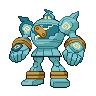

# 623 - Golurk

## Types

| Version | Type                                                                |
| :-----: | ------------------------------------------------------------------: |
| Classic |   |

## Defenses

| Immune x0                                                                                                                | Resistant ×¼                       | Resistant ×½                                                    | Normal ×1                                                                                                                                                                                                                                                              | Weak ×2                                                                                                                                                                        | Weak ×4 |
| ------------------------------------------------------------------------------------------------------------------------ | ---------------------------------- | --------------------------------------------------------------- | ---------------------------------------------------------------------------------------------------------------------------------------------------------------------------------------------------------------------------------------------------------------------- | ------------------------------------------------------------------------------------------------------------------------------------------------------------------------------ | ------- |
|    |  |   |        |      |         |

## Abilities

| Version | Ability              |
| ------- | -------------------- |
| All     | [Iron-Fist](#/abilities/ironfist) / [No-Guard](#/abilities/noguard) |

## Base Stats

| Version | HP | Atk | Def | SAtk | SDef | Spd | BST |
| ------- | -- | --- | --- | ---- | ---- | --- | --- |
| Base Game | 89 | 124 | 80 | 55 | 80 | 55 | 483 |
| All     | 99 | 124 | 90  | 55   | 90   | 55  | 513 |

## Level Up Moves

| Level | Name          | Power | Accuracy | PP | Type                                   | Damage Class                           |
| ----- | ------------- | ----- | -------- | -- | -------------------------------------- | -------------------------------------- |
| 1      | [Pound](#/moves/pound) | 40    | 100%     | 35 |      |  || 1      | [Defense-Curl](#/moves/defensecurl) | -     | -        | 40 |      |      || 1      | [Mud-Slap](#/moves/mudslap) | 20    | 100%     | 10 |      |    || 1      | [Astonish](#/moves/astonish) | 30    | 100%     | 15 |        |  || 1      | [Fire-Punch](#/moves/firepunch) | 80    | 100%     | 15 |          |  || 1      | [Thunder-Punch](#/moves/thunderpunch) | 80    | 100%     | 15 |  |  || 1      | [Ice-Punch](#/moves/icepunch) | 80    | 100%     | 15 |            |  || 9      | [Rollout](#/moves/rollout) | 30    | 90%      | 20 |          |  || 13     | [Shadow-Punch](#/moves/shadowpunch) | 70    | -        | 20 |        |  || 17     | [Iron-Defense](#/moves/irondefense) | -     | -        | 15 |        |      || 21     | [Mega-Punch](#/moves/megapunch) | 80    | 85%      | 20 |      |  || 25     | [Magnitude](#/moves/magnitude) | -     | 100%     | 30 |      |  || 30     | [Dynamic-Punch](#/moves/dynamicpunch) | 100   | 50%      | 5  |  |  || 35     | [Night-Shade](#/moves/nightshade) | -     | 100%     | 15 |        |    || 36     | [Heavy-Slam](#/moves/heavyslam) | -     | 100%     | 10 |        |  || 40     | [Curse](#/moves/curse) | -     | -        | 10 |        |      || 50     | [Earthquake](#/moves/earthquake) | 100   | 100%     | 10 |      |  || 60     | [Hammer-Arm](#/moves/hammerarm) | 100   | 90%      | 10 |  |  || 70     | [Focus-Punch](#/moves/focuspunch) | 150   | 100%     | 20 |  |  |
## Learnable Moves

| Machine | Name         | Power | Accuracy | PP | Type                                   | Damage Class                           |
| ------- | ------------ | ----- | -------- | -- | -------------------------------------- | -------------------------------------- |
| HM02 | [Fly](#/moves/fly) | 100   | 100%     | 15 |      |  || HM04 | [Strength](#/moves/strength) | 85    | 100%     | 15 |          |  || TM06 | [Toxic](#/moves/toxic) | -     | 85%      | 10 |      |      || TM10 | [Hidden-Power](#/moves/hiddenpower) | 60    | 100%     | 15 |      |    || TM13 | [Ice-Beam](#/moves/icebeam) | 90    | 100%     | 10 |            |    || TM15 | [Hyper-Beam](#/moves/hyperbeam) | 150   | 90%      | 5  |      |    || TM17 | [Protect](#/moves/protect) | -     | -        | 10 |      |      || TM18 | [Rain-Dance](#/moves/raindance) | -     | -        | 5  |        |      || TM19 | [Telekinesis](#/moves/telekinesis) | -     | -        | 15 |    |      || TM20 | [Safeguard](#/moves/safeguard) | -     | -        | 25 |      |      || TM21 | [Frustration](#/moves/frustration) | -     | 100%     | 20 |      |  || TM22 | [Solar-Beam](#/moves/solarbeam) | 120   | 100%     | 10 |        |    || TM24 | [Thunderbolt](#/moves/thunderbolt) | 90    | 100%     | 15 |  |    || TM27 | [Return](#/moves/return) | -     | 100%     | 20 |      |  || TM29 | [Psychic](#/moves/psychic) | 90    | 100%     | 10 |    |    || TM30 | [Shadow-Ball](#/moves/shadowball) | 90    | 100%     | 15 |        |    || TM31 | [Brick-Break](#/moves/brickbreak) | 75    | 100%     | 15 |  |  || TM32 | [Double-Team](#/moves/doubleteam) | -     | -        | 15 |      |      || TM39 | [Rock-Tomb](#/moves/rocktomb) | 60    | 95%      | 15 |          |  || TM42 | [Facade](#/moves/facade) | 70    | 100%     | 20 |      |  || TM44 | [Rest](#/moves/rest) | -     | -        | 10 |    |      || TM46 | [Thief](#/moves/thief) | 60    | 100%     | 25 |          |  || TM47 | [Low-Sweep](#/moves/lowsweep) | 65    | 100%     | 20 |  |  || TM48 | [Round](#/moves/round) | 60    | 100%     | 15 |      |    || TM52 | [Focus-Blast](#/moves/focusblast) | 120   | 70%      | 5  |  |    || TM56 | [Fling](#/moves/fling) | -     | 100%     | 10 |          |  || TM57 | [Charge-Beam](#/moves/chargebeam) | 50    | 90%      | 10 |  |    || TM68 | [Giga-Impact](#/moves/gigaimpact) | 150   | 90%      | 5  |      |  || TM69 | [Rock-Polish](#/moves/rockpolish) | -     | -        | 20 |          |      || TM70 | [Flash](#/moves/flash) | -     | 100%     | 20 |      |      || TM71 | [Stone-Edge](#/moves/stoneedge) | 100   | 80%      | 5  |          |  || TM74 | [Gyro-Ball](#/moves/gyroball) | -     | 100%     | 5  |        |  || TM78 | [Bulldoze](#/moves/bulldoze) | 80    | 100%     | 20 |      |  || TM80 | [Rock-Slide](#/moves/rockslide) | 80    | 95%      | 10 |          |  || TM86 | [Grass-Knot](#/moves/grassknot) | -     | 100%     | 20 |        |    || TM87 | [Swagger](#/moves/swagger) | -     | 85%      | 15 |      |      || TM90 | [Substitute](#/moves/substitute) | -     | -        | 10 |      |      || TM91 | [Flash-Cannon](#/moves/flashcannon) | 80    | 100%     | 10 |        |    || TM94    | Rock-Smash   | 40    | 100%     | 15 |  |  |
## Locations

- [Dragonsprial Tower - Inside](routes/Dragonsprial%20Tower%20-%20Inside/index.md)
