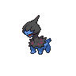

# 633 - Deino

## Types

| Version | Type                                                              |
| :-----: | ----------------------------------------------------------------: |
| Classic |   |

## Defenses

| Immune x0                            | Resistant ×¼ | Resistant ×½                                                                                                                                                                                                                | Normal ×1                                                                                                                                                                                                                       | Weak ×2                                                                                                                                         | Weak ×4                          |
| ------------------------------------ | ------------ | --------------------------------------------------------------------------------------------------------------------------------------------------------------------------------------------------------------------------- | ------------------------------------------------------------------------------------------------------------------------------------------------------------------------------------------------------------------------------- | ----------------------------------------------------------------------------------------------------------------------------------------------- | -------------------------------- |
|  |              |       |       |     |  |

## Abilities

| Version | Ability             |
| ------- | ------------------- |
| Base Game | [Hustle](#/abilities/hustle) |
| All     | [Hustle](#/abilities/hustle) / [Intimidate](#/abilities/intimidate) |

## Base Stats

| Version | HP | Atk | Def | SAtk | SDef | Spd | BST |
| ------- | -- | --- | --- | ---- | ---- | --- | --- |
| Base Game | 52 | 65 | 50 | 45 | 50 | 38 | 300 |
| All     | 52 | 65  | 50  | 45   | 50   | 38  | 300 |

## Evolution Change

Evolves at level 30

## Level Up Moves

| Level | Name          | Power | Accuracy | PP | Type                               | Damage Class                           |
| ----- | ------------- | ----- | -------- | -- | ---------------------------------- | -------------------------------------- |
| 1      | [Tackle](#/moves/tackle) | 35    | 95%      | 35 |  |  || 1      | [Dragon-Rage](#/moves/dragonrage) | -     | 100%     | 10 |  |    || 4      | [Focus-Energy](#/moves/focusenergy) | -     | -        | 30 |  |      || 9      | [Bite](#/moves/bite) | 60    | 100%     | 25 |      |  || 12     | [Headbutt](#/moves/headbutt) | 70    | 100%     | 15 |  |  || 17     | [Dragon-Breath](#/moves/dragonbreath) | 60    | 100%     | 20 |  |    || 20     | [Roar](#/moves/roar) | -     | -        | 20 |  |      || 25     | [Crunch](#/moves/crunch) | 80    | 100%     | 15 |      |  || 28     | [Slam](#/moves/slam) | 80    | 75%      | 20 |  |  || 32     | [Dragon-Pulse](#/moves/dragonpulse) | 85    | 100%     | 10 |  |    || 35     | [Dark-Pulse](#/moves/darkpulse) | 90    | 100%     | 15 |      |    || 38     | [Work-Up](#/moves/workup) | -     | -        | 30 |  |      || 42     | [Dragon-Rush](#/moves/dragonrush) | 100   | 75%      | 10 |  |  || 45     | [Earth-Power](#/moves/earthpower) | 90    | 100%     | 10 |  |    || 48     | [Body-Slam](#/moves/bodyslam) | 85    | 100%     | 15 |  |  || 52     | [Scary-Face](#/moves/scaryface) | -     | 90%      | 10 |  |      || 58     | [Hyper-Voice](#/moves/hypervoice) | 90    | 100%     | 10 |  |    || 62     | [Outrage](#/moves/outrage) | 120   | 100%     | 10 |  |  |
## Learnable Moves

| Machine | Name         | Power | Accuracy | PP | Type                                   | Damage Class                           |
| ------- | ------------ | ----- | -------- | -- | -------------------------------------- | -------------------------------------- |
| HM04 | [Strength](#/moves/strength) | 85    | 100%     | 15 |          |  || TM06 | [Toxic](#/moves/toxic) | -     | 85%      | 10 |      |      || TM10 | [Hidden-Power](#/moves/hiddenpower) | 60    | 100%     | 15 |      |    || TM11 | [Sunny-Day](#/moves/sunnyday) | -     | -        | 5  |          |      || TM12 | [Taunt](#/moves/taunt) | -     | 100%     | 20 |          |      || TM17 | [Protect](#/moves/protect) | -     | -        | 10 |      |      || TM18 | [Rain-Dance](#/moves/raindance) | -     | -        | 5  |        |      || TM21 | [Frustration](#/moves/frustration) | -     | 100%     | 20 |      |  || TM27 | [Return](#/moves/return) | -     | 100%     | 20 |      |  || TM32 | [Double-Team](#/moves/doubleteam) | -     | -        | 15 |      |      || TM41 | [Torment](#/moves/torment) | -     | 100%     | 15 |          |      || TM42 | [Facade](#/moves/facade) | 70    | 100%     | 20 |      |  || TM44 | [Rest](#/moves/rest) | -     | -        | 10 |    |      || TM45 | [Attract](#/moves/attract) | -     | 100%     | 15 |      |      || TM46 | [Thief](#/moves/thief) | 60    | 100%     | 25 |          |  || TM48 | [Round](#/moves/round) | 60    | 100%     | 15 |      |    || TM59 | [Incinerate](#/moves/incinerate) | 50    | 100%     | 15 |          |    || TM73 | [Thunder-Wave](#/moves/thunderwave) | -     | 90%      | 20 |  |      || TM77 | [Psych-Up](#/moves/psychup) | -     | -        | 10 |      |      || TM82 | [Dragon-Tail](#/moves/dragontail) | 60    | 90%      | 10 |      |  || TM87 | [Swagger](#/moves/swagger) | -     | 85%      | 15 |      |      || TM90 | [Substitute](#/moves/substitute) | -     | -        | 10 |      |      || TM94    | Rock-Smash   | 40    | 100%     | 15 |  |  |
## Locations

- [Chargestone Cave - B1F](routes/Chargestone%20Cave%20-%20B1F/index.md)
- [Mistralton Cave - 1F](routes/Mistralton%20Cave%20-%201F/index.md)
- [Mistralton Cave - 2F](routes/Mistralton%20Cave%20-%202F/index.md)
