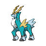

# 638 - Cobalion

## Types

| Version | Type                                                                    |
| :-----: | ----------------------------------------------------------------------: |
| Classic |   |

## Defenses

| Immune x0                          | Resistant ×¼                                                    | Resistant ×½                                                                                                                                                                                                            | Normal ×1                                                                                                                                                                                                                             | Weak ×2                                                                                                          | Weak ×4 |
| ---------------------------------- | --------------------------------------------------------------- | ----------------------------------------------------------------------------------------------------------------------------------------------------------------------------------------------------------------------- | ------------------------------------------------------------------------------------------------------------------------------------------------------------------------------------------------------------------------------------- | ---------------------------------------------------------------------------------------------------------------- | ------- |
|  |   |       |       |    |         |

## Abilities

| Version | Ability   |
| ------- | --------- |
| All     | [Justified](#/abilities/justified) |

## Base Stats

| Version | HP | Atk | Def | SAtk | SDef | Spd | BST |
| ------- | -- | --- | --- | ---- | ---- | --- | --- |
| Base Game | 91 | 90 | 129 | 90 | 72 | 108 | 580 |
| All     | 91 | 90  | 129 | 90   | 72   | 108 | 580 |

## Level Up Moves

| Level | Name         | Power | Accuracy | PP | Type                                   | Damage Class                           |
| ----- | ------------ | ----- | -------- | -- | -------------------------------------- | -------------------------------------- |
| 1      | [Leer](#/moves/leer) | -     | 100%     | 30 |      |      || 1      | [Quick-Attack](#/moves/quickattack) | 40    | 100%     | 30 |      |  || 7      | [Double-Kick](#/moves/doublekick) | 30    | 100%     | 30 |  |  || 13     | [Metal-Claw](#/moves/metalclaw) | 50    | 95%      | 35 |        |  || 19     | [Take-Down](#/moves/takedown) | 90    | 85%      | 20 |      |  || 25     | [Helping-Hand](#/moves/helpinghand) | -     | -        | 20 |      |      || 31     | [Retaliate](#/moves/retaliate) | 70    | 100%     | 5  |      |  || 37     | [Iron-Head](#/moves/ironhead) | 80    | 100%     | 15 |        |  || 42     | [Sacred-Sword](#/moves/sacredsword) | 90    | 100%     | 15 |  |  || 49     | [Swords-Dance](#/moves/swordsdance) | -     | -        | 20 |      |      || 55     | [Quick-Guard](#/moves/quickguard) | -     | -        | 15 |  |      || 61     | [Work-Up](#/moves/workup) | -     | -        | 30 |      |      || 67     | [Metal-Burst](#/moves/metalburst) | -     | 100%     | 10 |        |  || 73     | [Close-Combat](#/moves/closecombat) | 120   | 100%     | 5  |  |  || 79     | [Secret-Sword](#/moves/secretsword) | 85    | 100%     | 10 |  |    |
## Learnable Moves

| Machine | Name         | Power | Accuracy | PP | Type                                   | Damage Class                           |
| ------- | ------------ | ----- | -------- | -- | -------------------------------------- | -------------------------------------- |
| HM01 | [Cut](#/moves/cut) | 60    | 100%     | 20 |        |  || HM04 | [Strength](#/moves/strength) | 85    | 100%     | 15 |          |  || TM01 | [Hone-Claws](#/moves/honeclaws) | -     | -        | 15 |          |      || TM04 | [Calm-Mind](#/moves/calmmind) | -     | -        | 20 |    |      || TM05 | [Roar](#/moves/roar) | -     | -        | 20 |      |      || TM06 | [Toxic](#/moves/toxic) | -     | 85%      | 10 |      |      || TM10 | [Hidden-Power](#/moves/hiddenpower) | 60    | 100%     | 15 |      |    || TM12 | [Taunt](#/moves/taunt) | -     | 100%     | 20 |          |      || TM15 | [Hyper-Beam](#/moves/hyperbeam) | 150   | 90%      | 5  |      |    || TM17 | [Protect](#/moves/protect) | -     | -        | 10 |      |      || TM20 | [Safeguard](#/moves/safeguard) | -     | -        | 25 |      |      || TM21 | [Frustration](#/moves/frustration) | -     | 100%     | 20 |      |  || TM27 | [Return](#/moves/return) | -     | 100%     | 20 |      |  || TM32 | [Double-Team](#/moves/doubleteam) | -     | -        | 15 |      |      || TM33 | [Reflect](#/moves/reflect) | -     | -        | 20 |    |      || TM37 | [Sandstorm](#/moves/sandstorm) | -     | -        | 10 |          |      || TM40 | [Aerial-Ace](#/moves/aerialace) | 60    | -        | 20 |      |  || TM42 | [Facade](#/moves/facade) | 70    | 100%     | 20 |      |  || TM44 | [Rest](#/moves/rest) | -     | -        | 10 |    |      || TM48 | [Round](#/moves/round) | 60    | 100%     | 15 |      |    || TM52 | [Focus-Blast](#/moves/focusblast) | 120   | 70%      | 5  |  |    || TM54 | [False-Swipe](#/moves/falseswipe) | 40    | 100%     | 40 |      |  || TM68 | [Giga-Impact](#/moves/gigaimpact) | 150   | 90%      | 5  |      |  || TM69 | [Rock-Polish](#/moves/rockpolish) | -     | -        | 20 |          |      || TM71 | [Stone-Edge](#/moves/stoneedge) | 100   | 80%      | 5  |          |  || TM72 | [Volt-Switch](#/moves/voltswitch) | 70    | 100%     | 20 |  |    || TM73 | [Thunder-Wave](#/moves/thunderwave) | -     | 90%      | 20 |  |      || TM77 | [Psych-Up](#/moves/psychup) | -     | -        | 10 |      |      || TM81 | [X-Scissor](#/moves/xscissor) | 80    | 100%     | 15 |            |  || TM84 | [Poison-Jab](#/moves/poisonjab) | 80    | 100%     | 20 |      |  || TM87 | [Swagger](#/moves/swagger) | -     | 85%      | 15 |      |      || TM90 | [Substitute](#/moves/substitute) | -     | -        | 10 |      |      || TM91 | [Flash-Cannon](#/moves/flashcannon) | 80    | 100%     | 10 |        |    || TM94    | Rock-Smash   | 40    | 100%     | 15 |  |  |
## Locations

- [Mistralton Cave - 3F (Guidance Chamber)](routes/Mistralton%20Cave%20-%203F%20(Guidance%20Chamber)/index.md)
