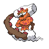

# 645 - Landorus-Incarnate

## Types

| Version | Type                                                                  |
| :-----: | --------------------------------------------------------------------: |
| Classic |   |

## Defenses

| Immune x0                                                                     | Resistant ×¼ | Resistant ×½                                                                                                   | Normal ×1                                                                                                                                                                                                                                                                                                                                                                                                              | Weak ×2                          | Weak ×4                      |
| ----------------------------------------------------------------------------- | ------------ | -------------------------------------------------------------------------------------------------------------- | ---------------------------------------------------------------------------------------------------------------------------------------------------------------------------------------------------------------------------------------------------------------------------------------------------------------------------------------------------------------------------------------------------------------------- | -------------------------------- | ---------------------------- |
|   |              |    |            |  |  |

## Abilities

| Version | Ability                  |
| ------- | ------------------------ |
| All     | [Sand-Force](#/abilities/sandforce) / [Sheer-Force](#/abilities/sheerforce) |

## Base Stats

| Version | HP | Atk | Def | SAtk | SDef | Spd | BST |
| ------- | -- | --- | --- | ---- | ---- | --- | --- |
| Base Game | 89 | 125 | 90 | 115 | 80 | 101 | 600 |
| All     | 89 | 125 | 90  | 115  | 80   | 101 | 600 |

## Level Up Moves

| Level | Name         | Power | Accuracy | PP | Type                                   | Damage Class                           |
| ----- | ------------ | ----- | -------- | -- | -------------------------------------- | -------------------------------------- |
| 1      | [Rock-Tomb](#/moves/rocktomb) | 60    | 95%      | 15 |          |  || 1      | [Block](#/moves/block) | -     | -        | 5  |      |      || 1      | [Mud-Shot](#/moves/mudshot) | 55    | 95%      | 15 |      |    || 7      | [Imprison](#/moves/imprison) | -     | -        | 10 |    |      || 13     | [Punishment](#/moves/punishment) | 60    | 100%     | 60 |          |  || 19     | [Bulldoze](#/moves/bulldoze) | 80    | 100%     | 20 |      |  || 25     | [Rock-Throw](#/moves/rockthrow) | 50    | 90%      | 15 |          |  || 31     | [Extrasensory](#/moves/extrasensory) | 80    | 100%     | 20 |    |    || 37     | [Swords-Dance](#/moves/swordsdance) | -     | -        | 20 |      |      || 43     | [Earth-Power](#/moves/earthpower) | 90    | 100%     | 10 |      |    || 49     | [Rock-Slide](#/moves/rockslide) | 80    | 95%      | 10 |          |  || 55     | [Earthquake](#/moves/earthquake) | 100   | 100%     | 10 |      |  || 61     | [Sandstorm](#/moves/sandstorm) | -     | -        | 10 |          |      || 67     | [Fissure](#/moves/fissure) | -     | 30%      | 5  |      |  || 73     | [Stone-Edge](#/moves/stoneedge) | 100   | 80%      | 5  |          |  || 79     | [Hammer-Arm](#/moves/hammerarm) | 100   | 90%      | 10 |  |  || 85     | [Outrage](#/moves/outrage) | 120   | 100%     | 10 |      |  |
## Learnable Moves

| Machine | Name         | Power | Accuracy | PP | Type                                   | Damage Class                           |
| ------- | ------------ | ----- | -------- | -- | -------------------------------------- | -------------------------------------- |
| HM02 | [Fly](#/moves/fly) | 100   | 100%     | 15 |      |  || HM04 | [Strength](#/moves/strength) | 85    | 100%     | 15 |          |  || TM04 | [Calm-Mind](#/moves/calmmind) | -     | -        | 20 |    |      || TM06 | [Toxic](#/moves/toxic) | -     | 85%      | 10 |      |      || TM08 | [Bulk-Up](#/moves/bulkup) | -     | -        | 20 |  |      || TM10 | [Hidden-Power](#/moves/hiddenpower) | 60    | 100%     | 15 |      |    || TM15 | [Hyper-Beam](#/moves/hyperbeam) | 150   | 90%      | 5  |      |    || TM17 | [Protect](#/moves/protect) | -     | -        | 10 |      |      || TM21 | [Frustration](#/moves/frustration) | -     | 100%     | 20 |      |  || TM23 | [Smack-Down](#/moves/smackdown) | 50    | 100%     | 15 |          |  || TM27 | [Return](#/moves/return) | -     | 100%     | 20 |      |  || TM28 | [Dig](#/moves/dig) | 100   | 100%     | 10 |      |  || TM29 | [Psychic](#/moves/psychic) | 90    | 100%     | 10 |    |    || TM31 | [Brick-Break](#/moves/brickbreak) | 75    | 100%     | 15 |  |  || TM32 | [Double-Team](#/moves/doubleteam) | -     | -        | 15 |      |      || TM34 | [Sludge-Wave](#/moves/sludgewave) | 95    | 100%     | 10 |      |    || TM36 | [Sludge-Bomb](#/moves/sludgebomb) | 90    | 100%     | 10 |      |    || TM42 | [Facade](#/moves/facade) | 70    | 100%     | 20 |      |  || TM44 | [Rest](#/moves/rest) | -     | -        | 10 |    |      || TM45 | [Attract](#/moves/attract) | -     | 100%     | 15 |      |      || TM48 | [Round](#/moves/round) | 60    | 100%     | 15 |      |    || TM52 | [Focus-Blast](#/moves/focusblast) | 120   | 70%      | 5  |  |    || TM56 | [Fling](#/moves/fling) | -     | 100%     | 10 |          |  || TM64 | [Explosion](#/moves/explosion) | 250   | 100%     | 5  |      |  || TM66 | [Payback](#/moves/payback) | 50    | 100%     | 10 |          |  || TM68 | [Giga-Impact](#/moves/gigaimpact) | 150   | 90%      | 5  |      |  || TM69 | [Rock-Polish](#/moves/rockpolish) | -     | -        | 20 |          |      || TM86 | [Grass-Knot](#/moves/grassknot) | -     | 100%     | 20 |        |    || TM87 | [Swagger](#/moves/swagger) | -     | 85%      | 15 |      |      || TM89 | [U-Turn](#/moves/uturn) | 70    | 100%     | 20 |            |  || TM90 | [Substitute](#/moves/substitute) | -     | -        | 10 |      |      || TM94    | Rock-Smash   | 40    | 100%     | 15 |  |  |
## Locations

- [Abundant Shrine](routes/Abundant%20Shrine/index.md)
