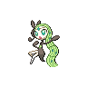

# 648 - Meloetta-Aria

## Types

| Version | Type                                                                    |
| :-----: | ----------------------------------------------------------------------: |
| Classic |   |

## Defenses

| Immune x0                        | Resistant ×¼ | Resistant ×½                         | Normal ×1                                                                                                                                                                                                                                                                                                                                                                                                                                                                                                                                       | Weak ×2                                                         | Weak ×4 |
| -------------------------------- | ------------ | ------------------------------------ | ----------------------------------------------------------------------------------------------------------------------------------------------------------------------------------------------------------------------------------------------------------------------------------------------------------------------------------------------------------------------------------------------------------------------------------------------------------------------------------------------------------------------------------------------- | --------------------------------------------------------------- | ------- |
|  |              |  |               |   |         |

## Abilities

| Version | Ability                    |
| ------- | -------------------------- |
| All     | [Serene-Grace](#/abilities/serenegrace) / [Magic-Guard](#/abilities/magicguard) |

## Base Stats

| Version | HP  | Atk | Def | SAtk | SDef | Spd | BST |
| ------- | --- | --- | --- | ---- | ---- | --- | --- |
| All     | 100 | 77  | 77  | 128  | 128  | 90  | 600 |

## Level Up Moves

| Level | Name         | Power | Accuracy | PP | Type                                   | Damage Class                           |
| ----- | ------------ | ----- | -------- | -- | -------------------------------------- | -------------------------------------- |
| 1      | [Round](#/moves/round) | 60    | 100%     | 15 |      |    || 1      | [Relic-Song](#/moves/relicsong) | 75    | 100%     | 10 |      |    || 6      | [Quick-Attack](#/moves/quickattack) | 40    | 100%     | 30 |      |  || 11     | [Confusion](#/moves/confusion) | 50    | 100%     | 25 |    |    || 16     | [Sing](#/moves/sing) | -     | 55%      | 15 |      |      || 21     | [Teeter-Dance](#/moves/teeterdance) | -     | 100%     | 20 |      |      || 26     | [Acrobatics](#/moves/acrobatics) | 55    | 100%     | 15 |      |  || 31     | [Psybeam](#/moves/psybeam) | 65    | 100%     | 20 |    |    || 36     | [Echoed-Voice](#/moves/echoedvoice) | 40    | 100%     | 15 |      |    || 43     | [U-Turn](#/moves/uturn) | 70    | 100%     | 20 |            |  || 50     | [Wake-Up-Slap](#/moves/wakeupslap) | 70    | 100%     | 10 |  |  || 57     | [Psychic](#/moves/psychic) | 90    | 100%     | 10 |    |    || 64     | [Hyper-Voice](#/moves/hypervoice) | 90    | 100%     | 10 |      |    || 71     | [Role-Play](#/moves/roleplay) | -     | -        | 10 |    |      || 78     | [Close-Combat](#/moves/closecombat) | 120   | 100%     | 5  |  |  || 85     | [Perish-Song](#/moves/perishsong) | -     | -        | 5  |      |      |
## Learnable Moves

| Machine | Name         | Power | Accuracy | PP | Type                                   | Damage Class                           |
| ------- | ------------ | ----- | -------- | -- | -------------------------------------- | -------------------------------------- |
| HM04 | [Strength](#/moves/strength) | 85    | 100%     | 15 |          |  || TM01 | [Hone-Claws](#/moves/honeclaws) | -     | -        | 15 |          |      || TM03 | [Psyshock](#/moves/psyshock) | 80    | 100%     | 10 |    |    || TM04 | [Calm-Mind](#/moves/calmmind) | -     | -        | 20 |    |      || TM06 | [Toxic](#/moves/toxic) | -     | 85%      | 10 |      |      || TM10 | [Hidden-Power](#/moves/hiddenpower) | 60    | 100%     | 15 |      |    || TM11 | [Sunny-Day](#/moves/sunnyday) | -     | -        | 5  |          |      || TM15 | [Hyper-Beam](#/moves/hyperbeam) | 150   | 90%      | 5  |      |    || TM16 | [Light-Screen](#/moves/lightscreen) | -     | -        | 30 |    |      || TM17 | [Protect](#/moves/protect) | -     | -        | 10 |      |      || TM18 | [Rain-Dance](#/moves/raindance) | -     | -        | 5  |        |      || TM19 | [Telekinesis](#/moves/telekinesis) | -     | -        | 15 |    |      || TM20 | [Safeguard](#/moves/safeguard) | -     | -        | 25 |      |      || TM21 | [Frustration](#/moves/frustration) | -     | 100%     | 20 |      |  || TM24 | [Thunderbolt](#/moves/thunderbolt) | 90    | 100%     | 15 |  |    || TM25 | [Thunder](#/moves/thunder) | 110   | 70%      | 10 |  |    || TM27 | [Return](#/moves/return) | -     | 100%     | 20 |      |  || TM30 | [Shadow-Ball](#/moves/shadowball) | 90    | 100%     | 15 |        |    || TM31 | [Brick-Break](#/moves/brickbreak) | 75    | 100%     | 15 |  |  || TM32 | [Double-Team](#/moves/doubleteam) | -     | -        | 15 |      |      || TM42 | [Facade](#/moves/facade) | 70    | 100%     | 20 |      |  || TM44 | [Rest](#/moves/rest) | -     | -        | 10 |    |      || TM47 | [Low-Sweep](#/moves/lowsweep) | 65    | 100%     | 20 |  |  || TM52 | [Focus-Blast](#/moves/focusblast) | 120   | 70%      | 5  |  |    || TM53 | [Energy-Ball](#/moves/energyball) | 90    | 100%     | 10 |        |    || TM56 | [Fling](#/moves/fling) | -     | 100%     | 10 |          |  || TM57 | [Charge-Beam](#/moves/chargebeam) | 50    | 90%      | 10 |  |    || TM63 | [Embargo](#/moves/embargo) | -     | 100%     | 15 |          |      || TM65 | [Shadow-Claw](#/moves/shadowclaw) | 80    | 100%     | 15 |        |  || TM66 | [Payback](#/moves/payback) | 50    | 100%     | 10 |          |  || TM67 | [Retaliate](#/moves/retaliate) | 70    | 100%     | 5  |      |  || TM68 | [Giga-Impact](#/moves/gigaimpact) | 150   | 90%      | 5  |      |  || TM70 | [Flash](#/moves/flash) | -     | 100%     | 20 |      |      || TM71 | [Stone-Edge](#/moves/stoneedge) | 100   | 80%      | 5  |          |  || TM73 | [Thunder-Wave](#/moves/thunderwave) | -     | 90%      | 20 |  |      || TM77 | [Psych-Up](#/moves/psychup) | -     | -        | 10 |      |      || TM83 | [Work-Up](#/moves/workup) | -     | -        | 30 |      |      || TM85 | [Dream-Eater](#/moves/dreameater) | 100   | 100%     | 15 |    |    || TM86 | [Grass-Knot](#/moves/grassknot) | -     | 100%     | 20 |        |    || TM87 | [Swagger](#/moves/swagger) | -     | 85%      | 15 |      |      || TM90 | [Substitute](#/moves/substitute) | -     | -        | 10 |      |      || TM92 | [Trick-Room](#/moves/trickroom) | -     | -        | 5  |    |      || TM94    | Rock-Smash   | 40    | 100%     | 15 |  |  |
## Locations

- [Village Bridge](routes/Village%20Bridge/index.md)
