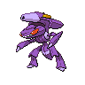

# 649 - Genesect

## Types

| Version | Type                                                          |
| :-----: | ------------------------------------------------------------: |
| Classic |   |

## Defenses

| Immune x0                          | Resistant ×¼                     | Resistant ×½                                                                                                                                                                                                                                                   | Normal ×1                                                                                                                                                                                                                                                                                                       | Weak ×2 | Weak ×4                        |
| ---------------------------------- | -------------------------------- | -------------------------------------------------------------------------------------------------------------------------------------------------------------------------------------------------------------------------------------------------------------- | --------------------------------------------------------------------------------------------------------------------------------------------------------------------------------------------------------------------------------------------------------------------------------------------------------------- | ------- | ------------------------------ |
|  |  |        |         |         |  |

## Abilities

| Version | Ability  |
| ------- | -------- |
| All     | [Download](#/abilities/download) |

## Base Stats

| Version | HP | Atk | Def | SAtk | SDef | Spd | BST |
| ------- | -- | --- | --- | ---- | ---- | --- | --- |
| Base Game | 71 | 120 | 95 | 120 | 95 | 99 | 600 |
| All     | 71 | 120 | 95  | 120  | 95   | 99  | 600 |

## Level Up Moves

| Level | Name          | Power | Accuracy | PP | Type                                   | Damage Class                           |
| ----- | ------------- | ----- | -------- | -- | -------------------------------------- | -------------------------------------- |
| 1      | [Quick-Attack](#/moves/quickattack) | 40    | 100%     | 30 |      |  || 1      | [Screech](#/moves/screech) | -     | 85%      | 40 |      |      || 1      | [Metal-Claw](#/moves/metalclaw) | 50    | 95%      | 35 |        |  || 1      | [Magnet-Rise](#/moves/magnetrise) | -     | -        | 10 |  |      || 1      | [Techno-Blast](#/moves/technoblast) | 120   | 100%     | 5  |      |    || 7      | [Fury-Cutter](#/moves/furycutter) | 10    | 95%      | 10 |            |  || 11     | [Lock-On](#/moves/lockon) | -     | -        | 5  |      |      || 18     | [Flame-Charge](#/moves/flamecharge) | 50    | 100%     | 20 |          |  || 22     | [Magnet-Bomb](#/moves/magnetbomb) | 70    | -        | 20 |        |  || 29     | [Slash](#/moves/slash) | 70    | 100%     | 20 |      |  || 33     | [Metal-Sound](#/moves/metalsound) | -     | 85%      | 40 |        |      || 40     | [Signal-Beam](#/moves/signalbeam) | 75    | 100%     | 15 |            |    || 44     | [Tri-Attack](#/moves/triattack) | 80    | 100%     | 10 |      |    || 51     | [X-Scissor](#/moves/xscissor) | 80    | 100%     | 15 |            |  || 55     | [Bug-Buzz](#/moves/bugbuzz) | 90    | 100%     | 10 |            |    || 62     | [Simple-Beam](#/moves/simplebeam) | -     | 100%     | 15 |      |      || 66     | [Zap-Cannon](#/moves/zapcannon) | 120   | 50%      | 5  |  |    || 73     | [Hyper-Beam](#/moves/hyperbeam) | 150   | 90%      | 5  |      |    || 77     | [Self-Destruct](#/moves/selfdestruct) | 200   | 100%     | 5  |      |  |
## Learnable Moves

| Machine | Name         | Power | Accuracy | PP | Type                                   | Damage Class                           |
| ------- | ------------ | ----- | -------- | -- | -------------------------------------- | -------------------------------------- |
| HM02 | [Fly](#/moves/fly) | 100   | 100%     | 15 |      |  || TM01 | [Hone-Claws](#/moves/honeclaws) | -     | -        | 15 |          |      || TM06 | [Toxic](#/moves/toxic) | -     | 85%      | 10 |      |      || TM10 | [Hidden-Power](#/moves/hiddenpower) | 60    | 100%     | 15 |      |    || TM13 | [Ice-Beam](#/moves/icebeam) | 90    | 100%     | 10 |            |    || TM14 | [Blizzard](#/moves/blizzard) | 110   | 70%      | 5  |            |    || TM16 | [Light-Screen](#/moves/lightscreen) | -     | -        | 30 |    |      || TM17 | [Protect](#/moves/protect) | -     | -        | 10 |      |      || TM21 | [Frustration](#/moves/frustration) | -     | 100%     | 20 |      |  || TM22 | [Solar-Beam](#/moves/solarbeam) | 120   | 100%     | 10 |        |    || TM24 | [Thunderbolt](#/moves/thunderbolt) | 90    | 100%     | 15 |  |    || TM25 | [Thunder](#/moves/thunder) | 110   | 70%      | 10 |  |    || TM27 | [Return](#/moves/return) | -     | 100%     | 20 |      |  || TM29 | [Psychic](#/moves/psychic) | 90    | 100%     | 10 |    |    || TM32 | [Double-Team](#/moves/doubleteam) | -     | -        | 15 |      |      || TM33 | [Reflect](#/moves/reflect) | -     | -        | 20 |    |      || TM35 | [Flamethrower](#/moves/flamethrower) | 95    | 100%     | 15 |          |    || TM40 | [Aerial-Ace](#/moves/aerialace) | 60    | -        | 20 |      |  || TM42 | [Facade](#/moves/facade) | 70    | 100%     | 20 |      |  || TM44 | [Rest](#/moves/rest) | -     | -        | 10 |    |      || TM48 | [Round](#/moves/round) | 60    | 100%     | 15 |      |    || TM53 | [Energy-Ball](#/moves/energyball) | 90    | 100%     | 10 |        |    || TM57 | [Charge-Beam](#/moves/chargebeam) | 50    | 90%      | 10 |  |    || TM64 | [Explosion](#/moves/explosion) | 250   | 100%     | 5  |      |  || TM65 | [Shadow-Claw](#/moves/shadowclaw) | 80    | 100%     | 15 |        |  || TM68 | [Giga-Impact](#/moves/gigaimpact) | 150   | 90%      | 5  |      |  || TM69 | [Rock-Polish](#/moves/rockpolish) | -     | -        | 20 |          |      || TM70 | [Flash](#/moves/flash) | -     | 100%     | 20 |      |      || TM73 | [Thunder-Wave](#/moves/thunderwave) | -     | 90%      | 20 |  |      || TM76 | [Struggle-Bug](#/moves/strugglebug) | 50    | 100%     | 20 |            |    || TM87 | [Swagger](#/moves/swagger) | -     | 85%      | 15 |      |      || TM89 | [U-Turn](#/moves/uturn) | 70    | 100%     | 20 |            |  || TM90 | [Substitute](#/moves/substitute) | -     | -        | 10 |      |      || TM91    | Flash-Cannon | 80    | 100%     | 10 |        |    |
## Locations

- [Challenger's Cave - All Floors](routes/Challenger's%20Cave%20-%20All%20Floors/index.md)
