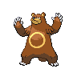
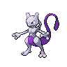
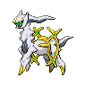

# Challenger's cave - b2f

| Area                                                                             | Pokemon                                                                                            | &nbsp;                                                                                           | &nbsp;                                                                                          | &nbsp;                                                                                        | &nbsp;                                                                                         | &nbsp;                                                                                         |
| -------------------------------------------------------------------------------- | -------------------------------------------------------------------------------------------------- | ------------------------------------------------------------------------------------------------ | ----------------------------------------------------------------------------------------------- | --------------------------------------------------------------------------------------------- | ---------------------------------------------------------------------------------------------- | ---------------------------------------------------------------------------------------------- |
|  cave-normal              |   [Mawile](#/pokemon/303)  20%         |   [Sableye](#/pokemon/302)  20%     |   [Golbat](#/pokemon/042)  10%      |   [Kadabra](#/pokemon/064)  10%  |   [Zweilous](#/pokemon/634)  10% |   [Medicham](#/pokemon/308)  10% |
|                                                                                  |   [Ursaring](#/pokemon/217)  10%     |   [Donphan](#/pokemon/232)  10%     |
|  cave-special           |   [Excadrill](#/pokemon/530)  50%   |   [Dugtrio](#/pokemon/051)  50%     |
| legendary-encounter cave-normal                                              |   [Mewtwo](#/pokemon/150)  1%          |   [Darkrai](#/pokemon/491)  1%      |   [Arceus](#/pokemon/493)  1%       |
|  surf-normal              |   [Psyduck](#/pokemon/054)  90%       |   [Tentacool](#/pokemon/072)  10% |
|  surf-special           |   [Tentacruel](#/pokemon/073)  60% |   [Golduck](#/pokemon/055)  30%     |   [Starmie](#/pokemon/121)  10%    |
|  fishing-normal     |   [Goldeen](#/pokemon/118)  90%       |   [Poliwhirl](#/pokemon/061)  10% |
|  fishing-special  |   [Seaking](#/pokemon/119)  60%       |   [Gyarados](#/pokemon/130)  30%   |   [Poliwrath](#/pokemon/062)  5% |   [Politoed](#/pokemon/186)  5% |