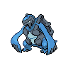

# Chargestone cave - 1f

| Trainer                                                                                        | 1                                                                                                 | 2                                                                                                     | 3                                                                                                     | 4                                                                                           | 5                                                                                           | 6                                                                                           |
| ---------------------------------------------------------------------------------------------- | ------------------------------------------------------------------------------------------------- | ----------------------------------------------------------------------------------------------------- | ----------------------------------------------------------------------------------------------------- | ------------------------------------------------------------------------------------------- | ------------------------------------------------------------------------------------------- | ------------------------------------------------------------------------------------------- |
| Scientist Ronald                                                                               |   [Klang](#/pokemon/600)  Lv. 40       |
| Ace Trainer Jared                                                                              |   [Axew](#/pokemon/610)  Lv. 40         |   [Dragonair](#/pokemon/148)  Lv. 40   |
| Hiker Hardy                                                                                    |   [Bronzong](#/pokemon/437)  Lv. 39 |   [Relicanth](#/pokemon/369)  Lv. 39   |   [Carracosta](#/pokemon/565)  Lv. 39 |
| Scientist Naoko                                                                                |   [Durant](#/pokemon/632)  Lv. 40     |   [Ferrothorn](#/pokemon/598)  Lv. 40 |
| Scientist Orville                                                                              |   [Fearow](#/pokemon/022)  Lv. 42     |   [Pidgeot](#/pokemon/018)  Lv. 42       |
| Ace Trainer Corky                                                                              |   [Bagon](#/pokemon/371)  Lv. 40       |   [Zangoose](#/pokemon/335)  Lv. 40     |   [Cradily](#/pokemon/346)  Lv. 40       |
| Pkmn Trainer N   |   [Rotom](#/pokemon/479)  Lv. 47       |   [Rotom](#/pokemon/479)  Lv. 47           |   [Rotom](#/pokemon/479)  Lv. 47           |   [Rotom](#/pokemon/479)  Lv. 47 |   [Rotom](#/pokemon/479)  Lv. 47 |   [Rotom](#/pokemon/479)  Lv. 47 |

## Pkmn Trainer N

|                   | Item | Nature | Ability | Moves                                                     |
| ------------------------------------------------------------------------------------------- | ---- | ------ | ------- | --------------------------------------------------------- |
|   [Rotom](#/pokemon/479)  Lv. 47 | N/A  | N/A    | N/A     | <ul><li>N/A</li><li>N/A</li><li>N/A</li><li>N/A</li></ul> |
|   [Rotom](#/pokemon/479)  Lv. 47 | N/A  | N/A    | N/A     | <ul><li>N/A</li><li>N/A</li><li>N/A</li><li>N/A</li></ul> |
|   [Rotom](#/pokemon/479)  Lv. 47 | N/A  | N/A    | N/A     | <ul><li>N/A</li><li>N/A</li><li>N/A</li><li>N/A</li></ul> |
|   [Rotom](#/pokemon/479)  Lv. 47 | N/A  | N/A    | N/A     | <ul><li>N/A</li><li>N/A</li><li>N/A</li><li>N/A</li></ul> |
|   [Rotom](#/pokemon/479)  Lv. 47 | N/A  | N/A    | N/A     | <ul><li>N/A</li><li>N/A</li><li>N/A</li><li>N/A</li></ul> |
|   [Rotom](#/pokemon/479)  Lv. 47 | N/A  | N/A    | N/A     | <ul><li>N/A</li><li>N/A</li><li>N/A</li><li>N/A</li></ul> |