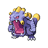

# Chargestone Cave - B1F

## Wild Encounters

| Area                                                                    | Pokemon                                                                                      | &nbsp;                                                                                       | &nbsp;                                                                                         | &nbsp;                                                                                     | &nbsp;                                                                                       | &nbsp;                                                                                     |
| ----------------------------------------------------------------------- | -------------------------------------------------------------------------------------------- | -------------------------------------------------------------------------------------------- | ---------------------------------------------------------------------------------------------- | ------------------------------------------------------------------------------------------ | -------------------------------------------------------------------------------------------- | ------------------------------------------------------------------------------------------ |
|  cave-normal     |   [Joltik](#/pokemon/595)  20%   |   [Klink](#/pokemon/599)  20%     |   [Nosepass](#/pokemon/299)  10% |   [Mawile](#/pokemon/303)  10% |   [Sableye](#/pokemon/302)  10% |   [Tynamo](#/pokemon/602)  10% |
|                                                                         |   [Durant](#/pokemon/632)  10%   |   [Deino](#/pokemon/633)  10%     |
|  cave-special  |   [Drilbur](#/pokemon/529)  50% |   [Diglett](#/pokemon/050)  50% |
## Trainers

| Trainer             | 1                                                                                                   | 2                                                                                                   | 3                                                                                                   | 4                                                                                                   |
| ------------------- | --------------------------------------------------------------------------------------------------- | --------------------------------------------------------------------------------------------------- | --------------------------------------------------------------------------------------------------- | --------------------------------------------------------------------------------------------------- |
| Doctor Wayne        |   [Reuniclus](#/pokemon/579)  Lv. 41 |
| Team Plasma Grunt 1 |   [Krokorok](#/pokemon/552)  Lv. 39   |   [Watchog](#/pokemon/505)  Lv. 39     |   [Scrafty](#/pokemon/560)  Lv. 39     |
| Team Plasma Grunt 2 |   [Eelektrik](#/pokemon/603)  Lv. 39 |   [Banette](#/pokemon/354)  Lv. 39     |   [Crawdaunt](#/pokemon/342)  Lv. 39 |
| Team Plasma Grunt 3 |   [Pawniard](#/pokemon/624)  Lv. 38   |   [Cacturne](#/pokemon/332)  Lv. 38   |   [Scraggy](#/pokemon/559)  Lv. 38     |   [Mightyena](#/pokemon/262)  Lv. 38 |
| Team Plasma Grunt 4 |   [Garbodor](#/pokemon/569)  Lv. 41   |   [Weezing](#/pokemon/110)  Lv. 41     |
| Team Plasma Grunt 5 |   [Arbok](#/pokemon/024)  Lv. 39         |   [Honchkrow](#/pokemon/430)  Lv. 39 |   [Vileplume](#/pokemon/045)  Lv. 39 |
| Team Plasma Grunt 6 |   [Exploud](#/pokemon/295)  Lv. 42     |
| Team Plasma Grunt 7 |   [Garbodor](#/pokemon/569)  Lv. 42   |
