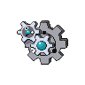
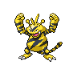
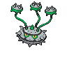
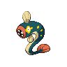
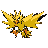

# Chargestone cave - b2f

| Area                                                                    | Pokemon                                                                                            | &nbsp;                                                                                          | &nbsp;                                                                                             | &nbsp;                                                                                         | &nbsp;                                                                                           | &nbsp;                                                                                             |
| ----------------------------------------------------------------------- | -------------------------------------------------------------------------------------------------- | ----------------------------------------------------------------------------------------------- | -------------------------------------------------------------------------------------------------- | ---------------------------------------------------------------------------------------------- | ------------------------------------------------------------------------------------------------ | -------------------------------------------------------------------------------------------------- |
|  cave-normal     |   [Galvantula](#/pokemon/596)  20% |   [Klang](#/pokemon/600)  20%        |   [Electabuzz](#/pokemon/125)  10% |   [Magneton](#/pokemon/082)  10% |   [Electrode](#/pokemon/101)  10% |   [Ferrothorn](#/pokemon/598)  10% |
|                                                                         |   [Durant](#/pokemon/632)  5%          |   [Eelektrik](#/pokemon/603)  5% |   [Porygon](#/pokemon/137)  5%        |   [Rotom](#/pokemon/479)  4%        |
|  cave-special  |   [Excadrill](#/pokemon/530)  50%   |   [Dugtrio](#/pokemon/051)  50%    |
| legendary-encounter                                                 |   [Zapdos](#/pokemon/145)  1%          |