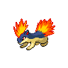
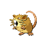

# Cold storage

| Trainer           | 1                                                                                                   | 2                                                                                                 | 3                                                                                                 | 4                                                                                                   |
| ----------------- | --------------------------------------------------------------------------------------------------- | ------------------------------------------------------------------------------------------------- | ------------------------------------------------------------------------------------------------- | --------------------------------------------------------------------------------------------------- |
| Youngster Kenneth |   [Persian](#/pokemon/053)  Lv. 35     |   [Dugtrio](#/pokemon/051)  Lv. 35   |   [Servine](#/pokemon/496)  Lv. 35   |
| Youngster Albert  |   [Primeape](#/pokemon/057)  Lv. 35   |   [Magneton](#/pokemon/082)  Lv. 35 |   [Dewott](#/pokemon/502)  Lv. 35     |
| Worker Eddie      |   [Drilbur](#/pokemon/529)  Lv. 34     |   [Bayleef](#/pokemon/153)  Lv. 34   |   [Sneasel](#/pokemon/215)  Lv. 34   |   [Piloswine](#/pokemon/221)  Lv. 34 |
| Worker Victor     |   [Vanillish](#/pokemon/583)  Lv. 35 |   [Croconaw](#/pokemon/159)  Lv. 35 |   [Mienfoo](#/pokemon/619)  Lv. 35   |
| Worker Glenn      |   [Quilava](#/pokemon/156)  Lv. 35     |   [Hariyama](#/pokemon/297)  Lv. 35 |   [Floatzel](#/pokemon/419)  Lv. 35 |
| Worker Filipe     |   [Snover](#/pokemon/459)  Lv. 36       |   [Crustle](#/pokemon/558)  Lv. 36   |
| Worker Patton     |   [Graveler](#/pokemon/075)  Lv. 36   |   [Gurdurr](#/pokemon/533)  Lv. 36   |
| Worker Ryan       |   [Beldum](#/pokemon/374)  Lv. 37       |   [Metang](#/pokemon/375)  Lv. 37     |
| Plasma Grunt 1    |   [Haunter](#/pokemon/093)  Lv. 35     |   [Arbok](#/pokemon/024)  Lv. 35       |
| Plasma Grunt 2    |   [Grimer](#/pokemon/088)  Lv. 35       |   [Swalot](#/pokemon/317)  Lv. 35     |
| Plasma Grunt 3    |   [Trubbish](#/pokemon/568)  Lv. 35   |   [Sharpedo](#/pokemon/319)  Lv. 35 |
| Plasma Grunt 4    |   [Raticate](#/pokemon/020)  Lv. 36   |